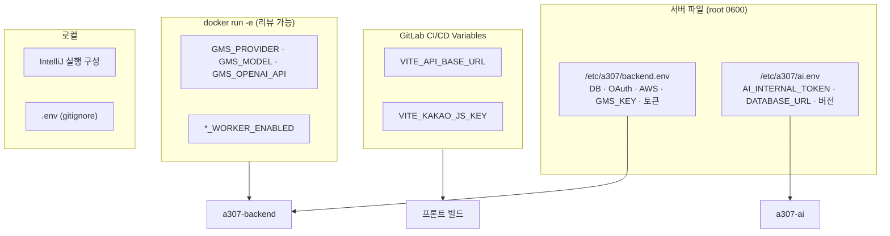

# 환경변수 목록

## 목적

시스템이 읽는 환경변수를 **이름과 용도만** 정리한다.
**실제 값은 어느 것도 이 문서에 적지 않는다 — 전부 [보안 정보 제외].**

## 현재 구현

### 백엔드 (33개)

`backend/src/main/resources/application.properties` 가 참조하는 변수 전체다.

#### 데이터베이스·세션

| 변수 | 용도 | 비밀 |
| --- | --- | --- |
| `DB_USERNAME` | DB 계정 | ✓ |
| `DB_PASSWORD` | DB 비밀번호 | ✓ **[보안 정보 제외]** |

Redis 접속은 `spring.data.redis.host` · `port` 로 고정값이다 (환경변수 아님).

#### 인증 (OAuth2)

| 변수 | 비밀 |
| --- | --- |
| `KAKAO_CLIENT_ID` | ✓ |
| `KAKAO_CLIENT_SECRET` | ✓ **[보안 정보 제외]** |
| `GOOGLE_CLIENT_ID` | ✓ |
| `GOOGLE_CLIENT_SECRET` | ✓ **[보안 정보 제외]** |

#### 네트워크·CORS

| 변수 | 용도 |
| --- | --- |
| `CORS_ALLOWED_ORIGINS` | 허용 오리진 목록 |
| `FRONTEND_BASE_URL` | OAuth 리다이렉트 기준 |

#### AI 연동

| 변수 | 용도 | 비밀 |
| --- | --- | --- |
| `AI_SERVER_URL` | AI 서버 주소 | |
| `ANALYSIS_CALLBACK_BASE_URL` | AI가 콜백할 주소 | |
| `INTERNAL_API_TOKEN` | `X-Internal-Token` 공유 비밀 | ✓ **[보안 정보 제외]** |
| `ANALYSIS_REQUEST_WORKER_ENABLED` | 분석 요청 워커 on/off | |

#### 저장소 (S3)

| 변수 | 용도 |
| --- | --- |
| `AWS_REGION` | 리전 |
| `STORAGE_STAGING_BUCKET` | 업로드 격리 버킷 |
| `STORAGE_SERVICE_BUCKET` | 서비스 버킷 |
| `PROFILE_IMAGE_STAGING_BUCKET` | 프로필 업로드 격리 |
| `PROFILE_IMAGE_SERVICE_BUCKET` | 프로필 서비스 |
| `DOCUMENT_STORAGE_PROVIDER` | 문서 저장소 종류 (`s3` / 로컬) |
| `DOCUMENT_STORAGE_LOCAL_ROOT` | 로컬 폴백 경로 |

**AWS 액세스 키는 환경변수에 없다.** 기본 자격증명 체인(IAM 역할)을 쓴다.

#### LLM (SSAFY GMS)

| 변수 | 용도 | 비밀 |
| --- | --- | --- |
| `GMS_KEY` | API 키 | ✓ **[보안 정보 제외]** |
| `GMS_PROVIDER` | 제공자 | |
| `GMS_MODEL` | 모델명 | |
| `GMS_OPENAI_API` | 호출 형식 | |

CI 주석에 따르면 `GMS_KEY` 만 `backend.env` 에 두고, 나머지 셋은 `docker run` 에 `-e` 로
박아 리뷰 가능하게 한다. **같은 이름을 두 곳에 두지 않는다** — "어느 값이 쓰이는지 헷갈린다."

#### 기능 스위치

| 변수 | 기능 | 저장소 기본값 |
| --- | --- | --- |
| `ESTIMATE_WORKER_ENABLED` | 견적 산출 워커 | |
| `ESTIMATE_NARRATIVE_WORKER_ENABLED` | LLM 요약 워커 | `false` |
| `REPAIR_CHECKLIST_WORKER_ENABLED` | 체크리스트 워커 | `false` |
| `REPAIR_QUESTION_WORKER_ENABLED` | 정비소 질문 워커 | `false` |
| `ESTIMATE_PDF_ENABLED` | 견적 PDF | |
| `ESTIMATE_SUMMARY_ENABLED` | 견적 요약 | |
| `VALIDATION_PDF_ENABLED` | 검증 PDF | |
| `ESTIMATE_OCR_PROVIDER` | OCR 벤더 | (빈 값) |
| `ESTIMATE_OCR_MODEL` | OCR 모델 | |

#### 외부 API

| 변수 | 용도 | 비밀 |
| --- | --- | --- |
| `KAKAO_REST_API_KEY` | 카카오 로컬 API (정비소 검색) | ✓ **[보안 정보 제외]** |

### AI 서버 (14개)

`AI/server/app/core/config.py` 가 읽는 변수다.

| 변수 | 기본값 | 용도 | 비밀 |
| --- | --- | --- | --- |
| `AI_INTERNAL_TOKEN` | `""` | `X-Internal-Token` 공유 비밀 | ✓ **[보안 정보 제외]** |
| `FEATURE_PIPELINE_VERSION_ID` | `0` | 사용할 파이프라인 버전. 0이면 503 | |
| `ANALYSIS_PROFILE` | `production` | `production` / `mock` | |
| `MAX_INFERENCE_CONCURRENCY` | `1` | 동시 추론 수 | |
| `YOLO_IMAGE_SIZE` | `960` | 추론 이미지 크기 | |
| `PART_MODEL_WEIGHTS` | `AI/models/part/damage_part_best-35ep.pt` | 부품 가중치 경로 | |
| `DAMAGE_MODEL_WEIGHTS` | `AI/models/damage/damage_best-60ep.pt` | 손상 가중치 경로 | |
| `PART_MODEL_VERSION` | `35ep` | 버전 문자열 | |
| `DAMAGE_MODEL_VERSION` | `60ep` | 버전 문자열 | |
| `DATABASE_URL` | `""` | 읽기 전용 DB 접속 | ✓ **[보안 정보 제외]** |
| `EMBEDDING_MODEL_NAME` | `facebook/dinov2-base` | | |
| `EMBEDDING_MODEL_REVISION` | `f9e44c81…` | 가중치 커밋 해시 | |
| `EMBEDDING_MODEL_VERSION` | `f9e44c8-pooler-pad20-lb224gray` | 전처리 포함 버전 | |
| `SEARCH_TOP_K` | `20` | 검색 Top-K | |

`config.py` 첫 줄 — "Environment-backed server configuration; **secrets never live in the
repository.**"

Dockerfile이 설정하는 것들도 있다.

| 변수 | 값 | 용도 |
| --- | --- | --- |
| `HF_HOME` | `/opt/hf` | Hugging Face 캐시 |
| `HF_HUB_OFFLINE` | `1` | 런타임 다운로드 차단 |
| `PYTHONUNBUFFERED` | `1` | 로그 즉시 출력 |
| `PYTHONDONTWRITEBYTECODE` | `1` | `.pyc` 생성 안 함 |

### 프론트엔드 (3개)

| 변수 | 용도 | `.env.example` |
| --- | --- | --- |
| `VITE_API_BASE_URL` | 백엔드 주소 | ✓ |
| `VITE_KAKAO_JS_KEY` | 카카오 지도 SDK 키 | ✓ |
| `VITE_AUTH_GUARD` | `off` 면 목업 모드 | ✗ **미기재** |

**`VITE_` 접두사는 번들에 박혀 브라우저로 나간다.** 비밀을 넣으면 안 된다.
CI 주석이 이를 명시하고, 그래서 이 둘만 CI 변수에 둔다고 적었다.

### 로컬 compose (3개)

| 변수 | 기본값 |
| --- | --- |
| `DB_USERNAME` | `a307` |
| `DB_PASSWORD` | `ssafy` |
| `DB_PORT` | `5432` |
| `REDIS_PORT` | `6379` |

로컬 기본값은 `docker-compose.yml` 에 적혀 있다. 포트가 `127.0.0.1` 에만 묶여 있고
운영은 이 파일을 쓰지 않아 저장소에 둬도 된다고 주석이 설명한다.

## 배치 위치



### 비밀값 정책

`.gitlab-ci.yml` 헤더 주석:

> 백엔드 비밀값(DB·OAuth·AWS 키)은 서버의 `/etc/a307/backend.env` 에만 있고 컨테이너에
> `--env-file` 로 들어간다. CI 변수로 옮기면 파이프라인 로그·아티팩트·포크 MR 로 새어 나갈
> 경로가 늘어난다.

`backend/Dockerfile` 주석:

> 환경변수는 파일로 넣는다. **명령줄에 키를 적으면 `ps` 에 보인다.**

`docker-compose.yml` 주석:

> 계정 정보는 아래 기본값을 그대로 쓰면 된다. … 이 값이 리포지토리에 있어도 되는 이유는
> 포트를 `127.0.0.1` 에만 묶었기 때문이다.

### `.gitignore` 보호

```
.env
.env.*
!.env.example
```

`.env.example` 만 추적하고 실제 `.env` 는 제외한다.

## 설정 및 실행 방법

로컬 백엔드는 **IntelliJ 실행 구성의 Environment variables** 에 넣는다 —
Spring Boot는 `.env` 를 읽지 않는다.

## 오류 및 예외 처리

| 증상 | 원인 |
| --- | --- |
| `Could not resolve placeholder` | 환경변수 누락 |
| 업로드 API 503 | 버킷 3종 중 누락 |
| LLM 기능 503 | `GMS_KEY` 없음 |
| AI `/search` 503 | `FEATURE_PIPELINE_VERSION_ID` 가 0 |
| 콜백 401 | 두 토큰 값 불일치 |

**`--env-file` 은 컨테이너 생성 시점에만 읽힌다.** `docker restart` 로는 값이 안 바뀌고
`docker rm -f` 후 `docker run` 이 필요하다.

## 관련 소스코드

- `backend/src/main/resources/application.properties`
- `backend/.env.example` · `frontend/.env.example`
- `AI/server/app/core/config.py`
- `.gitlab-ci.yml`
- `.gitignore`

## 근거 자료

- `grep -oE '\$\{[A-Z_]+' application.properties` → 33개
- `config.py` 의 `os.getenv` 호출 → 14개
- `.env.example` 파일 2개

## 확인 필요 항목

- **모든 변수의 실제 값** — 서버 파일·CI 변수라 저장소에서 확인할 수 없음. **[보안 정보 제외]**
- **`backend/.env.example` 과 실제 필요 변수의 차이** — example에 12개만 있고 properties는 33개를 참조한다
- **`VITE_AUTH_GUARD` 가 `.env.example` 에 없음** — 운영 빌드에서 켜질 위험
- **워커 스위치의 운영 실제 값** — CI 주석으로 일부만 확인됨
