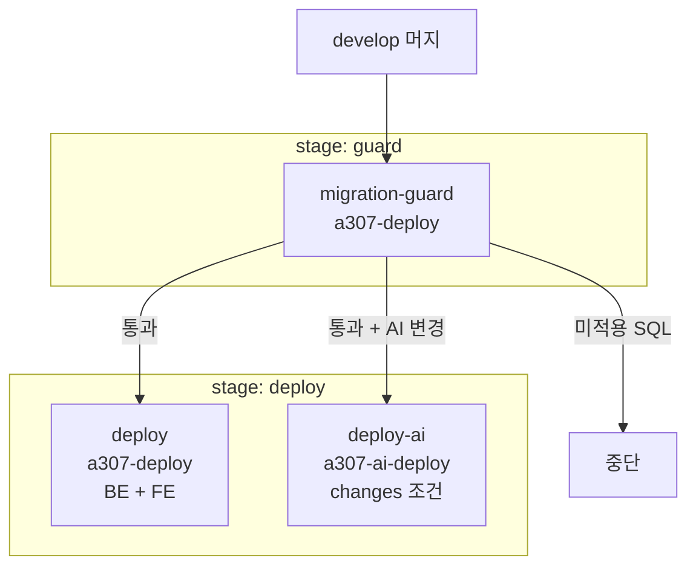

# CI/CD 파이프라인

## 목적

`.gitlab-ci.yml` 의 구조와 각 잡의 동작을 정리한다.

## 현재 구현

### 전체 구조

```yaml
stages:
  - guard
  - deploy

default:
  tags:
    - a307-deploy

variables:
  GIT_DEPTH: "0"
  DEPLOY_MARK: "/home/ubuntu/.a307-deployed-commit"
  APPLIED_MIGRATIONS: "/home/ubuntu/.a307-applied-migrations"
  IMAGE: "a307-backend"
  WEB_ROOT: "/var/www/a307"
  HEALTH_URL: "http://127.0.0.1:8080/actuator/health"
  PRIVATE_IP: "172.26.8.28"
```

잡은 3개다 — `migration-guard`, `deploy`, `deploy-ai`.

### `GIT_DEPTH: "0"` 인 이유

```yaml
# guard 가 이전 배포 커밋과 비교해야 한다. 기본값(얕은 클론)이면 옛 커밋이 없어 비교가 깨진다.
GIT_DEPTH: "0"
```

GitLab 기본은 shallow clone이다. 가드가 `DEPLOY_MARK` 의 옛 커밋과 현재를 비교해야 하므로
전체 히스토리가 필요하다.

### ① `migration-guard`

**역할**: 새 SQL이 있으면 배포를 멈춘다.

| 감시 경로 | 내용 |
| --- | --- |
| `Docs/Erd/migrations` | 날짜별 마이그레이션 11건 + `check-applied.sql` |
| `pipeline/sql` | `002` ~ `015` 14건 |

**왜 자동 적용하지 않는가** — 주석이 답한다.

> 스키마 변경은 사람이 적용한다. 자동으로 돌리면 실패했을 때 조용히 지나가고,
> `ddl-auto=validate` 라서 어긋나면 그 API 만이 아니라 **앱 전체가 안 뜬다.**

**원장 방식**

```
/home/ubuntu/.a307-applied-migrations
  <내용 해시> <경로>
```

경로만이 아니라 내용 해시까지 적는 이유 — "적용한 뒤 누가 SQL 을 고치면 다시 멈춰야 한다."

**가드는 DB를 조회하지 않는다.** 파일 원장만 본다. DB 자격증명을 CI에 두지 않으려는 선택으로
**추정**된다.

### ② `deploy`

**역할**: 백엔드 + 프론트엔드

#### 사전 확인

```sh
docker info > /dev/null 2>&1 || { echo "docker 를 쓸 수 없다."; exit 1; }
test -n "${VITE_API_BASE_URL:-}" || { echo "CI 변수 VITE_API_BASE_URL 이 없다."; exit 1; }
test -n "${VITE_KAKAO_JS_KEY:-}" || { echo "CI 변수 VITE_KAKAO_JS_KEY 가 없다."; exit 1; }
```

**빌드하기 전에 실패한다.** 오래 걸리는 빌드를 돌린 뒤 변수가 없어 실패하는 낭비를 막는다.

#### 백엔드

```sh
./gradlew bootJar -x test
docker build -t "$IMAGE:$CI_COMMIT_SHORT_SHA" -t "$IMAGE:latest" -f backend/Dockerfile .
```

**`-x test`** — CI 배포 단계에서 테스트를 건너뛴다. 별도 테스트 잡이 없다.

#### 프론트엔드

```sh
printf 'VITE_API_BASE_URL=%s\nVITE_KAKAO_JS_KEY=%s\n' "$VITE_API_BASE_URL" "$VITE_KAKAO_JS_KEY" > .env.production
npm ci
npm run build
grep -rq "$VITE_API_BASE_URL" dist/assets/ || { echo "번들에 API 주소가 없다. .env 우선순위를 확인하라."; exit 1; }
```

`npm ci` 를 쓴다 (`npm install` 아님) — lockfile 그대로 설치한다.

**빌드 산출물을 검증한다.** 빌드가 성공해도 값이 안 들어갔으면 실패시킨다.
배포 후에야 드러날 문제를 배포 전에 잡는다.

#### 컨테이너 교체

```sh
docker rm -f a307-backend 2>/dev/null || true
docker run -d --name a307-backend \
  --network a307-net \
  -p 127.0.0.1:8080:8080 -p 172.26.8.28:8080:8080 \
  --env-file /etc/a307/backend.env \
  -e GMS_PROVIDER=OPENAI -e GMS_MODEL=gpt-5.4 -e GMS_OPENAI_API=chat \
  -e REPAIR_CHECKLIST_WORKER_ENABLED=true -e REPAIR_QUESTION_WORKER_ENABLED=true \
  -e ESTIMATE_NARRATIVE_WORKER_ENABLED=true \
  --restart unless-stopped a307-backend:<SHA>
```

(위는 CI 헤더 주석의 롤백 예시에서 확인한 형태다.)

비밀이 아닌 설정은 `-e` 로 박아 리뷰 가능하게 두고, 비밀만 `--env-file` 로 넣는다.
주석이 이유를 적었다 — "backend.env 에는 이 여섯 이름을 적지 않는다 — 두 곳에 같은 이름이
있으면 어느 값이 쓰이는지 헷갈린다."

#### 기동 확인

```sh
# Dockerfile 의 HEALTHCHECK start-period 가 90초다. 넉넉히 120초까지 본다.
curl -sf "$HEALTH_URL"
```

주석이 한계를 적었다.

> health 만 보면 안 된다. **어댑터가 없어도 UP 이 뜬다** (배포 준비 체크리스트 §5).

#### 정적 파일 교체

```sh
rm -rf "${WEB_ROOT:?}"/*
cp -r frontend/dist/* "$WEB_ROOT"/
chown -R ubuntu:www-data "$WEB_ROOT"
sudo /usr/bin/systemctl reload nginx
```

`${WEB_ROOT:?}` 의 `:?` 는 변수가 비면 오류를 내는 bash 문법이다 — `rm -rf /*` 방어다.

### ③ `deploy-ai`

```yaml
rules:
  - if: $CI_COMMIT_BRANCH == "develop"
    changes:
      - AI/**/*
      - shared/vision/**/*
variables:
  AI_IMAGE: "a307-ai"
  AI_ENV: "/etc/a307/ai.env"
  AI_HEALTH: "http://172.26.4.46:8000/health"
```

기동 확인이 백엔드보다 꼼꼼하다.

```sh
H=$(curl -s "$AI_HEALTH")
echo "$H" | grep -q '"status":"ok"'      || exit 1
echo "$H" | grep -q '"configured":true'  || exit 1
echo "$H" | grep -q '"dbReachable":true' || exit 1
```

**`modelsLoaded` 로 판정하지 않는다.**

> YOLO·DINOv2 는 지연 로드라 첫 추론 때 올라오고, 기동 직후에는 정상적으로 false 다.
> `status` 와 `configured` 를 본다.

실패 시 로그를 남긴다.

```sh
echo "기동하지 못했다. 최근 로그 80줄:"
docker logs --tail 80 a307-ai || true
```

### 파이프라인 전체



### 없는 것

| 항목 | 상태 |
| --- | --- |
| 테스트 잡 | **없음** (`-x test`) |
| 린트·정적 분석 잡 | 없음 |
| 보안 스캔 | 없음 |
| 스테이징 환경 | 없음 (develop → 운영 직행) |
| 수동 승인 게이트 | 없음 |
| 자동 롤백 | 없음 |
| 이미지 레지스트리 푸시 | 없음 |

CI에서 테스트를 돌리지 않는다. 테스트는 로컬에서 돌리는 것을 전제로 한다.
(이 조사에서 로컬 실행 시 백엔드 1,677건 통과를 확인했다.)

## 설정 및 실행 방법

GitLab CI/CD Variables에 둘만 등록돼 있다.

| 변수 | 성격 |
| --- | --- |
| `VITE_API_BASE_URL` | 번들에 박혀 브라우저로 나감. 비밀 아님 |
| `VITE_KAKAO_JS_KEY` | 동일 |

## 오류 및 예외 처리

| 실패 | 로그 |
| --- | --- |
| docker 사용 불가 | "docker 를 쓸 수 없다." |
| CI 변수 누락 | "CI 변수 … 가 없다." |
| 번들 검증 실패 | "번들에 API 주소가 없다. .env 우선순위를 확인하라." |
| env 파일 못 읽음 | "/etc/a307/ai.env 를 읽을 수 없다." |
| 기동 실패 | 컨테이너 로그 80줄 |
| AI 설정 누락 | "환경변수 누락. /etc/a307/ai.env 확인." |
| AI DB 불가 | "DB 에 닿지 못한다. DATABASE_URL 확인." |

**모든 오류 메시지가 다음 행동을 지시한다.**

## 관련 소스코드

- `.gitlab-ci.yml` 전체 (312행)

## 근거 자료

- CI 파일 직접 확인

## 확인 필요 항목

- **`--network a307-net` 도커 네트워크** — CI 헤더 롤백 예시에만 나온다. 실제 `deploy` 잡에서 쓰는지 확인하지 못함
- **`migration-guard` 본문 상세** — 60~118행 일부만 확인함
- **파이프라인 평균 소요 시간** — 확인하지 못함
- **동시 파이프라인 제어** — `resource_group` 설정이 없어 동시 배포 시 충돌 가능
