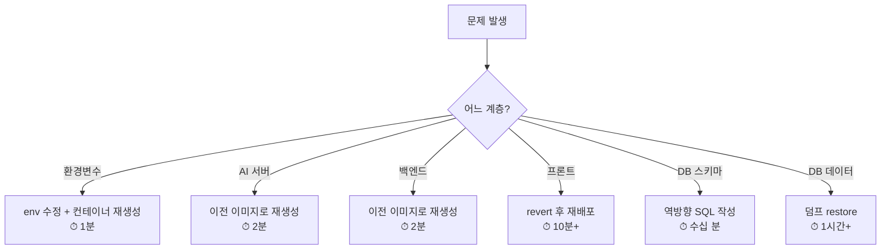
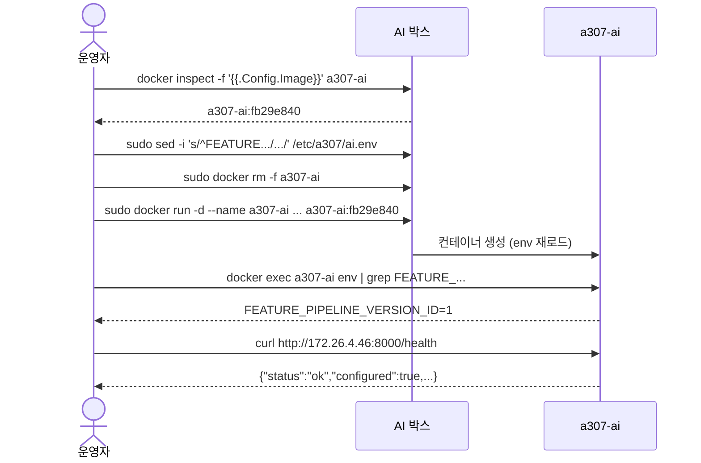

# 롤백 절차

## 목적

배포가 잘못됐을 때 되돌리는 방법을 대상별로 정리한다.

## 현재 구현

### 자동 롤백은 없다

CI는 헬스체크 실패 시 **실패만 보고한다.** 컨테이너는 이미 교체된 상태다.
되돌리는 것은 사람의 몫이다.

### ① 백엔드 롤백

`.gitlab-ci.yml` 헤더 주석에 명령이 그대로 있다.

```bash
docker rm -f a307-backend
```

```bash
docker run -d --name a307-backend --network a307-net \
  -p 127.0.0.1:8080:8080 -p 172.26.8.28:8080:8080 \
  --env-file /etc/a307/backend.env \
  -e GMS_PROVIDER=OPENAI -e GMS_MODEL=gpt-5.4 -e GMS_OPENAI_API=chat \
  -e REPAIR_CHECKLIST_WORKER_ENABLED=true -e REPAIR_QUESTION_WORKER_ENABLED=true \
  -e ESTIMATE_NARRATIVE_WORKER_ENABLED=true \
  --restart unless-stopped a307-backend:<이전 SHA>
```

가능한 이유는 **이미지를 커밋 SHA로도 태그**하기 때문이다.

```bash
docker images a307-backend
```

로 남아 있는 태그를 확인하고 고른다.

### ② AI 서버 롤백

```bash
docker images a307-ai
```

2026-09-21 실측으로 13개 태그가 남아 있었다.

```bash
IMG=a307-ai:<이전 SHA>
sudo docker rm -f a307-ai
sudo docker run -d --name a307-ai -p 172.26.4.46:8000:8000 \
  --env-file /etc/a307/ai.env \
  --memory=6g --memory-swap=6g --cpus=3 \
  --restart unless-stopped "$IMG"
```

**메모리 상한을 빼면 안 된다.** 같은 박스의 DB를 끌고 내려간다.

`sudo` 가 필요한 이유 — `/etc/a307/ai.env` 가 `0600 root:root` 라 `ubuntu` 가 못 읽는다.
`--env-file` 은 도커 클라이언트가 직접 읽는다.

### ③ 프론트엔드 롤백

**가장 어렵다.** `rm -rf $WEB_ROOT/*` 로 이전 파일을 지우고 덮어쓰기 때문에
서버에 이전 버전이 남지 않는다.

되돌리려면 **이전 커밋으로 다시 빌드·배포**해야 한다.

| 방법 | 절차 |
| --- | --- |
| 역방향 커밋 | 문제 커밋을 revert 하고 `develop` 에 머지 → 파이프라인 재실행 |
| 수동 빌드 | 이전 커밋을 체크아웃해 `npm run build` → `/var/www/a307` 에 복사 |

**개선 여지**: 릴리스별 디렉터리 + 심볼릭 링크 전환 방식이면 즉시 롤백이 된다.

### ④ 환경변수 롤백

값만 되돌리고 컨테이너를 **재생성**한다. `docker restart` 로는 안 바뀐다.

```bash
sudo sed -i 's/^FEATURE_PIPELINE_VERSION_ID=.*/FEATURE_PIPELINE_VERSION_ID=1/' /etc/a307/ai.env
```

```bash
IMG=$(docker inspect -f '{{.Config.Image}}' a307-ai)
sudo docker rm -f a307-ai
sudo docker run -d --name a307-ai -p 172.26.4.46:8000:8000 \
  --env-file /etc/a307/ai.env \
  --memory=6g --memory-swap=6g --cpus=3 \
  --restart unless-stopped "$IMG"
```

2026-09-21 v2 → v1 롤백을 실제로 이 절차로 수행했다(그리고 다시 v2로 되돌렸다).

**v1·v2 feature와 embedding이 같은 테이블에 공존**하므로 이 롤백이 가능하다.
데이터를 지우지 않았기 때문이다.

다만 **HNSW 인덱스는 롤백되지 않는다** — v1도 같은 인덱스를 쓴다(인덱스가
`pipeline_version_id` 를 가리지 않음). 문제는 없다.

### ⑤ 데이터베이스 롤백

**가장 위험하다.** 자동 방법이 없다.

| 상황 | 방법 |
| --- | --- |
| 스키마 변경 | 역방향 SQL을 사람이 작성·적용 |
| corpus 데이터 | 이전 `pg_dump` 덤프로 restore |
| 사용자 데이터 | 백업에서 복구 |

2026-09-21 이관 전에 `pg_dump -Fc --data-only` 덤프를 떴다.

**스키마를 되돌리면 원장도 정리해야 한다.** `/home/ubuntu/.a307-applied-migrations` 에서
해당 줄을 지우지 않으면 가드 상태와 DB 상태가 어긋난다.

### 롤백 우선순위



**아래로 갈수록 오래 걸리고 위험하다.**

### 롤백 전 확인

| 확인 | 명령 |
| --- | --- |
| 현재 이미지 태그 | `docker inspect -f '{{.Config.Image}}' a307-ai` |
| 남은 태그 목록 | `docker images a307-ai` |
| 현재 env 값 | `docker exec a307-ai env \| grep <이름>` |
| 배포 커밋 | `cat /home/ubuntu/.a307-deployed-commit` |

**`docker rm -f` 를 치기 전에 이미지 태그를 먼저 확보한다.** 지운 뒤 태그를 몰라 못 올리는
상황을 막는다.

### 🔴 하지 말아야 할 것

```
docker system prune -a --volumes    → 운영 DB 볼륨이 사라진다
docker compose down -v              → 같은 이유
```

AI 박스에 운영 DB가 있다. 롤백 중에 이미지를 정리하고 싶어도
`docker image prune -f` (dangling만)까지다.

## 동작 흐름 (환경변수 롤백 예)



## 주요 구성 요소

- `.gitlab-ci.yml` 헤더 주석 — 백엔드 롤백 명령
- `docker images` — 남은 태그
- `/home/ubuntu/db-backup/` — DB 덤프

## 설정 및 실행 방법

위 절차 참고.

## 오류 및 예외 처리

| 증상 | 원인 |
| --- | --- |
| `--env-file: permission denied` | `sudo` 누락 |
| 이전 이미지 없음 | `docker image prune` 으로 지워짐 |
| env 되돌렸는데 그대로 | `docker restart` 를 씀 (재생성 필요) |
| 롤백 후 스키마 오류 | DB가 새 스키마인데 코드가 구버전 |

**마지막 항목이 가장 위험하다.** 스키마를 적용한 뒤 코드를 롤백하면
`ddl-auto=validate` 가 불일치를 잡아 **앱이 기동하지 않는다.** 스키마 변경이 포함된 배포는
코드만 되돌릴 수 없다.

## 관련 소스코드

- `.gitlab-ci.yml:18~28` — 롤백 예시 주석

## 근거 자료

- CI 헤더 주석
- 2026-09-21 v2↔v1 전환 실측

## 확인 필요 항목

- **이미지 보존 정책** — 언제까지 이전 태그가 남는지 확인하지 못함
- **프론트 롤백 표준 절차** — 문서화된 절차를 확인하지 못함
- **DB 백업 주기·보존** — [백업과 복구](../10_운영/백업과_복구.md) 참고
- **역방향 마이그레이션 SQL** — `pipeline/sql/` 에 down 스크립트가 없음
