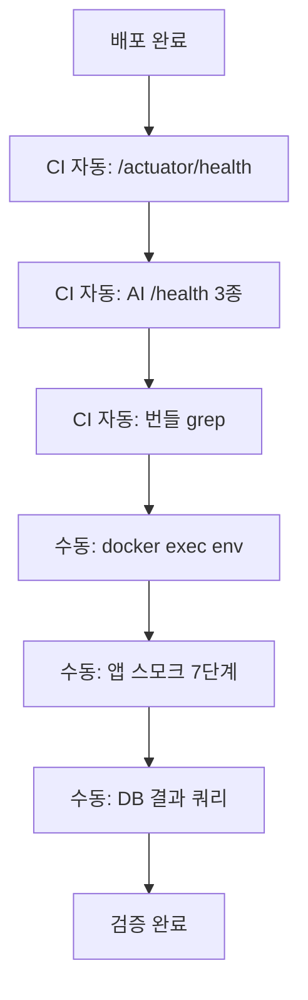

# 배포 검증

## 목적

배포가 끝난 뒤 실제로 동작하는지 확인하는 방법을 정리한다.
**"기동했다" 와 "동작한다" 는 다르다** — 이 프로젝트는 그 차이를 코드 주석에 명시해 두었다.

## 현재 구현

### 자동 검증 (CI가 한다)

#### 백엔드

```sh
curl -sf http://127.0.0.1:8080/actuator/health
```

최대 120초 대기. Dockerfile의 `HEALTHCHECK start-period` 가 90초라 넉넉히 잡았다.

**한계가 명시돼 있다.**

```sh
# health 만 보면 안 된다. 어댑터가 없어도 UP 이 뜬다 (배포 준비 체크리스트 §5).
```

Dockerfile 주석도 같다 — "**'기동했다' 까지만 보증한다.** 어댑터가 없어도 UP 이 뜨므로
기능 확인은 배포 준비 체크리스트 §5 로 따로 한다."

S3 버킷이 비어 있어도, GMS 키가 없어도 `/actuator/health` 는 UP이다.

#### AI 서버

3가지를 본다.

```sh
H=$(curl -s "http://172.26.4.46:8000/health")
echo "$H" | grep -q '"status":"ok"'      || exit 1
echo "$H" | grep -q '"configured":true'  || exit 1
echo "$H" | grep -q '"dbReachable":true' || exit 1
```

| 필드 | 의미 |
| --- | --- |
| `status: ok` | 프로세스 살아 있음 |
| `configured: true` | `AI_INTERNAL_TOKEN` 있고 `FEATURE_PIPELINE_VERSION_ID > 0` |
| `dbReachable: true` | DB 연결 가능 |

백엔드보다 낫다 — **설정 누락과 DB 연결까지 본다.**

`modelsLoaded` 는 보지 않는다. 지연 로드라 기동 직후 `false` 가 정상이다.

#### 프론트엔드

```sh
grep -rq "$VITE_API_BASE_URL" dist/assets/ || exit 1
```

배포 **전에** 번들을 검사한다. 빌드가 성공해도 값이 안 들어갔으면 막는다.

### 수동 검증

#### 환경변수 반영 확인

`--env-file` 은 컨테이너 생성 시점에만 읽히므로 실제 반영을 확인해야 한다.

```bash
docker exec a307-ai env | grep FEATURE_PIPELINE_VERSION_ID
```

```bash
docker exec a307-backend env | grep -E "BUCKET|AWS_REGION"
```

(두 번째 명령은 `Docs/Architecture/인프라 실행 교본.md:826` 에 있다.)

**값 자체는 비밀일 수 있으므로 문서·로그에 옮기지 않는다.**

#### 컨테이너 상태

```bash
docker ps --format '{{.Names}}\t{{.Status}}'
```

```bash
docker logs --tail 80 a307-backend
```

#### AI 헬스 전체

```bash
curl http://172.26.4.46:8000/health
```

```json
{
  "status": "ok",
  "modelsLoaded": false,
  "embeddingModelLoaded": false,
  "dbReachable": true,
  "configured": true,
  "analysisProfile": "production",
  "embeddingConfigured": true,
  "partWeightsPresent": true,
  "damageWeightsPresent": true
}
```

`partWeightsPresent` · `damageWeightsPresent` 가 `false` 면 가중치 파일이 이미지에 없다.

### 기능 검증 (스모크 테스트)

헬스체크로는 알 수 없는 것들이다. **앱에서 직접 해야 한다.**

| 순서 | 확인 |
| --- | --- |
| 1 | 로그인 (카카오 또는 구글) |
| 2 | 차량 등록 — **분석에 `modelId` 가 필요하다** |
| 3 | 사고 접수 + 사진 업로드 → S3 동작 확인 |
| 4 | 분석 요청 → 첫 요청은 모델 로딩으로 30초~1분 |
| 5 | 견적 조회 → 금액이 나오는지 |
| 6 | 체크리스트 생성 → LLM(GMS) 동작 확인 |
| 7 | 견적 PDF → 폰트·AWT 동작 확인 |

**차종을 반드시 고른다.** `modelId` 가 없으면 검색이 `MODEL` · `PRICE_TIER` 단계를 타지 않아
이관·마이그레이션 효과를 확인할 수 없다.

### 결과 검증 쿼리

분석을 돌린 뒤 DB로 확인한다.

```sql
SELECT job_id, status, failure_reason, pipeline_version_id, model_version, created_at
FROM analysis_job ORDER BY job_id DESC LIMIT 3;
```

기대: `status = COMPLETED`, `pipeline_version_id` 가 의도한 값.

```sql
SELECT ei.ref_condition->>'fallbackStage' AS stage, count(*)
FROM estimate_item ei JOIN estimate e USING (estimate_id)
WHERE e.created_at > now() - interval '1 hour'
GROUP BY 1;
```

기대: `MODEL` 또는 `PRICE_TIER` 가 나온다. **전부 `ALL` 이면** 해당 차종의 `model_id` 가
corpus에 없거나 마이그레이션이 덜 된 것이다.

### 데이터 이관 검증 (건수 대조)

2026-09-21 v2 corpus 이관에서 쓴 방법이다.

```sql
SELECT 'case' t, count(*) FROM repair_case
UNION ALL SELECT 'image',   count(*) FROM repair_case_image
UNION ALL SELECT 'feat_v1', count(*) FROM repair_case_damage_feature WHERE pipeline_version_id=1
UNION ALL SELECT 'feat_v2', count(*) FROM repair_case_damage_feature WHERE pipeline_version_id=2
UNION ALL SELECT 'emb',     count(*) FROM repair_case_roi_embedding;
```

| 항목 | 기대 | 실제 (2026-09-21) |
| --- | --: | --: |
| `case` | 93,964 | 93,964 ✓ |
| `image` | 337,966 | 337,966 ✓ |
| `feat_v1` | 205,977 | 205,977 ✓ |
| `feat_v2` | 851,516 | 851,516 ✓ |
| `emb` | 720,668 | 720,668 ✓ |

`pg_restore --disable-triggers` 로 FK 검사를 끄고 넣었기 때문에 **이 대조가 유일한
안전장치**였다.

인덱스와 tier도 확인했다.

```sql
SELECT indexname FROM pg_indexes WHERE tablename='repair_case_roi_embedding';
-- 기대: repair_case_roi_embedding_pkey, uk_roi, ix_roi_hnsw
```

```sql
SELECT (SELECT count(*) FROM repair_case c JOIN vehicle_model m USING (model_id)
        WHERE m.price_tier IS NOT NULL AND c.price_tier IS DISTINCT FROM m.price_tier) AS mismatch,
       (SELECT count(*) FROM repair_case WHERE model_id IS NOT NULL AND price_tier IS NULL) AS missing;
-- 기대: 0, 0
```

**주의**: 위 두 값은 `model_id IS NOT NULL` 을 전제로 센다. `model_id` 가 전부 NULL이면
아무것도 세지 않고 0이 나온다 — **거짓 통과**다. 그래서 커버리지도 함께 봐야 한다.

```sql
SELECT count(*) AS total, count(model_id) AS with_model, count(price_tier) AS with_tier
FROM repair_case;
-- 실제: 93,964 / 80,919 / 80,919 (86.1%)
```

## 동작 흐름



## 주요 구성 요소

- `.gitlab-ci.yml` — 자동 검증
- `Docs/Architecture/배포 준비 체크리스트.md` — §5 기능 확인
- `Docs/Architecture/인프라 실행 교본.md` — 확인 명령 모음

## 설정 및 실행 방법

자동 검증은 CI가 한다. 수동 검증은 위 명령을 순서대로 실행한다.

## 오류 및 예외 처리

| 증상 | 원인 |
| --- | --- |
| 헬스 UP인데 업로드 503 | 버킷 미설정 |
| 헬스 UP인데 체크리스트 503 | `GMS_KEY` 없음 |
| AI `configured: false` | 토큰 또는 `FEATURE_PIPELINE_VERSION_ID` 누락 |
| AI `dbReachable: false` | `DATABASE_URL` 오류 |
| `fallbackStage` 전부 `ALL` | `model_id` 미적재 |
| 첫 분석이 매우 느림 | 모델 지연 로드 (정상) |

## 관련 소스코드

- `.gitlab-ci.yml` 기동 확인 블록
- `AI/server/app/api/routes.py:30~42` — `/health`

## 근거 자료

- CI 검증 로직
- 2026-09-21 이관 실측 결과

## 확인 필요 항목

- **`배포 준비 체크리스트.md` §5 내용** — 문서 존재는 확인했으나 본문을 확인하지 못함
- **자동 스모크 테스트** — 없다. 전부 수동
- **모니터링 알림** — 배포 후 이상 감지 체계를 확인하지 못함
