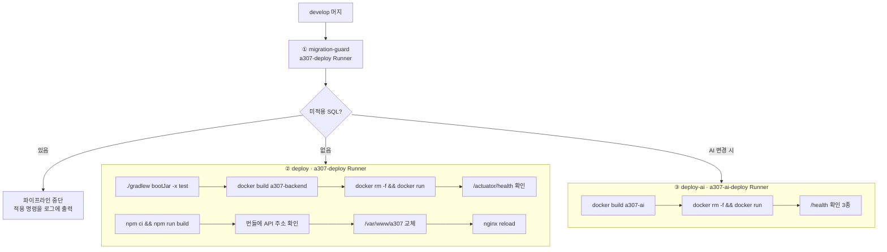

# 배포 구조

## 목적

무엇이 어디로, 어떤 순서로 나가는지 정리한다.

## 현재 구현

### 배포 대상 3종

| 대상 | 방식 | 위치 | CI 잡 |
| --- | --- | --- | --- |
| 프론트엔드 | 정적 파일 복사 | BE 박스 `/var/www/a307` | `deploy` |
| 백엔드 | 컨테이너 교체 | BE 박스 `a307-backend` | `deploy` |
| AI 서버 | 컨테이너 교체 | AI 박스 `a307-ai` | `deploy-ai` |

**데이터베이스는 자동 배포 대상이 아니다.** 사람이 적용하고 CI 가드가 확인한다.

### 트리거

```yaml
rules:
  - if: $CI_COMMIT_BRANCH == "develop"
```

`develop` 브랜치 머지로만 돈다. 태그·수동 승인 게이트가 없다.

`deploy-ai` 만 추가 조건이 있다.

```yaml
changes:
  - AI/**/*
  - shared/vision/**/*
```

AI 코드나 공용 비전 모듈이 바뀔 때만 AI를 재배포한다. `shared/vision` 이 들어간 이유는
AI 서버가 그것을 import 하기 때문이다.

CI 주석이 예외를 적었다.

> GitLab 에서 손으로 돌린 파이프라인(New pipeline)에는 비교할 이전 커밋이 없어서 `changes` 가
> 참으로 평가된다. **즉 수동 실행하면 AI 도 같이 재배포된다.**

### 스테이지 2개

```yaml
stages:
  - guard
  - deploy
```

| 스테이지 | 잡 | 역할 |
| --- | --- | --- |
| `guard` | `migration-guard` | 미적용 SQL이 있으면 배포 중단 |
| `deploy` | `deploy`, `deploy-ai` | 실제 배포 |

가드가 먼저 돈다. **스키마가 준비되지 않았으면 코드가 나가지 않는다.**

### Runner

| 잡 | 태그 | 박스 |
| --- | --- | --- |
| `migration-guard`, `deploy` | `a307-deploy` | BE |
| `deploy-ai` | `a307-ai-deploy` | AI |

shell executor다. **빌드와 배포가 같은 서버에서 일어난다.**

태그를 쓰는 이유가 주석에 있다.

> SSAFY GitLab 에는 공용 Runner 가 붙어 있다. 태그가 없으면 공용 Runner 가 작업을 가져가는데,
> 그 Runner 는 우리 서버에 닿지 못해 배포가 실패한다.

### 배포 흐름



### 이미지 태깅

```sh
docker build -t "$IMAGE:$CI_COMMIT_SHORT_SHA" -t "$IMAGE:latest" -f backend/Dockerfile .
```

커밋 SHA와 `latest` 두 개를 붙인다. 실행은 SHA 태그로 한다.

```sh
docker run -d --name a307-backend ... "$IMAGE:$CI_COMMIT_SHORT_SHA"
```

**레지스트리에 푸시하지 않는다.** 이미지는 빌드한 서버의 로컬에만 있다.
따라서 롤백은 그 서버에 남아 있는 이전 이미지에 의존한다.

2026-09-21 AI 박스 실측으로 13개 태그가 남아 있었다 (`a307-ai:10db1f11` ~ `fb29e840`).
각 3.5GB대다.

### 무중단 여부

**무중단이 아니다.**

| 대상 | 다운타임 |
| --- | --- |
| 백엔드 | `docker rm -f` → `docker run` → 헬스 통과까지 (최대 120초) |
| 프론트 | `rm -rf $WEB_ROOT/*` → `cp` 사이 |
| AI | `docker rm -f` → `docker run` → 헬스 통과까지 (최대 90초) |

블루-그린이나 롤링 배포가 없다. 단일 인스턴스라 교체 중 접속이 끊긴다.

프론트는 `rm -rf` 후 `cp` 라 그 사이에 정적 파일이 아예 없다.

### 정리

```sh
docker image prune -f > /dev/null 2>&1 || true
```

두 배포 잡 모두 마지막에 dangling 이미지를 지운다.
**`-a` 나 `--volumes` 를 쓰지 않는다** — AI 박스에 운영 DB가 있어서 위험하다.

## 주요 구성 요소

| 구성 요소 | 파일 |
| --- | --- |
| CI 정의 | `.gitlab-ci.yml` |
| 백엔드 이미지 | `backend/Dockerfile` |
| AI 이미지 | `AI/server/Dockerfile` |
| 배포 문서 | `Docs/Architecture/배포 준비 체크리스트.md`, `인프라 실행 교본.md` |

## 설정 및 실행 방법

자동이다. `develop` 에 머지하면 시작된다.

수동 실행은 GitLab UI의 New pipeline이며, 이 경우 AI도 함께 재배포된다.

## 오류 및 예외 처리

| 실패 지점 | 처리 |
| --- | --- |
| 가드 중단 | SQL 적용 → 원장 기록 → 재실행 |
| 빌드 실패 | 파이프라인 실패. 기존 컨테이너 유지 |
| 헬스 실패 | 최근 로그 80줄 출력 후 실패. **컨테이너는 이미 교체된 상태** |

**헬스 실패 시 자동 롤백이 없다.** 새 컨테이너가 이미 떠 있고 실패만 보고한다.
사람이 [롤백 절차](롤백_절차.md)를 따라야 한다.

## 관련 소스코드

- `.gitlab-ci.yml` 전체
- `Docs/Architecture/배포 준비 체크리스트.md`

## 근거 자료

- `.gitlab-ci.yml` 직접 확인
- 2026-09-21 AI 박스 `docker images` 실측

## 확인 필요 항목

- **GitLab Runner 등록 설정** — `config.toml` 을 확인하지 못함
- **이미지 보존 개수** — `docker image prune -f` 는 dangling만 지운다. 태그된 이미지는 계속 쌓인다(디스크 압박 가능)
- **배포 알림** — Slack·Mattermost 연동 여부를 확인하지 못함
- **`deploy` 와 `deploy-ai` 의 실행 순서** — 같은 스테이지라 병렬로 추정
