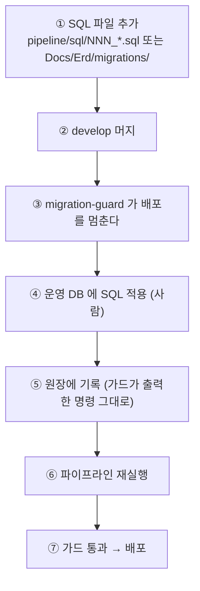
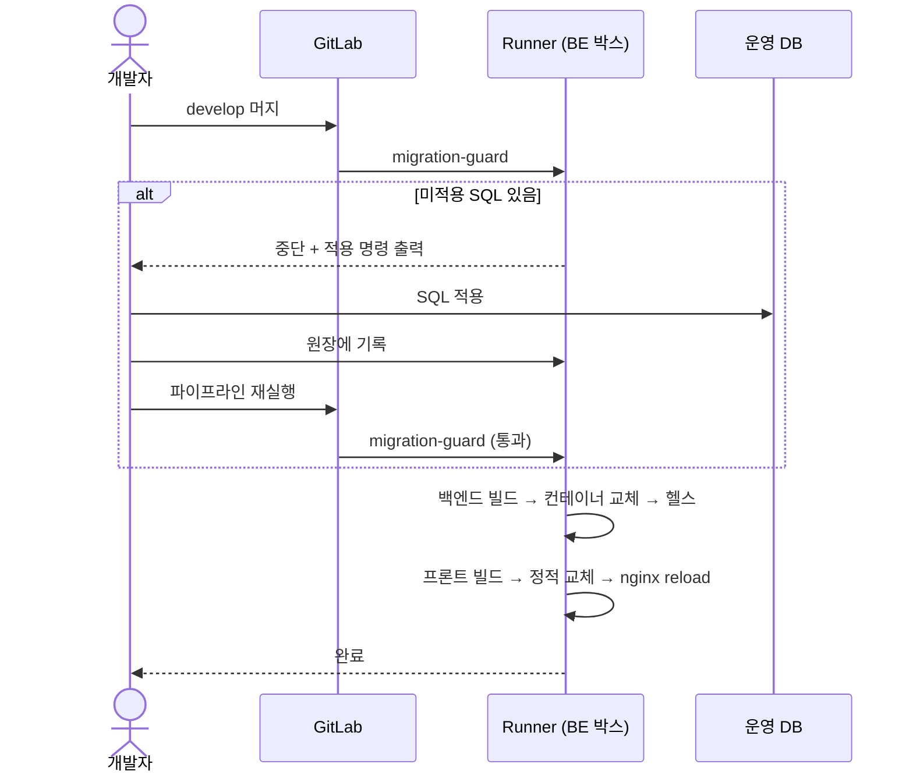

# 배포 절차

## 목적

스키마 변경이 있는 배포와 없는 배포를 나눠, 실제 순서를 정리한다.

## 현재 구현

### 일반 배포 (스키마 변경 없음)

1. 기능 브랜치에서 작업
2. `develop` 으로 MR 생성·머지
3. 파이프라인 자동 실행 — `migration-guard` → `deploy` (+ 필요 시 `deploy-ai`)
4. 완료

**사람이 할 일이 없다.**

### 스키마 변경이 있는 배포

`ddl-auto=validate` 때문에 **순서를 틀리면 앱 전체가 기동하지 않는다.**



CI 주석이 이 순서를 정확히 적었다.

> **멈췄을 때 푸는 순서**
> 1. 운영 DB 에 그 SQL 을 적용한다
> 2. BE 박스에서 guard 로그에 찍힌 echo 명령을 그대로 붙여넣어 적용 완료를 기록한다
> 3. 파이프라인을 다시 실행한다

### 왜 원장이 필요한가

주석이 과거 실패를 기록했다.

> 예전에는 "적용 후 다시 실행" 만 안내했는데, 배포가 실패하면 `DEPLOY_MARK` 가 그대로라
> 다시 실행해도 같은 SQL 이 또 잡혀 **영영 통과하지 못했다.** 그래서 적용 완료 목록을 둔다.
> 경로만이 아니라 **내용 해시까지 적는다** — 적용한 뒤 누가 SQL 을 고치면 다시 멈춰야 한다.

| 파일 | 내용 |
| --- | --- |
| `/home/ubuntu/.a307-applied-migrations` | `<내용 해시> <경로>` 한 줄씩 |
| `/home/ubuntu/.a307-deployed-commit` | 마지막 배포 커밋 |

**가드는 DB를 보지 않는다.** 파일 원장만 본다. 그래서 사람이 DB에 적용한 뒤 반드시
원장에 적어야 한다.

### 가드가 감시하는 경로

```yaml
Docs/Erd/migrations
pipeline/sql
```

두 곳 중 어디에 새 SQL이 생겨도 잡는다.

### 배포 잡 상세 (`deploy`)

```sh
# 1. 백엔드 빌드
./gradlew bootJar -x test
docker build -t "$IMAGE:$CI_COMMIT_SHORT_SHA" -t "$IMAGE:latest" -f backend/Dockerfile .

# 2. 프론트 빌드
test -n "${VITE_API_BASE_URL:-}" || exit 1
test -n "${VITE_KAKAO_JS_KEY:-}" || exit 1
printf 'VITE_API_BASE_URL=%s\nVITE_KAKAO_JS_KEY=%s\n' "$VITE_API_BASE_URL" "$VITE_KAKAO_JS_KEY" > .env.production
npm ci
npm run build
grep -rq "$VITE_API_BASE_URL" dist/assets/ || exit 1

# 3. 백엔드 교체
docker rm -f a307-backend 2>/dev/null || true
docker run -d --name a307-backend ...

# 4. 기동 확인 (최대 120초)
curl -sf "$HEALTH_URL"

# 5. 프론트 교체
rm -rf "${WEB_ROOT:?}"/*
cp -r frontend/dist/* "$WEB_ROOT"/
chown -R ubuntu:www-data "$WEB_ROOT"
sudo /usr/bin/systemctl reload nginx

# 6. 정리
docker image prune -f
```

**백엔드를 먼저 올리고 프론트를 나중에 교체한다.** 새 프론트가 아직 없는 API를 부르는
상황을 피한다.

빌드 전 CI 변수 존재를 확인하고, 빌드 후 번들에 값이 들어갔는지 `grep` 으로 검증한다.
Vite의 `.env` 우선순위 때문에 값이 덮이는 사고를 막는다.

### 배포 잡 상세 (`deploy-ai`)

```sh
test -r "$AI_ENV" || exit 1
docker info > /dev/null 2>&1 || exit 1
docker build -t "$AI_IMAGE:$CI_COMMIT_SHORT_SHA" -t "$AI_IMAGE:latest" -f AI/server/Dockerfile .
docker rm -f a307-ai 2>/dev/null || true
docker run -d --name a307-ai \
  -p 172.26.4.46:8000:8000 \
  --env-file "$AI_ENV" \
  --memory=6g --memory-swap=6g --cpus=3 \
  --restart unless-stopped \
  "$AI_IMAGE:$CI_COMMIT_SHORT_SHA"
# 기동 확인 (3초 × 30회)
curl -sf "$AI_HEALTH"
```

### 환경변수만 바꾸는 배포

코드 변경 없이 스위치만 바꿀 때다. **`--env-file` 은 컨테이너 생성 시점에만 읽히므로
재생성이 필요하다.**

```bash
sudo sed -i 's/^FEATURE_PIPELINE_VERSION_ID=.*/FEATURE_PIPELINE_VERSION_ID=2/' /etc/a307/ai.env
```

```bash
IMG=$(docker inspect -f '{{.Config.Image}}' a307-ai)
sudo docker rm -f a307-ai
sudo docker run -d --name a307-ai -p 172.26.4.46:8000:8000 \
  --env-file /etc/a307/ai.env \
  --memory=6g --memory-swap=6g --cpus=3 \
  --restart unless-stopped "$IMG"
```

**`docker restart` 로는 안 바뀐다.** 2026-09-21 v2 corpus 전환에서 이 절차를 실제로 썼다.

`ubuntu` 계정은 `/etc/a307/ai.env` (`0600 root:root`)를 못 읽어 `sudo docker run` 이 필요하다.

### 데이터 이관이 있는 배포

2026-09-21 v2 corpus 이관 절차다. [데이터 파이프라인](../05_데이터/데이터_파이프라인.md)에
상세가 있다.

1. AI 컨테이너 **정지** (검색이 깨지는 구간을 서비스에 노출하지 않는다)
2. `TRUNCATE` → `DROP INDEX` → `pg_restore` → `setval` → `CREATE INDEX` → `ANALYZE` → 마이그레이션 재실행
3. 건수 대조 검증
4. env 변경 + 컨테이너 재생성

**검증이 통과한 뒤에만** 컨테이너를 올린다.

## 동작 흐름



## 주요 구성 요소

- `.gitlab-ci.yml`
- `/home/ubuntu/.a307-applied-migrations`
- `/home/ubuntu/.a307-deployed-commit`
- `Docs/Architecture/배포 준비 체크리스트.md`

## 설정 및 실행 방법

위 절차 참고.

## 오류 및 예외 처리

| 증상 | 조치 |
| --- | --- |
| 가드가 계속 멈춤 | 원장 기록 누락 또는 SQL 내용 변경 |
| 헬스 실패 | `docker logs --tail 80` 확인 |
| 번들 검증 실패 | `.env` 우선순위 확인 |
| `Could not resolve placeholder` | `backend.env` 확인 |
| env 바꿨는데 반영 안 됨 | `docker restart` 가 아니라 재생성 |

## 관련 소스코드

- `.gitlab-ci.yml:60~118` — `migration-guard`
- `.gitlab-ci.yml:119~239` — `deploy`
- `.gitlab-ci.yml:240~312` — `deploy-ai`

## 근거 자료

- CI 정의와 주석
- 2026-09-21 v2 corpus 이관 실측

## 확인 필요 항목

- **가드의 정확한 해시 알고리즘** — `git hash-object` 계열로 추정하나 확인하지 못함
- **배포 승인 절차** — MR 리뷰 규칙을 확인하지 못함
