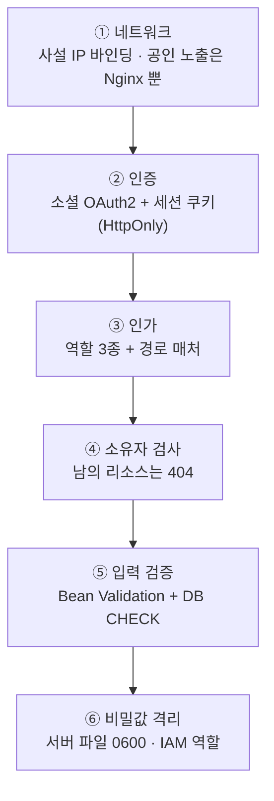
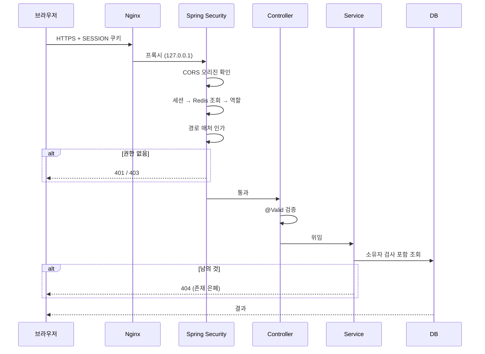

# 보안 구조

## 목적

시스템 전체의 보안 경계와 방어 계층을 정리한다.

## 현재 구현

### 방어 계층



### ① 네트워크 경계

| 서비스 | 바인딩 | 인터넷 노출 |
| --- | --- | --- |
| Nginx | `0.0.0.0:443` (추정) | ✓ |
| 백엔드 | `127.0.0.1` + `172.26.8.28` | ✗ |
| AI 서버 | `172.26.4.46` 만 | ✗ |
| PostgreSQL | 사설 | ✗ |

**AI 서버와 DB는 인터넷에서 닿을 수 없다.**

### ② 인증

| 항목 | 값 |
| --- | --- |
| 방식 | 소셜 OAuth2 (카카오·구글) |
| 세션 | `SESSION` HttpOnly 쿠키, Redis 저장 |
| 타임아웃 | 30분 |
| 비밀번호 | **없음** (`formLogin` 비활성, 컬럼 없음) |
| JWT | **미사용** |

비밀번호가 없어 유출·재사용·무차별 대입 공격 표면이 원천적으로 없다.
HttpOnly 쿠키라 XSS로 토큰을 훔칠 수 없다.

### ③ 인가

`SecurityConfig` 매처가 위에서부터 적용된다.

| 순서 | 대상 | 정책 |
| --- | --- | --- |
| 1 | `POST /internal/analysis-jobs/*/result` | `permitAll()` (+ 컨트롤러가 토큰 검증) |
| 2 | `/internal/**`, `/inference/**` | `denyAll()` |
| 3 | 공개 경로 7개 | `permitAll()` |
| 4 | Swagger | `permitAll()` |
| 5 | `/api/admin/**` | `hasRole("ADMIN")` |
| 6 | 나머지 | `hasAnyRole("USER","ADMIN")` |

**`denyAll()` 이 `permitAll()` 바로 다음에 있다.** 내부 경로를 통째로 닫고 딱 하나만 연다.

역할 3종 — `ROLE_SIGNUP_PENDING` · `ROLE_USER` · `ROLE_ADMIN`.
가입 대기를 독립 역할로 둬서 `authenticated()` 만으로 통과하지 못하게 했다.

### ④ 소유자 검사 — 404로 은폐

```java
// AnalysisCallbackService
// 없는 작업도 404 다. 토큰을 통과한 뒤이므로 존재 여부를 알려도 되지만, 굳이
// 다른 문구를 주어 jobId 를 훑을 단서를 남기지 않는다.
```

`api.js` 도 "남의 견적은 404" 라고 적었다. **403이 아니라 404** — 존재 여부 자체를 숨긴다.

### ⑤ 내부 API 2중 방어

`AnalysisCallbackController` javadoc:

> `X-Internal-Token` 공유 비밀과 **네트워크 차단**(사설 IP) 두 겹으로 막는다.

토큰만으로도, 네트워크만으로도 부족하다고 본 설계다.

### ⑥ 비밀값 격리

| 위치 | 보호 |
| --- | --- |
| `/etc/a307/backend.env` | `root` 0600 |
| `/etc/a307/ai.env` | `root` 0600 (실측 확인) |
| AWS | **IAM 역할** — 액세스 키 없음 |
| GitLab CI 변수 | 비밀 아닌 것 2개만 |
| 저장소 | `.env` 는 `.gitignore` |

`backend/Dockerfile` — "환경변수는 파일로 넣는다. **명령줄에 키를 적으면 `ps` 에 보인다.**"

`.gitlab-ci.yml` — "CI 변수로 옮기면 파이프라인 로그·아티팩트·포크 MR 로 새어 나갈 경로가
늘어난다."

`AI/server/app/core/config.py` 첫 줄 — "secrets never live in the repository."

### ⑦ 컨테이너 보안

| 항목 | 백엔드 | AI |
| --- | --- | --- |
| 실행 사용자 | `uid 1001` (`a307`) | `uid 1001` (`a307`) |
| 메모리 상한 | `MaxRAMPercentage=75` | `--memory=6g` |
| 재시작 | `unless-stopped` | `unless-stopped` |
| 외부 네트워크 | 필요 시만 | `HF_HUB_OFFLINE=1` |

**둘 다 root로 돌지 않는다.**

### ⑧ 파일 업로드 경계

| 방어 | 내용 |
| --- | --- |
| 키를 서버만 만든다 | 사용자 파일명이 경로에 안 들어간다 |
| 타입 제한 | `image/jpeg` · `image/png` |
| 크기 제한 | 20MB (앱 + DB CHECK) |
| 버킷 분리 | staging(업로드) / service(서비스) |
| presigned 한시적 | 그 객체만, 제한 시간 |

상세는 [파일 업로드 보안](파일_업로드_보안.md)에 있다.

### ⑨ 데이터 보호

| 항목 | 처리 |
| --- | --- |
| EXIF | `RESIZED` · `THUMBNAIL` 에서 제거 |
| 질의 벡터 | **저장하지 않음** (요청 메모리만) |
| 임시 파일 | `TemporaryDirectory` 로 자동 삭제 |
| 탈퇴 | CASCADE로 전파 |
| AI 서버 DB 권한 | **읽기 전용** |

### ⑩ 감사

`audit_log` 테이블과 인덱스 4개(`actor` · `target` · `created` · `action`)가 있다.
`audit` 패키지 5개 파일이 기록한다.

## 🔴 확인된 위험

| 위험 | 내용 | 영향 |
| --- | --- | --- |
| **CSRF 비활성화** | `.csrf(csrf -> csrf.disable())` | SPA + 쿠키 세션인데 CSRF 토큰이 없다. `SameSite` 속성 확인 필요 |
| **S3 객체 미삭제** | DB CASCADE가 S3까지 가지 않음 | 탈퇴 후에도 사진이 S3에 남을 수 있다 |
| **원본 EXIF 보존** | `ORIGINAL` 은 EXIF 유지 | 위치 정보 포함 가능 |
| **`nonEstimableReason` 노출** | 화면이 코드를 그대로 출력 | 내부 코드가 사용자에게 보인다 (정보 노출은 경미) |
| **`VITE_AUTH_GUARD`** | `.env.example` 에 없는 목업 스위치 | 운영 빌드에서 켜지면 목업 데이터 표시 |
| **베이스 이미지 미고정** | 다이제스트 고정 없음 | 재빌드 시 베이스가 바뀔 수 있다 |
| **보안 스캔 부재** | CI에 SAST·의존성 스캔 없음 | 알려진 취약점 탐지 못함 |

## 동작 흐름 (요청 하나의 보안 경로)



## 주요 구성 요소

- `backend/src/main/java/com/ssafy/a307/config/SecurityConfig.java`
- `backend/src/main/java/com/ssafy/a307/auth/`
- `backend/src/main/java/com/ssafy/a307/accident/image/AccidentImageKeys.java`
- `AI/server/app/core/security.py`
- `.gitignore`

## 설정 및 실행 방법

[환경변수 목록](../07_인프라/환경변수_목록.md) 참고. 모든 비밀값은 [보안 정보 제외].

## 오류 및 예외 처리

[예외처리](../03_백엔드/예외처리.md) 참고.

## 근거 자료

- 소스·설정 직접 확인
- 2026-09-21 서버 파일 권한 실측

## 확인 필요 항목

- **`SameSite` 쿠키 속성** — CSRF 비활성화의 보완책인지 확인하지 못함
- **TLS 설정·인증서** — Nginx 설정이 없어 확인하지 못함
- **방화벽 규칙** — 확인하지 못함
- **S3 버킷 정책·퍼블릭 액세스 차단** — 확인하지 못함
- **세션 고정 공격 방어** — `sessionManagement` 설정을 확인하지 못함
- **Rate limiting** — `TOO_MANY_REQUESTS` 코드는 있으나 적용 지점을 확인하지 못함
- **의존성 취약점** — 스캔 도구가 없어 확인하지 못함
