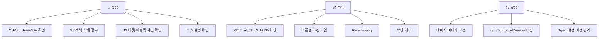
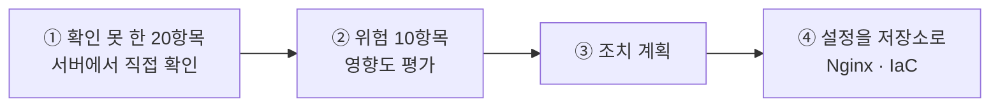

# 보안 점검표

## 목적

확인된 항목과 확인하지 못한 항목을 체크리스트로 정리한다.
**"확인 안 됨" 은 "문제 있음" 이 아니라 "저장소에서 근거를 찾지 못함" 이다.**

## 현재 구현

### ✅ 확인된 방어

| # | 항목 | 근거 |
| --- | --- | --- |
| 1 | 비밀번호를 저장하지 않는다 | `formLogin` 비활성, `member` 에 비밀번호 컬럼 없음 |
| 2 | 세션 쿠키가 HttpOnly | `api.js` 주석, Spring Session 기본 |
| 3 | 세션 30분 만료 | `server.servlet.session.timeout=30m` |
| 4 | 역할 기반 인가 | `SecurityConfig` 매처 6단 |
| 5 | 관리자 경로 분리 | `/api/admin/**` → `hasRole("ADMIN")` |
| 6 | 내부 경로 기본 차단 | `/internal/**` · `/inference/**` → `denyAll()` |
| 7 | 내부 API 2중 방어 | `X-Internal-Token` + 사설 IP |
| 8 | 존재 은폐 (404) | 남의 리소스·없는 작업 모두 404 |
| 9 | CORS 오리진 목록 지정 | `CORS_ALLOWED_ORIGINS` (와일드카드 아님) |
| 10 | AWS 액세스 키 없음 | IAM 역할 사용 |
| 11 | 최소 권한 IAM | `ListAllMyBuckets` 거부 확인 |
| 12 | 비밀값을 파일로만 | `/etc/a307/*.env` root 0600 |
| 13 | CI 변수에 비밀 없음 | 공개 값 2개뿐 |
| 14 | 명령줄에 키 안 적음 | `--env-file` 사용 |
| 15 | `.env` gitignore | `!.env.example` 만 추적 |
| 16 | 컨테이너 비-root | `uid 1001` × 2 |
| 17 | 컨테이너 메모리 상한 | AI `--memory=6g` |
| 18 | AI 서버 DB 읽기 전용 | 쓰기 경로 없음 |
| 19 | AI 서버 AWS 자격증명 없음 | presigned URL만 |
| 20 | AI 외부 네트워크 차단 | `HF_HUB_OFFLINE=1` |
| 21 | S3 키를 서버만 생성 | `AccidentImageKeys` |
| 22 | 파일명이 키에 안 들어감 | 경로 조작 방지 |
| 23 | 업로드 타입·크기 3중 검증 | 프론트 + 서버 + DB CHECK |
| 24 | 버킷 분리 (staging/service) | `ObjectStorageProperties` |
| 25 | EXIF 제거 (파생본) | `ImageVariant` 주석 |
| 26 | 질의 벡터 미저장 | `AI/server/README.md` |
| 27 | 임시 파일 자동 삭제 | `TemporaryDirectory` |
| 28 | 입력 검증 | `@Valid` + DB CHECK 다수 |
| 29 | 낙관적 락 | 관리자 마스터 `VERSION_CONFLICT` |
| 30 | 멱등성 3단 검증 | AI 콜백 `requestId` |
| 31 | 감사 로그 테이블 | `audit_log` + 인덱스 4 |
| 32 | 자동 재시도 없음 | `api.js` — 429 증폭 방지 |
| 33 | LLM 무한 재시도 차단 | `ABANDONED` 종결 |
| 34 | 탈퇴 시 CASCADE | FK 전파 |
| 35 | 오류 메시지에 힌트 없음 | jobId 훑기 방지 주석 |

### ⚠️ 확인된 위험

| # | 항목 | 내용 | 권고 |
| --- | --- | --- | --- |
| 1 | **CSRF 비활성화** | `.csrf(csrf -> csrf.disable())`. SPA + 쿠키 세션 | `SameSite=Lax/Strict` 확인. 없으면 설정 |
| 2 | **S3 객체 미삭제** | DB CASCADE가 S3까지 안 감 | 탈퇴·삭제 시 S3 정리 경로 추가 |
| 3 | **원본 EXIF 보존** | 위치 정보 포함 가능 | 보존 기간 정책 수립 |
| 4 | **`VITE_AUTH_GUARD` 미문서화** | `.env.example` 에 없는 목업 스위치 | 문서화하거나 운영 빌드에서 차단 |
| 5 | **베이스 이미지 미고정** | 다이제스트 없음 | `@sha256:` 고정 검토 |
| 6 | **보안 스캔 부재** | CI에 SAST·의존성 스캔 없음 | GitLab SAST·Dependency Scanning 검토 |
| 7 | **Nginx 설정 미추적** | 저장소에 없음 | `infra/nginx/` 로 버전 관리 |
| 8 | **역방향 마이그레이션 부재** | down 스크립트 없음 | 스키마 롤백 절차 수립 |
| 9 | **`nonEstimableReason` 노출** | 코드를 화면에 그대로 출력 | 한국어 매핑 추가 |
| 10 | **내용 기반 파일 검증 미확인** | Content-Type 위조 가능 | 매직 바이트 검사 확인 |

### ❓ 확인하지 못한 항목

**현재 작업공간에서 근거를 확인하지 못한 것들이다.**

| # | 항목 | 왜 확인 못 했나 |
| --- | --- | --- |
| 1 | TLS 버전·암호화 스위트 | Nginx 설정이 저장소에 없음 |
| 2 | 인증서 발급·갱신 | 동일 |
| 3 | HSTS·CSP·X-Frame-Options 헤더 | 동일 |
| 4 | `SameSite` 쿠키 속성 | 설정을 찾지 못함 |
| 5 | 세션 고정 공격 방어 | `sessionManagement` 설정 미확인 |
| 6 | 동시 세션 제한 | 설정 미확인 |
| 7 | 방화벽 규칙 | 보안 그룹/ufw 설정 미확인 |
| 8 | S3 버킷 정책·퍼블릭 차단 | 확인 불가 |
| 9 | S3 버킷 CORS | 확인 불가 |
| 10 | S3 암호화 (SSE) | 확인 불가 |
| 11 | IAM 역할 정책 내용 | 확인 불가 |
| 12 | Rate limiting | `TOO_MANY_REQUESTS` 코드만 있음 |
| 13 | `ROLE_ADMIN` 부여 경로 | 코드에서 찾지 못함 |
| 14 | 토큰 비교 방식 (상수 시간) | `matches()` 구현 미확인 |
| 15 | 의존성 취약점 | 스캔 도구 없음 |
| 16 | SSH 접근 통제 | 확인 불가 |
| 17 | 백업 암호화 | 확인 불가 |
| 18 | 개인정보 처리방침 문안 | 화면은 있으나 내용 미확인 |
| 19 | 로그에 개인정보 포함 여부 | 전수 검사 못 함 |
| 20 | 바이러스 검사 | 없는 것으로 추정 |

### 점검 우선순위

## 동작 흐름

점검 절차 제안이다.

④가 핵심이다. **Nginx 설정과 IaC가 저장소에 없어서** 확인 못 한 항목의 절반이 발생했다.
설정을 코드로 관리하면 점검·리뷰·이력이 모두 해결된다.

## 주요 구성 요소

- `backend/src/main/java/com/ssafy/a307/config/SecurityConfig.java`
- `backend/src/main/java/com/ssafy/a307/accident/image/AccidentImageKeys.java`
- `.gitlab-ci.yml` · `.gitignore`
- `AI/server/app/core/security.py`

## 설정 및 실행 방법

해당 없음 (점검 문서).

## 오류 및 예외 처리

해당 없음.

## 근거 자료

- 소스·설정 직접 확인
- 2026-09-21 서버 실측 (파일 권한, IAM 권한 거부)

## 확인 필요 항목

위 "확인하지 못한 항목" 20건 전체. 대부분 **서버 설정이 저장소 밖에 있어서** 생긴 공백이다.
