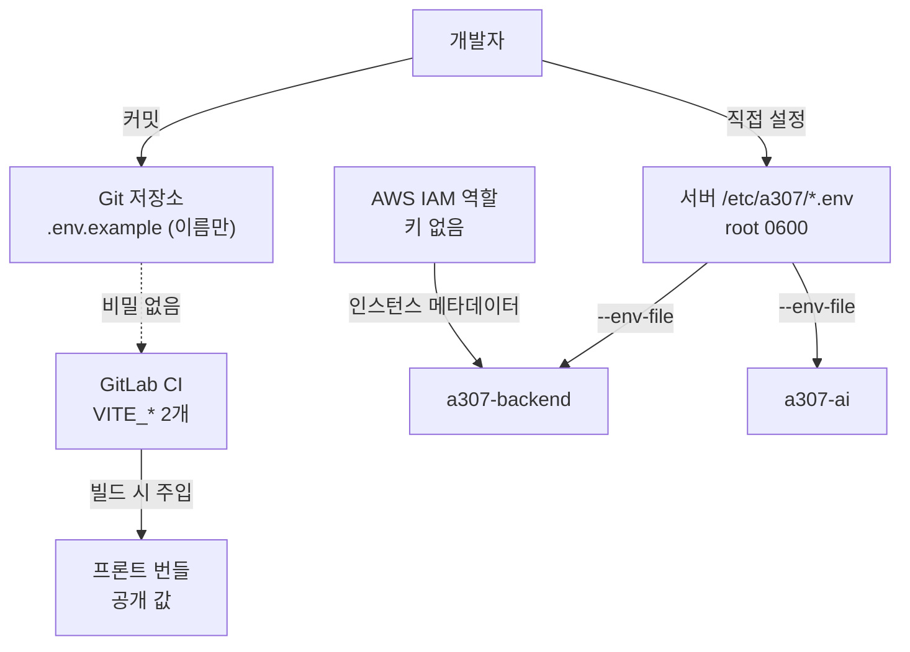

# 인증정보 관리

## 목적

비밀값이 어디에 있고 어떻게 보호되는지 정리한다.
**이 문서에 실제 값은 없다 — 전부 [보안 정보 제외].**

## 현재 구현

### 비밀값 목록 (이름만)

| 비밀값 | 위치 | 성격 |
| --- | --- | --- |
| `DB_PASSWORD` | `/etc/a307/backend.env` | DB 접속 |
| `KAKAO_CLIENT_SECRET` | `/etc/a307/backend.env` | OAuth2 |
| `GOOGLE_CLIENT_SECRET` | `/etc/a307/backend.env` | OAuth2 |
| `KAKAO_REST_API_KEY` | `/etc/a307/backend.env` | 카카오 로컬 API |
| `GMS_KEY` | `/etc/a307/backend.env` | LLM |
| `INTERNAL_API_TOKEN` | `/etc/a307/backend.env` | 내부 API 공유 비밀 |
| `AI_INTERNAL_TOKEN` | `/etc/a307/ai.env` | 위와 **같은 값** |
| `DATABASE_URL` | `/etc/a307/ai.env` | 읽기 전용 DB 접속 |
| AWS 자격증명 | **없음** | IAM 역할 사용 |
| SSH 키 | 운영자 로컬 `~/.ssh/*.pem` | 서버 접근 |

### 보관 원칙 4가지

**1. 저장소에 두지 않는다**

```
# .gitignore
.env
.env.*
!.env.example
```

`.env.example` 은 **이름만** 담는다. `AI/server/app/core/config.py` 첫 줄 —
"secrets never live in the repository."

**2. 서버 파일에만 둔다**

| 파일 | 권한 (실측) |
| --- | --- |
| `/etc/a307/backend.env` | 확인 필요 |
| `/etc/a307/ai.env` | `-rw------- root root` |

`ubuntu` 계정도 읽을 수 없다. `--env-file` 을 쓰려면 `sudo` 가 필요하다.

**3. CI 변수에 두지 않는다**

`.gitlab-ci.yml` 헤더:

> 백엔드 비밀값(DB·OAuth·AWS 키)은 서버의 `/etc/a307/backend.env` 에만 있고 컨테이너에
> `--env-file` 로 들어간다. **CI 변수로 옮기면 파이프라인 로그·아티팩트·포크 MR 로
> 새어 나갈 경로가 늘어난다.**
>
> GitLab CI/CD Variables 에 두는 것은 프론트 빌드값 둘뿐이다. 이 둘은 어차피 번들에 박혀
> 브라우저로 나가는 값이라 **비밀이 아니다.**

**4. 명령줄에 적지 않는다**

`backend/Dockerfile`:

> 환경변수는 파일로 넣는다. **명령줄에 키를 적으면 `ps` 에 보인다.**

`docker run -e SECRET=...` 은 `ps aux` 나 `docker inspect` 에 노출된다.
비밀이 아닌 설정(`GMS_MODEL` 등)만 `-e` 로 박는다.

### 비밀과 설정의 구분

같은 LLM 설정인데 처리가 다르다.

| 변수 | 위치 | 이유 |
| --- | --- | --- |
| `GMS_KEY` | `--env-file` | 비밀 |
| `GMS_PROVIDER` · `GMS_MODEL` · `GMS_OPENAI_API` | `docker run -e` | 비밀 아님 → 리뷰 가능하게 |

CI 주석 — "모델·호출 형식·워커 on/off 는 비밀이 아니라 위 `docker run` 에 `-e` 로 박아
**리뷰 가능하게** 둔다. `backend.env` 에는 이 여섯 이름을 적지 않는다 — 두 곳에 같은 이름이
있으면 어느 값이 쓰이는지 헷갈린다."

**같은 이름을 두 곳에 두지 않는다**는 규칙이 요점이다.

### AWS — 키가 없다

```gradle
// backend/build.gradle
// 자격증명은 기본 체인(로컬 aws configure · 배포 EC2 IAM 역할)을 쓰므로
// 액세스 키를 설정 파일에 두지 않는다.
```

| 환경 | 방식 |
| --- | --- |
| 배포 | 인스턴스 IAM 역할 (**키 없음**) |
| 로컬 | `~/.aws/credentials` |

**가장 안전한 방식이다.** 배포 환경에 유출될 키가 아예 없다.

이 조사에서 로컬 자격증명의 권한을 확인했다.

```
AccessDenied: User: arn:aws:iam::<계정>:user/a307-dev is not authorized to perform:
s3:ListAllMyBuckets
```

**최소 권한 IAM 사용자**다. 버킷 나열조차 안 된다.

### 공유 비밀 — 양쪽이 같아야 한다

| 쪽 | 변수 |
| --- | --- |
| 백엔드 | `INTERNAL_API_TOKEN` |
| AI 서버 | `AI_INTERNAL_TOKEN` |

이름이 다르지만 **값이 같아야** 한다. 헤더는 양쪽 다 `X-Internal-Token` 이다.

값이 어긋나면 콜백이 401로 막혀 분석 결과가 영영 도착하지 않는다.

### 브라우저로 나가는 값

`VITE_` 접두사 값은 번들에 박혀 **누구나 볼 수 있다.**

| 변수 | 왜 괜찮은가 |
| --- | --- |
| `VITE_API_BASE_URL` | 어차피 네트워크 탭에 보인다 |
| `VITE_KAKAO_JS_KEY` | JavaScript 키는 **도메인 제한**으로 보호된다 |

카카오 **REST API 키**(`KAKAO_REST_API_KEY`)는 성격이 달라 백엔드 환경변수다.

### 로깅 정책

확인된 로그 출력에서 비밀값 노출은 발견되지 않았다.

```java
log.warn("썸네일 조회 URL 발급 실패 key={}", s3Key, e);
```

S3 키(경로)는 찍지만 presigned URL 전체(서명 포함)는 찍지 않는다.

## 동작 흐름



## 주요 구성 요소

- `.gitignore`
- `backend/.env.example` · `frontend/.env.example`
- `.gitlab-ci.yml` 헤더 주석
- `backend/Dockerfile` 주석
- `AI/server/app/core/config.py`

## 설정 및 실행 방법

로컬 백엔드는 IntelliJ 실행 구성의 Environment variables에 넣는다.
Spring Boot는 `.env` 를 읽지 않는다.

`application.properties:376` 주석 — "IntelliJ 실행 구성의 Environment variables 에
`INTERNAL_API_TOKEN` 을 넣는다."

## 오류 및 예외 처리

| 증상 | 원인 |
| --- | --- |
| `Could not resolve placeholder` | 환경변수 누락 |
| `--env-file: permission denied` | `sudo` 누락 |
| 콜백 401 | 두 토큰 값 불일치 |
| AWS 권한 거부 | IAM 정책 부족 |

## 관련 소스코드

- `backend/src/main/resources/application.properties:376~391`
- `backend/build.gradle` — AWS 자격증명 주석
- `AI/server/app/core/security.py`

## 근거 자료

- 설정·주석 직접 확인
- 2026-09-21 파일 권한 실측 (`ls -l /etc/a307/ai.env`)
- IAM 권한 거부 응답 실측

## 확인 필요 항목

- **`/etc/a307/backend.env` 권한** — 확인하지 못함 (`ai.env` 와 같을 것으로 추정)
- **비밀값 순환 주기** — 정책을 확인하지 못함
- **IAM 역할 정책 내용** — 확인하지 못함
- **`internalApi.matches(token)` 비교 방식** — 상수 시간 비교인지 확인하지 못함
- **SSH 키 관리** — 접근 권한자·보관 방식을 확인하지 못함
- **로그 전수 검사** — 일부만 확인함. 비밀값 출력 여부를 전수 확인하지 못함
