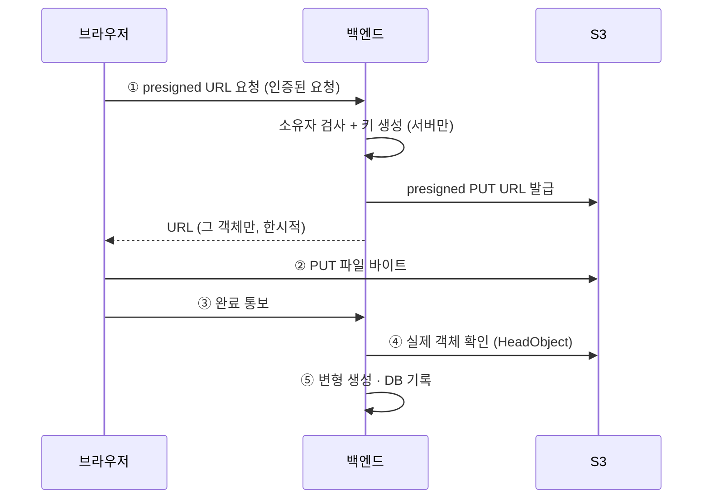
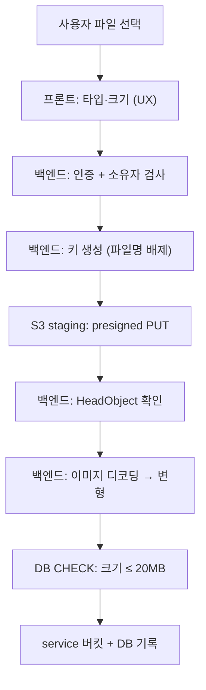

# 파일 업로드 보안

## 목적

브라우저가 S3에 직접 올리는 구조의 보안 장치를 정리한다.
파일 바이트가 백엔드를 거치지 않으므로 통제 지점이 다르다.

## 현재 구현

### 업로드 구조



**백엔드가 파일 바이트를 받지 않는다.** 대신 ①에서 권한을 통제하고 ④에서 실제를 확인한다.

### 방어 장치

#### 1. 키를 서버만 만든다

```java
/**
 * S3 키 규칙. 키는 서버만 만든다 — 요청으로 받지 않는다.
 * accidents/{accidentId}/images/{imageId}/{variant}.{ext}
 */
```

클라이언트가 키를 정하면 `../` 로 다른 사고의 객체를 덮어쓰거나 남의 사진을 읽을 수 있다.
**서버가 정하므로 구조적으로 불가능하다.**

#### 2. 원본 파일명을 키에 넣지 않는다

javadoc:

> 사용자 입력이 스토리지 경로에 들어가면 **경로 조작과 인코딩 문제**가 생긴다.
> 원본 파일명은 `accident_image.original_filename` 에만 둔다.

| 위험 파일명 | 결과 |
| --- | --- |
| `../../../etc/passwd` | 키에 안 들어가므로 무해 |
| `사진.jpg` · 이모지 | 인코딩 문제 없음 |
| 아주 긴 이름 | 키 길이 영향 없음 |

원본 파일명은 DB 컬럼(`VARCHAR(255)`)에만 들어간다. 화면에 그대로 출력하면 XSS 위험이
있지만, Vue가 기본적으로 이스케이프한다.

#### 3. 키 형식 검증 (양방향)

생성 시:

```java
if (accidentId <= 0) throw new IllegalArgumentException("accidentId must be positive");
if (imageId <= 0)    throw new IllegalArgumentException("imageId must be positive");
if (variant == null) throw new IllegalArgumentException("variant is required");
if (extension == null || extension.isBlank()) throw new IllegalArgumentException("extension is required");
```

사용 시:

```java
throw new IllegalArgumentException("storage key must end with /{variant}.{ext}");
```

#### 4. 타입·크기 제한

| 항목 | 값 | 강제 위치 |
| --- | --- | --- |
| 타입 | `image/jpeg` · `image/png` | 프론트 + 서버 |
| 사고 이미지 | 20MB | 프론트 + 서버 + **DB CHECK** |
| 프로필 이미지 | 5MB | 프론트 + 서버 |

```sql
CONSTRAINT ck_aia_size CHECK (file_size IS NULL OR file_size <= 20971520)
```

프론트 주석 — "최종 판정은 서버". **클라이언트 검증은 편의이고 신뢰 경계가 아니다.**

3중으로 막는다 — 프론트(UX), 서버(신뢰 경계), DB(최종 보루).

#### 5. 버킷 분리

| 버킷 | 용도 |
| --- | --- |
| staging | "업로드 격리용. 브라우저가 presigned PUT 으로 직접 올린다" |
| service | "서비스 본문. 검증 통과본·프로필 이미지·견적서 원본·검증 PDF 가 여기 있다" |

**브라우저가 직접 쓰는 곳과 서비스가 읽는 곳을 나눴다.** 검증 안 된 파일이 서비스 버킷에
들어가지 않는다.

#### 6. presigned URL 한계

| 성질 | 효과 |
| --- | --- |
| 객체 한정 | 그 키 하나만 |
| 메서드 한정 | PUT 또는 GET |
| 시간 한정 | 유효 시간 후 무효 |
| 자격증명 불포함 | AWS 키가 노출되지 않는다 |

**AI 서버는 AWS 자격증명이 없다.** presigned GET URL로만 이미지를 받는다.
AI 박스가 털려도 S3 전체가 열리지 않는다.

#### 7. EXIF 제거

| 변형 | EXIF |
| --- | --- |
| `ORIGINAL` | 유지 |
| `RESIZED` | **제거** |
| `THUMBNAIL` | **제거** |

`ImageVariant.java` 주석 그대로다. 외부(AI 서버·브라우저)로 나가는 변형에서 지운다.
EXIF에는 촬영 위치·기기 정보가 들어 있을 수 있다.

**원본에는 남는다.** 원본은 S3에만 있고 직접 서빙되지 않는 것으로 **추정**되나,
확인하지 못했다.

#### 8. 소유자 검사

presigned URL 발급은 **인증된 요청**이다. `/api/accidents/{accidentId}/images/upload-urls` 가
`hasAnyRole("USER","ADMIN")` 에 걸리고, 서비스가 그 사고의 소유자인지 확인한다.
남의 사고면 404다.

#### 9. 한 장 체계

사고당 사진 1장이다. 새로 올리면 이전 것을 지운다.
저장 공간이 무한정 늘어나지 않는다.

### 🔴 확인된 위험

| 위험 | 내용 |
| --- | --- |
| **S3 객체 미삭제** | DB CASCADE가 S3까지 안 간다. 탈퇴 후 사진이 남을 수 있음 |
| **원본 EXIF 보존** | 위치 정보 포함 가능. 보존 기간 정책 미확인 |
| **실제 내용 검증 부재** | Content-Type 헤더는 위조 가능. 매직 바이트 검사 여부 미확인 |
| **staging 정리** | 완료 통보를 안 하면 staging에 고아 객체가 남을 수 있음 |
| **버킷 CORS** | 브라우저 직접 PUT에 CORS가 필요한데 설정을 확인하지 못함 |

**실제 내용 검증**이 가장 주의할 점이다. 브라우저가 `image/jpeg` 라고 선언하고
실행 파일을 올릴 수 있다. 다만:

- 백엔드가 그 파일을 **이미지로 읽어 변형을 만든다** → 이미지가 아니면 거기서 실패한다
- S3 객체는 실행되지 않는다
- YOLO도 이미지가 아니면 실패한다

실질적 위험은 낮지만, `HeadObject` 로 Content-Type만 보는지 바이트를 검사하는지는
확인하지 못했다.

## 동작 흐름 (방어 지점)



## 주요 구성 요소

| 구성 요소 | 파일 |
| --- | --- |
| 키 규칙 | `accident/image/AccidentImageKeys.java` |
| 저장소 포트 | `accident/image/AccidentImageStoragePort.java` |
| S3 구현 | `accident/image/S3AccidentImageStorage.java` |
| 검증 예외 | `accident/image/AccidentImageValidationException.java` |
| 속성 | `accident/config/AccidentImageProperties.java` |
| 프론트 | `frontend/src/views/UploadView.vue`, `lib/api.js` |

## 설정 및 실행 방법

```
STORAGE_STAGING_BUCKET · STORAGE_SERVICE_BUCKET · AWS_REGION
app.accident-image.max-file-size-bytes
```

셋 중 하나라도 없으면 업로드 API가 `503` 이다.

## 오류 및 예외 처리

| 상황 | 결과 |
| --- | --- |
| 타입·크기 위반 | `AccidentImageValidationException` → `400 INVALID_REQUEST` |
| 키 형식 위반 | `IllegalArgumentException` |
| 버킷 미설정 | `503` |
| S3 장애 | `503`, 프론트가 `STORAGE` 로 분류 |
| presigned 만료 | PUT 실패 → `NETWORK` 재시도 |

## 관련 소스코드

- `backend/src/main/java/com/ssafy/a307/accident/image/AccidentImageKeys.java`
- `backend/src/main/java/com/ssafy/a307/accident/entity/ImageVariant.java`
- `Docs/Erd/A307_ddl_final.sql` — `ck_aia_size`

## 근거 자료

- `AccidentImageKeys.java` javadoc (설계 근거 3가지)
- DDL CHECK 제약
- 프론트 상수와 주석

## 확인 필요 항목

- **매직 바이트 검사 여부** — Content-Type 외에 실제 내용을 보는지 확인하지 못함
- **S3 버킷 CORS 설정** — 브라우저 직접 PUT에 필요
- **presigned URL 유효 시간** — 설정 키만 확인함
- **staging 고아 객체 정리** — 수명 주기 정책을 확인하지 못함
- **S3 객체 삭제 경로** — DB 삭제 시 S3를 지우는 코드를 찾지 못함
- **원본 EXIF 보존 기간** — 정책을 확인하지 못함
- **바이러스 검사** — 없는 것으로 추정
