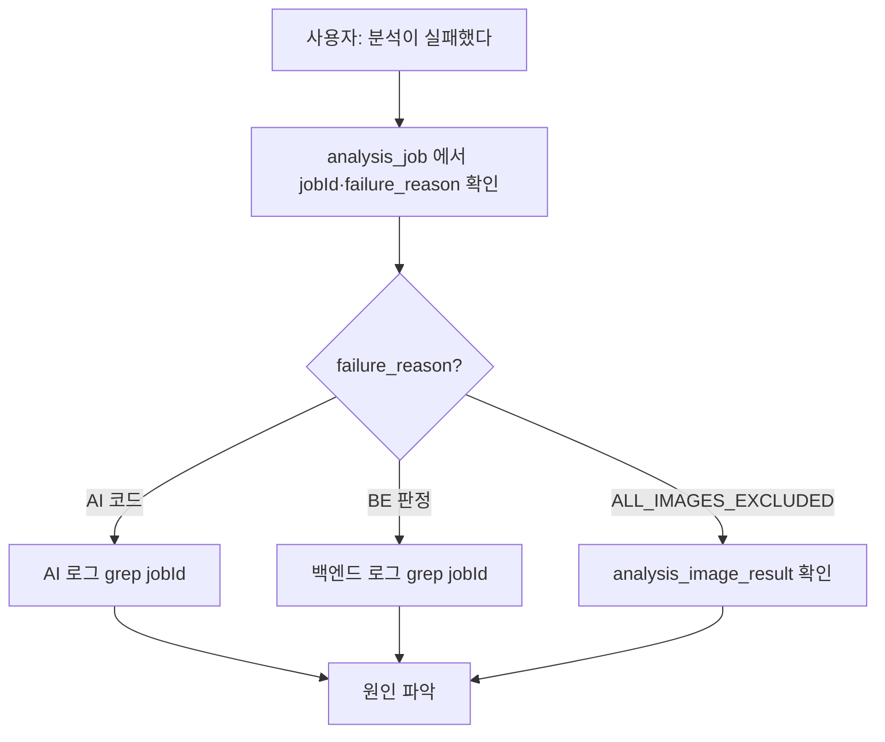

# 로그 확인

## 목적

어디서 무엇을 볼 수 있는지 정리한다.

## 현재 구현

### 로그 위치

| 대상 | 명령 | 보관 |
| --- | --- | --- |
| 백엔드 | `docker logs a307-backend` | 도커 기본 (json-file) |
| AI 서버 | `docker logs a307-ai` | 동일 |
| PostgreSQL | `docker logs a307-db` | 동일 |
| Nginx | `/var/log/nginx/` (추정) | 확인 필요 |
| GitLab CI | 파이프라인 잡 로그 | GitLab |

**중앙 로그 수집이 없다.** ELK·Loki 같은 도구 설정을 확인하지 못했다.

### 기본 명령

```bash
docker logs --tail 80 a307-backend
```

```bash
docker logs -f a307-ai
```

```bash
docker logs --since 1h a307-backend
```

CI도 실패 시 같은 방식을 쓴다.

```sh
echo "기동하지 못했다. 최근 로그 80줄:"
docker logs --tail 80 a307-ai || true
```

### 백엔드 로그 형식

Spring Boot 기본 형식이다.

```
2026-09-21T08:42:13.782+09:00  INFO 23408 --- [ionShutdownHook] com.zaxxer.hikari.HikariDataSource : HikariPool-17 - Shutdown initiated...
```

타임존은 `TZ=Asia/Seoul` (Dockerfile).

### 주요 로그 메시지

소스에서 확인된 것들이다. **이 문자열로 grep 하면 된다.**

#### 분석 콜백 (`AnalysisCallbackService`)

| 레벨 | 메시지 |
| --- | --- |
| INFO | `분석 결과 중복 수신 — 저장 생략. jobId={} requestId={} status={}` |
| WARN | `분석 실패 수신. jobId={} code={} retryable={}` |
| INFO | `전체 이미지 제외로 분석 실패. jobId={} images={}` |
| INFO | `분석 결과 수신. jobId={} estimable={} items={} images={}` |

#### 결과 적재 (`AnalysisResultPersister`)

| 레벨 | 메시지 |
| --- | --- |
| WARN | `알 수 없는 fallbackStage 를 비운다: {}` |
| WARN | `산정 근거를 직렬화하지 못해 비운다. partCode={}` |

#### 이미지 (`AccidentImageDownloadUrls`)

| 레벨 | 메시지 |
| --- | --- |
| WARN | `썸네일 조회 URL 발급 실패 key={}` |

#### S3 (`S3AccidentImageStorage`)

| 레벨 | 메시지 |
| --- | --- |
| ERROR | `{what}: key={}` (예: `이미지 메타를 읽지 못했다`, `이미지를 저장하지 못했다`) |

#### AI 서버 (`analysis_service.py`)

| 레벨 | 메시지 |
| --- | --- |
| ERROR | `analysis image fetch failed. jobId=%s` |
| ERROR | `analysis model failed. jobId=%s` |
| ERROR | `analysis query embedding failed. jobId=%s` |
| ERROR | `analysis output was invalid. jobId=%s` |
| ERROR | `mock analysis image fetch failed. jobId=%s` |

전부 `log.exception` 이라 스택 트레이스가 함께 남는다.

### `jobId` 로 추적하기

분석 하나를 끝까지 따라가는 방법이다.

```bash
docker logs a307-backend 2>&1 | grep "jobId=12"
```

```bash
docker logs a307-ai 2>&1 | grep "jobId=12"
```

**`jobId` 가 두 서버의 공통 상관 키다.** 백엔드가 만들고 AI에 넘기고 콜백에 다시 실린다.

`requestId` 도 같은 역할을 한다. 재분석하면 새로 발급되므로 **시도 단위** 추적에 쓴다.

### DB 기반 확인

로그보다 DB가 정확한 경우가 많다. 실패 사유가 컬럼에 남기 때문이다.

```bash
docker exec a307-db psql -U <계정> -d a307 -c "SELECT job_id, status, failure_reason, created_at, finished_at FROM analysis_job ORDER BY job_id DESC LIMIT 20;"
```

```bash
docker exec a307-db psql -U <계정> -d a307 -c "SELECT failure_reason, count(*) FROM analysis_job WHERE status='FAILED' AND created_at > now() - interval '7 days' GROUP BY 1 ORDER BY 2 DESC;"
```

```bash
docker exec a307-db psql -U <계정> -d a307 -c "SELECT job_id, image_id, is_excluded, exclusion_reason FROM analysis_image_result WHERE is_excluded ORDER BY result_id DESC LIMIT 20;"
```

### 감사 로그

`audit_log` 테이블에 관리자 행위가 남는다.

```bash
docker exec a307-db psql -U <계정> -d a307 -c "SELECT * FROM audit_log ORDER BY created_at DESC LIMIT 20;"
```

인덱스가 `actor` · `target` · `action` · `created_at` 에 있어 어느 축으로든 조회할 수 있다.

관리자 API로도 볼 수 있다 — `GET /api/admin/audit-logs`.

### 배치 실행 이력

```bash
docker exec a307-db psql -U <계정> -d a307 -c "SELECT * FROM batch_job_execution ORDER BY 1 DESC LIMIT 20;"
```

```bash
docker exec a307-db psql -U <계정> -d a307 -c "SELECT * FROM data_validation_error ORDER BY 1 DESC LIMIT 20;"
```

관리자 API — `GET /api/admin/batch-jobs`, `/batch-jobs/history`.

### 로그에 없는 것

| 항목 | 상태 |
| --- | --- |
| 비밀값 | **없음** (확인된 범위에서) |
| presigned URL 전체 | 없음 (S3 키만 찍는다) |
| 요청/응답 본문 | 없음 |
| 사용자 개인정보 | 확인 필요 |

`log.warn("썸네일 조회 URL 발급 실패 key={}", s3Key, e)` 처럼 **경로만** 찍고 서명이 붙은
URL은 찍지 않는다.

## 동작 흐름 (장애 추적)



**로그보다 DB를 먼저 본다.** 실패 사유가 구조화돼 저장되기 때문이다.

## 주요 구성 요소

- `docker logs` — 컨테이너 로그
- `analysis_job.failure_reason` — 구조화된 실패 사유
- `audit_log` · `batch_job_execution` · `data_validation_error`

## 설정 및 실행 방법

로그 레벨 설정은 `application.properties` 에서 확인하지 못했다. Spring Boot 기본(INFO)으로
**추정**된다.

AI 서버는 `PYTHONUNBUFFERED=1` 이라 로그가 즉시 나간다.

## 오류 및 예외 처리

| 증상 | 확인 |
| --- | --- |
| 로그가 안 보임 | `docker ps -a` 로 컨테이너 존재 확인 |
| 로그가 잘림 | 도커 로그 로테이션 설정 확인 |
| 옛날 로그 필요 | 컨테이너를 재생성하면 로그가 사라진다 |

**컨테이너를 재생성하면 이전 로그가 사라진다.** 배포 때마다 `docker rm -f` 하므로
**배포 전 로그는 남지 않는다.** 중요한 로그는 미리 보관해야 한다.

## 관련 소스코드

- `backend/src/main/java/com/ssafy/a307/analysis/callback/AnalysisCallbackService.java`
- `AI/server/app/services/analysis_service.py`
- `.gitlab-ci.yml` — 실패 시 로그 출력

## 근거 자료

- 소스의 `log.*` 호출 직접 확인
- DDL의 로그성 테이블

## 확인 필요 항목

- **도커 로그 로테이션 설정** — `max-size` · `max-file` 을 확인하지 못함
- **Nginx 로그 위치·형식** — 설정이 저장소에 없음
- **로그 레벨 설정** — `logging.level.*` 을 확인하지 못함
- **중앙 로그 수집** — 없는 것으로 추정
- **로그 보존 기간** — 확인하지 못함
- **개인정보 로깅 여부** — 전수 검사하지 못함
