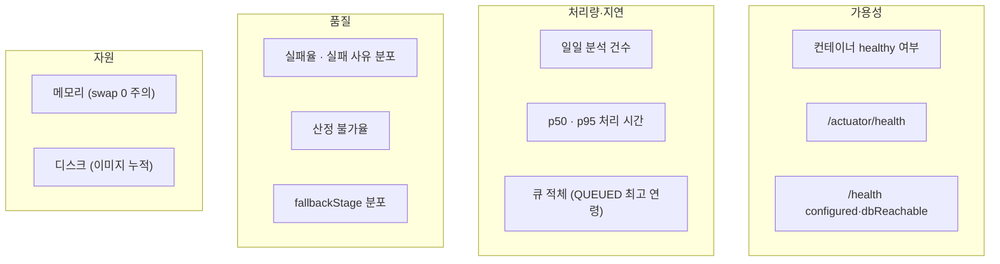
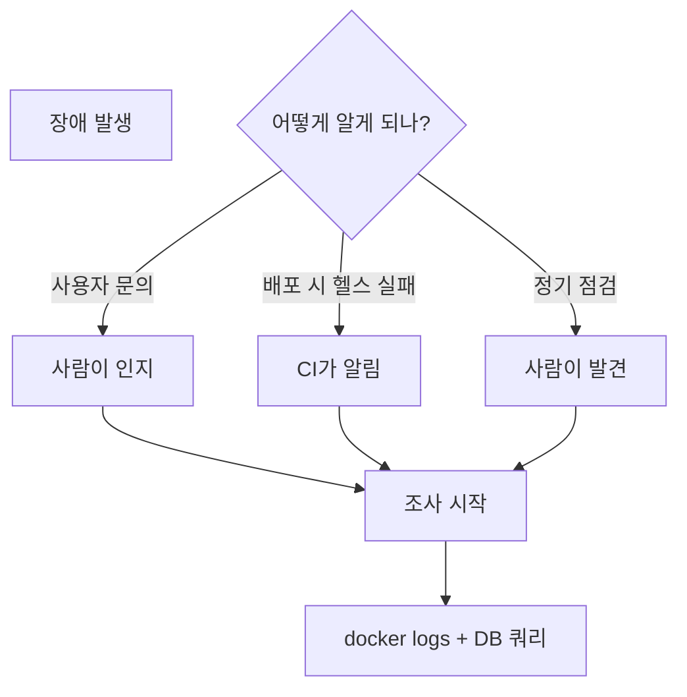

# 모니터링

## 목적

무엇을 어떻게 감시하는지, 그리고 **무엇이 없는지** 정리한다.

## 현재 구현

### 확인된 모니터링 수단

#### 1. 컨테이너 헬스체크

두 이미지 모두 `HEALTHCHECK` 를 갖는다.

| 대상 | 주기 | 타임아웃 | 시작 유예 | 재시도 |
| --- | --- | --- | --- | --- |
| 백엔드 | 30s | 3s | **90s** | 3 |
| AI 서버 | 30s | 5s | **60s** | 3 |

```bash
docker ps --format '{{.Names}}\t{{.Status}}'
```

`Status` 에 `(healthy)` / `(unhealthy)` 가 표시된다.

**`unhealthy` 가 되어도 도커가 재시작하지 않는다.** `--restart unless-stopped` 는 프로세스가
죽었을 때만 동작한다. 헬스체크 실패는 표시만 된다.

#### 2. Spring Boot Actuator

```properties
management.endpoints.web.exposure.include=health
```

**`health` 하나만 노출한다.** `metrics` · `prometheus` · `info` 는 닫혀 있다.

```bash
curl -sf http://127.0.0.1:8080/actuator/health
```

한계가 주석에 있다 — "**어댑터가 없어도 UP 이 뜬다.**" S3 버킷이 비어 있어도,
GMS 키가 없어도 UP이다. **기동 여부만 보증한다.**

#### 3. AI 서버 `/health`

백엔드보다 정보가 많다.

```json
{
  "status": "ok",
  "modelsLoaded": false,
  "embeddingModelLoaded": false,
  "dbReachable": true,
  "configured": true,
  "analysisProfile": "production",
  "embeddingConfigured": true,
  "partWeightsPresent": true,
  "damageWeightsPresent": true
}
```

**설정 누락과 DB 연결까지 본다.** 백엔드가 이 수준이면 더 좋았을 항목이다.

#### 4. DB 기반 지표

실질적인 서비스 상태는 DB로 본다.

**실패율**

```bash
docker exec a307-db psql -U <계정> -d a307 -c "SELECT status, count(*) FROM analysis_job WHERE created_at > now() - interval '1 day' GROUP BY 1;"
```

**실패 사유 분포**

```bash
docker exec a307-db psql -U <계정> -d a307 -c "SELECT failure_reason, count(*) FROM analysis_job WHERE status='FAILED' AND created_at > now() - interval '7 days' GROUP BY 1 ORDER BY 2 DESC;"
```

**큐 적체**

```bash
docker exec a307-db psql -U <계정> -d a307 -c "SELECT status, count(*), min(created_at) AS oldest FROM analysis_job WHERE status IN ('QUEUED','PROCESSING') GROUP BY 1;"
```

`oldest` 가 오래됐으면 워커가 멈췄거나 타임아웃 처리가 안 되는 것이다.

**처리 시간**

```bash
docker exec a307-db psql -U <계정> -d a307 -c "SELECT percentile_cont(0.5) WITHIN GROUP (ORDER BY finished_at - started_at) AS p50, percentile_cont(0.95) WITHIN GROUP (ORDER BY finished_at - started_at) AS p95 FROM analysis_job WHERE status='COMPLETED' AND created_at > now() - interval '1 day';"
```

`analysis_job` 에 `started_at` · `finished_at` 이 있어 계산할 수 있다.

**검색 품질**

```bash
docker exec a307-db psql -U <계정> -d a307 -c "SELECT ei.ref_condition->>'fallbackStage' AS stage, count(*) FROM estimate_item ei JOIN estimate e USING (estimate_id) WHERE e.created_at > now() - interval '7 days' GROUP BY 1;"
```

`ALL` 비율이 높으면 corpus 매칭이 잘 안 되고 있다는 신호다.

**산정 불가율**

```bash
docker exec a307-db psql -U <계정> -d a307 -c "SELECT non_estimable_reason, count(*) FROM estimate WHERE created_at > now() - interval '7 days' GROUP BY 1;"
```

#### 5. 시스템 자원

```bash
free -g
```

```bash
df -h
```

```bash
docker stats --no-stream
```

**AI 박스는 swap이 0이다.** 메모리 여유를 특히 봐야 한다.

### 🔴 없는 것

| 항목 | 상태 |
| --- | --- |
| APM (Datadog·New Relic 등) | 없음 |
| 메트릭 수집 (Prometheus) | 없음 (actuator에서 닫힘) |
| 대시보드 (Grafana) | 없음 |
| 중앙 로그 수집 (ELK·Loki) | 없음 |
| 알림 (PagerDuty·Slack) | 확인하지 못함 |
| 업타임 모니터링 | 확인하지 못함 |
| 오류 추적 (Sentry) | 없음 |
| 분산 추적 | 없음 |

**자동 알림이 없다.** 장애를 사람이 눈으로 발견하거나 사용자가 알려야 한다.

### 감시할 만한 지표 (권고)

이미 데이터가 있어 바로 볼 수 있는 것들이다.



### 디스크 주의

배포마다 이미지가 태그와 함께 쌓인다. 2026-09-21 AI 박스 실측으로 `a307-ai` 태그가
13개, 각 3.5GB대였다.

`docker image prune -f` 는 **dangling만** 지운다. 태그가 붙어 있으면 남는다.
롤백을 위해 필요하지만 무한정 쌓이면 디스크가 찬다.

```bash
docker images a307-ai --format '{{.Tag}}\t{{.Size}}'
```

```bash
df -h /var/lib/docker
```

## 동작 흐름 (현재 감시 방식)



**자동 감지 경로가 배포 시점뿐이다.** 운영 중 장애는 사람이 발견해야 한다.

## 주요 구성 요소

- `backend/Dockerfile` · `AI/server/Dockerfile` — HEALTHCHECK
- `backend/src/main/resources/application.properties:75` — actuator 노출 제한
- `AI/server/app/api/routes.py:30~42` — `/health`
- `analysis_job` · `estimate` 테이블 — 지표 원천

## 설정 및 실행 방법

추가 설정 없이 위 명령으로 확인한다.

Prometheus를 쓰려면 `management.endpoints.web.exposure.include` 에 `prometheus` 를 추가하고
`micrometer-registry-prometheus` 의존성이 필요하다. 다만 이 저장소는 **새 의존성을 넣지 않는
관례**가 있다 ([기술적 의사결정](../01_전체_아키텍처/기술적_의사결정.md)).

## 오류 및 예외 처리

| 증상 | 확인 |
| --- | --- |
| `unhealthy` 표시 | 헬스 엔드포인트 직접 호출 |
| 큐 적체 | 워커 스위치·로그 확인 |
| 메모리 부족 | `docker stats` · OOM 로그 |
| 디스크 부족 | `docker images` 정리 검토 |

## 관련 소스코드

- 위 주요 구성 요소 참고

## 근거 자료

- Dockerfile HEALTHCHECK 설정
- `application.properties` actuator 설정
- DDL의 타임스탬프 컬럼 (`started_at` · `finished_at`)
- 2026-09-21 실측 (이미지 13개, 메모리 15GB)

## 확인 필요 항목

- **알림 연동** — Slack·Mattermost 웹훅을 확인하지 못함
- **업타임 모니터링** — 외부 서비스 사용 여부를 확인하지 못함
- **`분석 응답 시간 측정 (S15P21A307-159).md`** — 문서 존재는 확인했으나 내용을 확인하지 못함
- **SLA·목표 지표** — "2초" 기준이 언급되나 공식 목표를 확인하지 못함
- **도커 로그 로테이션** — 디스크 압박 요인이 될 수 있으나 설정을 확인하지 못함
