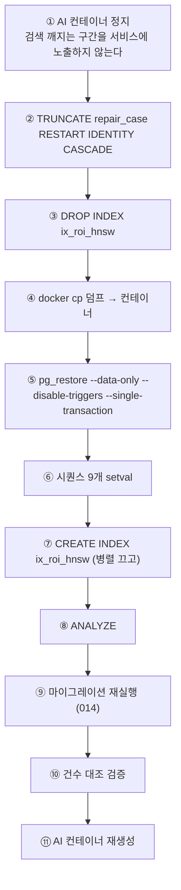

# 백업과 복구

## 목적

백업 방식과 복구 절차를 정리한다. 2026-09-21 v2 corpus 이관에서 실제로 수행한 절차가
그대로 참고가 된다.

## 현재 구현

### 백업 대상

| 대상 | 방식 | 확인 |
| --- | --- | --- |
| PostgreSQL | `pg_dump -Fc` | 수동 (확인됨) |
| S3 객체 | (확인 필요) | |
| Redis 세션 | 볼륨 (`a307-redisdata`) | 백업 불필요 — 유실 시 재로그인 |
| 설정 파일 | (확인 필요) | `/etc/a307/*.env` |
| 소스코드 | Git (GitLab) | ✓ |
| 도커 이미지 | 서버 로컬 태그 | 레지스트리 없음 |

**자동 백업 스케줄을 확인하지 못했다.** 이관 시점에 수동으로 뜬 덤프만 확인됐다.

### 확인된 백업 명령

```bash
pg_dump -Fc --data-only
```

| 옵션 | 의미 |
| --- | --- |
| `-Fc` | custom 포맷 (압축·선택적 복원 가능) |
| `--data-only` | 스키마 제외, 데이터만 |

2026-09-21 기준 corpus 10개 테이블 덤프가 **1.15GB** 였다.
저장 위치는 `/home/ubuntu/db-backup/` 이다.

`--data-only` 를 쓴 이유는 스키마가 정본 DDL과 마이그레이션으로 관리되기 때문이다.

전체 백업이 필요하면 `--data-only` 를 빼면 된다.

### 복구 절차 (corpus 이관 기준)

2026-09-21에 실제로 수행한 순서다.



#### 각 단계의 근거

**① AI 정지** — `DROP INDEX` 부터 `CREATE INDEX` 끝까지(30분~1시간) 검색이 인덱스 없이 돈다.
304k × 768차원 순차 스캔이라 느리고, restore와 DB를 두고 경합한다.

**② TRUNCATE CASCADE** — corpus 10개 테이블만 건드린다. 확인 결과 그 바깥에서 참조하는
테이블은 0건이라 `accident` · `analysis_job` · `estimate` 는 안전하다.

**③ 인덱스 삭제** — DDL 주석의 실측값 때문이다.

```sql
-- 주의: 대량 적재 전에 만들면 INSERT 가 느려집니다 (실측 11.4만건 65초).
```

**⑤ restore 옵션**

```bash
docker exec a307-db pg_restore -U <계정> -d a307 \
  --data-only --disable-triggers --single-transaction \
  --no-owner --no-privileges /tmp/corpus.dump
```

| 옵션 | 이유 |
| --- | --- |
| `--disable-triggers` | `--data-only` 는 테이블을 이름순으로 넣는데 FK 방향과 어긋난다 |
| `--single-transaction` | 실패 시 통째로 롤백 (`--exit-on-error` 포함) |
| `--no-owner` `--no-privileges` | 소유권·권한을 건드리지 않는다 |

**`--disable-triggers` 는 슈퍼유저 권한이 필요하다.**

파이프(`<`) 대신 `docker cp` 를 쓰는 이유 — pg_restore가 custom 포맷을 되감아야 한다.

**⑥ 시퀀스 보정** — `TRUNCATE ... RESTART IDENTITY` 로 시퀀스가 1로 돌아갔는데,
`--data-only` restore는 명시적 ID를 넣을 뿐 시퀀스를 올리지 않는다. 보정하지 않으면
다음 INSERT에서 PK 충돌이 난다.

BIGSERIAL 9개가 대상이다 (`repair_case_damage_feature_part_mapping` 은 복합 PK라 제외).

**⑦ 인덱스 재생성 — `/dev/shm` 함정**

```
ERROR: could not resize shared memory segment to 2144374176 bytes: No space left on device
```

컨테이너 `/dev/shm` 이 64MB라 pgvector 병렬 빌드가 실패한다. 병렬을 끈다.

```sql
SET max_parallel_maintenance_workers=0;
SET maintenance_work_mem='2GB';
CREATE INDEX ix_roi_hnsw ON repair_case_roi_embedding USING hnsw (embedding vector_cosine_ops);
```

단일 스레드라 304,114건에 30분~1시간이 걸린다.

**⑧ ANALYZE** — 통계는 restore로 따라오지 않는다. 없으면 플래너가 엉뚱한 계획을 고른다.

**⑨ 검증 — 유일한 안전장치**

`--disable-triggers` 로 FK 검사를 껐으므로 **건수 대조가 유일한 확인 수단**이다.

| 항목 | 기대 | 실제 |
| --- | --: | --: |
| `repair_case` | 39,676 | ✓ |
| `repair_case_image` | 168,297 | ✓ |
| `repair_case_damage_feature` v1 | 205,977 | ✓ |
| `repair_case_damage_feature` v2 | 347,086 | ✓ |
| `repair_case_roi_embedding` | 304,114 | ✓ |

### 실제로 겪은 실패 2건

**1. TRUNCATE를 건너뛰고 restore**

```
pg_restore: error: COPY failed for table "repair_case": ERROR: duplicate key value
violates unique constraint "repair_case_pkey" DETAIL: Key (case_id)=(1880) already exists.
```

`--single-transaction` 덕분에 **통째로 롤백**돼 DB가 그대로였다. 이 옵션의 가치를 보여 준 사례다.

**2. `/dev/shm` 부족으로 인덱스 생성 실패**

위 ⑦ 참고. 병렬을 꺼서 해결했다.

### 데이터 손실 범위

| 대상 | 백업으로 복구 가능? |
| --- | --- |
| corpus (`repair_case` 계열) | ✓ 덤프 있음. 파이프라인 재실행도 가능 |
| 사용자 데이터 (`member` · `accident` · `estimate`) | **확인 필요** — 백업 여부 미확인 |
| S3 객체 | **확인 필요** |
| 설정 파일 | **확인 필요** |

**corpus는 재생성 가능하다** — AI-Hub 원천 데이터와 `pipeline/jobs/` 로 다시 만들 수 있다.
그러나 시간이 오래 걸린다.

**사용자 데이터는 재생성이 불가능하다.** 백업 여부가 가장 중요한 확인 항목이다.

### 주의사항

```
docker system prune -a --volumes    → 운영 DB 볼륨이 사라진다
docker compose down -v              → 같은 이유
```

`estimate_item.ref_condition.referencedCaseIds` 는 FK 없는 JSONB라 corpus를 교체하면
**기존 견적의 사례 링크가 깨진다.** 데이터 손실은 아니지만 옛 견적의 "참조 사례" 상세가
다른 사례를 가리킨다.

## 주요 구성 요소

- `/home/ubuntu/db-backup/` — 덤프 위치
- `Docs/Erd/A307_ddl_final.sql` — 스키마 정본
- `pipeline/sql/` — 마이그레이션
- `pipeline/jobs/` — corpus 재생성

## 설정 및 실행 방법

**백업**

```bash
docker exec a307-db pg_dump -U <계정> -d a307 -Fc --data-only > /home/ubuntu/db-backup/a307-$(date +%Y%m%d).dump
```

**복구** — 위 10단계 참고.

작업 전 디스크 여유를 확인한다.

```bash
docker exec a307-db df -h /tmp
```

## 오류 및 예외 처리

| 증상 | 원인 | 조치 |
| --- | --- | --- |
| `duplicate key` | 기존 데이터 미삭제 | TRUNCATE 먼저 |
| `permission denied` (`--disable-triggers`) | 슈퍼유저 아님 | 슈퍼유저 계정 사용 |
| `No space left on device` (shm) | `/dev/shm` 64MB | 병렬 빌드 끄기 |
| restore 중 SSH 끊김 | 트랜잭션 롤백 | `nohup` 으로 백그라운드 실행 |
| 건수 불일치 | FK 검사 껐으므로 데이터 문제 | 다시 restore |

## 관련 소스코드

- `Docs/Erd/A307_ddl_final.sql:1096~1099` — 인덱스 주의사항
- `pipeline/sql/014_repair_case_price_tier_backfill.sql`

## 근거 자료

- 2026-09-21 v2 corpus 이관 전 과정 실측
- DDL 주석의 실측값

## 확인 필요 항목

- **자동 백업 스케줄** — cron 등 설정을 확인하지 못함. **가장 중요한 확인 항목**
- **사용자 데이터 백업** — corpus 외 테이블 백업 여부를 확인하지 못함
- **백업 보존 기간·세대 관리** — 확인하지 못함
- **백업 외부 보관** — 같은 박스에만 있으면 박스 장애 시 함께 잃는다
- **S3 객체 백업·버전 관리** — 확인하지 못함
- **설정 파일 백업** — `/etc/a307/*.env` 유실 시 복구 방법을 확인하지 못함
- **복구 목표 시간(RTO)·시점(RPO)** — 정의를 확인하지 못함
- **복구 훈련** — 수행 기록을 확인하지 못함
