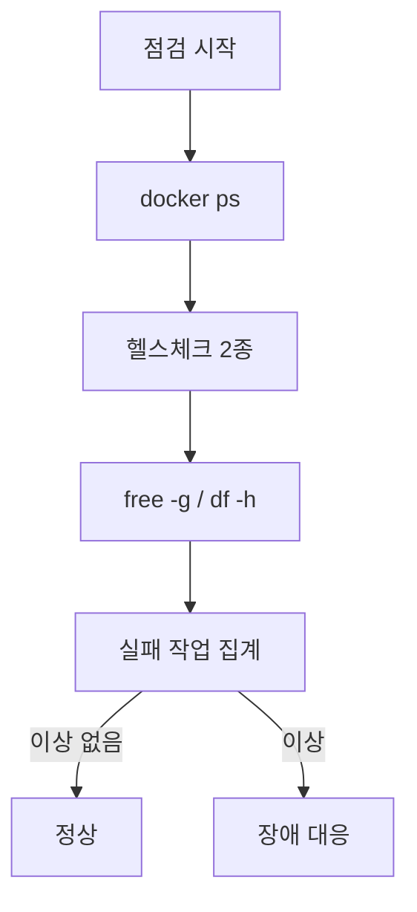

# 운영 가이드

## 목적

일상적인 운영 작업의 명령과 순서를 모은다.

## 현재 구현

### 접속

| 대상 | 방법 |
| --- | --- |
| BE 박스 | `ssh -i <키> ubuntu@<BE 박스>` |
| AI 박스 | `ssh -i <키> ubuntu@<AI 박스>` |
| 운영 DB | AI 박스에서 `docker exec a307-db psql -U <계정> -d a307` |

DB 계정·비밀번호는 [보안 정보 제외]. `docker exec` 로 컨테이너 안에서 접속하므로
비밀번호 없이 들어간다(peer/trust 인증으로 **추정**).

### 상태 확인

```bash
docker ps --format '{{.Names}}\t{{.Status}}'
```

```bash
curl -sf http://127.0.0.1:8080/actuator/health
```

```bash
curl http://172.26.4.46:8000/health
```

```bash
free -g
```

```bash
df -h
```

### 컨테이너 조작

**AI 서버 재시작 (코드·env 변경 없음)**

```bash
docker restart a307-ai
```

**AI 서버 재생성 (env 변경 시 필수)**

```bash
IMG=$(docker inspect -f '{{.Config.Image}}' a307-ai)
```

```bash
sudo docker rm -f a307-ai
```

```bash
sudo docker run -d --name a307-ai -p 172.26.4.46:8000:8000 --env-file /etc/a307/ai.env --memory=6g --memory-swap=6g --cpus=3 --restart unless-stopped "$IMG"
```

**`--env-file` 은 생성 시점에만 읽힌다.** `docker restart` 로는 환경변수가 안 바뀐다.

**작업 중 서비스 내리기**

```bash
docker stop a307-ai
```

`--restart unless-stopped` 라 손으로 stop 하면 자동 복구되지 않는다.

### 🔴 절대 치면 안 되는 명령

```
docker system prune -a --volumes
docker compose down -v
```

**AI 박스에 운영 DB가 있다.** 위 명령은 `repair_case` 93,964건을 포함한 corpus를 통째로
지운다. 이미지 정리는 `docker image prune -f` (dangling만)까지다.

### 환경변수 확인·변경

```bash
docker exec a307-ai env | grep FEATURE_PIPELINE_VERSION_ID
```

```bash
docker exec a307-backend env | grep -E "BUCKET|AWS_REGION"
```

**값이 비밀일 수 있으므로 문서·채팅에 옮기지 않는다.**

변경은 파일 수정 + 컨테이너 재생성이다.

```bash
sudo grep -n FEATURE_PIPELINE_VERSION_ID /etc/a307/ai.env
```

```bash
sudo sed -i 's/^FEATURE_PIPELINE_VERSION_ID=.*/FEATURE_PIPELINE_VERSION_ID=2/' /etc/a307/ai.env
```

`sed` 는 줄이 없으면 조용히 아무것도 안 한다. **수정 전후로 `grep` 해서 확인한다.**

### 기능 스위치

| 스위치 | 효과 |
| --- | --- |
| `ANALYSIS_REQUEST_WORKER_ENABLED` | 분석 요청 워커 |
| `ESTIMATE_NARRATIVE_WORKER_ENABLED` | LLM 요약 |
| `REPAIR_CHECKLIST_WORKER_ENABLED` | 체크리스트 |
| `REPAIR_QUESTION_WORKER_ENABLED` | 정비소 질문 |
| `ESTIMATE_PDF_ENABLED` | 견적 PDF |
| `VALIDATION_PDF_ENABLED` | 검증 PDF |
| `FEATURE_PIPELINE_VERSION_ID` | corpus 버전 (AI) |
| `ANALYSIS_PROFILE` | `production` / `mock` (AI) |

LLM 관련은 `docker run -e` 로 박혀 있어 CI 파일을 고쳐야 한다.

### DB 작업

**건수 확인**

```bash
docker exec a307-db psql -U <계정> -d a307 -c "SELECT count(*) FROM repair_case;"
```

**현재 실행 중인 쿼리**

```bash
docker exec a307-db psql -U <계정> -d a307 -c "SELECT now()-xact_start AS elapsed, state, wait_event_type, left(query,70) AS query FROM pg_stat_activity WHERE datname='a307' AND state<>'idle';"
```

**인덱스 생성 진행률**

```bash
docker exec a307-db psql -U <계정> -d a307 -c "SELECT phase, tuples_done, tuples_total FROM pg_stat_progress_create_index;"
```

**긴 쿼리 취소**

```bash
docker exec a307-db psql -U <계정> -d a307 -c "SELECT pid, pg_cancel_backend(pid) FROM pg_stat_activity WHERE query LIKE 'CREATE INDEX%' AND pid <> pg_backend_pid();"
```

### 오래 걸리는 작업

SSH가 끊기면 작업도 죽는다. `nohup` 으로 건다.

```bash
nohup docker exec a307-db psql -U <계정> -d a307 -c "<긴 SQL>" > ~/work.log 2>&1 &
```

```bash
jobs
```

```bash
cat ~/work.log
```

**psql 출력은 파일로 리다이렉트하면 버퍼링된다.** 도는 중에는 로그가 비어 보이는 것이 정상이다.
진행 상황은 `pg_stat_activity` 나 `pg_stat_progress_*` 로 본다.

### 스키마 마이그레이션 적용

1. 파이프라인이 `migration-guard` 에서 멈춘다
2. 로그에 찍힌 SQL 파일을 운영 DB에 적용

```bash
docker exec -i a307-db psql -U <계정> -d a307 -v ON_ERROR_STOP=1 < ~/S15P21A307/pipeline/sql/<파일>.sql
```

3. 가드 로그에 찍힌 `echo` 명령을 그대로 붙여 원장에 기록
4. 파이프라인 재실행

`-v ON_ERROR_STOP=1` 을 꼭 붙인다. 없으면 오류가 나도 계속 진행한다.

### 일상 점검

| 주기 | 항목 |
| --- | --- |
| 배포 후 | 헬스 3종, 스모크 |
| 수시 | `docker ps`, `free -g`, `df -h` |
| 수시 | 실패 작업 확인 (아래) |

```bash
docker exec a307-db psql -U <계정> -d a307 -c "SELECT failure_reason, count(*) FROM analysis_job WHERE status='FAILED' AND created_at > now() - interval '1 day' GROUP BY 1 ORDER BY 2 DESC;"
```

## 동작 흐름



## 주요 구성 요소

- `Docs/Architecture/인프라 실행 교본.md`
- `Docs/Architecture/배포 준비 체크리스트.md`
- `Docs/Architecture/운영 DB 마이그레이션 적용 절차.md`

## 설정 및 실행 방법

위 명령 참고.

## 오류 및 예외 처리

[장애 대응](장애_대응.md) 참고.

## 관련 소스코드

- `.gitlab-ci.yml`
- `docker-compose.yml`

## 근거 자료

- CI·Dockerfile 주석
- 2026-09-21 v2 corpus 이관 실측
- `Docs/Architecture/인프라 실행 교본.md` 의 확인 명령

## 확인 필요 항목

- **DB 계정 인증 방식** — `docker exec psql` 이 비밀번호 없이 되는 이유를 확인하지 못함(peer/trust 추정)
- **`인프라 실행 교본.md` 전체 내용** — 일부 줄만 확인함
- **정기 점검 주기** — 공식 절차를 확인하지 못함
- **당직·연락 체계** — 확인하지 못함
