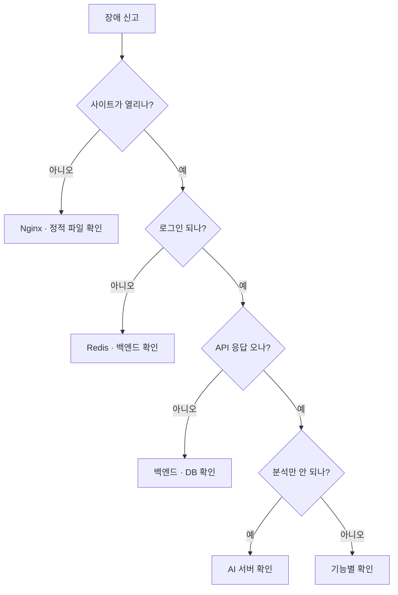

# 장애 대응

## 목적

장애 유형별 판단 순서와 조치를 정리한다.

## 현재 구현

### 장애 분류와 영향 범위

| 장애 | 영향 | 심각도 |
| --- | --- | --- |
| Nginx 중단 | 전체 접속 불가 | 🔴 최상 |
| **DB 중단** | 백엔드까지 기동 불가 | 🔴 최상 |
| 백엔드 중단 | 전체 기능 불가 (정적 페이지만) | 🔴 상 |
| Redis 중단 | 전원 로그아웃. 데이터 손실 없음 | 🟡 중 |
| AI 서버 중단 | 분석만 불가. 나머지 정상 | 🟡 중 |
| S3 장애 | 업로드·이미지 조회 불가 | 🟡 중 |
| GMS 장애 | 체크리스트·요약 불가 | ⚪ 하 |
| 카카오 API 장애 | 정비소 검색 불가 | ⚪ 하 |

**DB 중단이 가장 위험하다.** `ddl-auto=validate` 때문에 백엔드가 재기동도 못 한다.
게다가 DB가 AI 박스에 있어 **AI 박스 장애 = 전체 장애**다.

### 판단 순서



### 1차 확인 명령

```bash
docker ps --format '{{.Names}}\t{{.Status}}'
```

```bash
curl -sf http://127.0.0.1:8080/actuator/health
```

```bash
curl http://172.26.4.46:8000/health
```

```bash
free -g
```

```bash
df -h
```

### 유형별 조치

#### AI 서버 중단

```bash
docker logs --tail 80 a307-ai
```

| 로그 | 원인 | 조치 |
| --- | --- | --- |
| `model weights not found` | 가중치 누락 | 이미지 재빌드 |
| `ultralytics is not installed` | 의존성 문제 | 이미지 재빌드 |
| OOM 관련 | 메모리 초과 | 메모리 상한·동시성 확인 |
| DB 연결 실패 | `DATABASE_URL` | env 확인 |

재시작:

```bash
docker restart a307-ai
```

안 되면 이전 이미지로 재생성 — [롤백 절차](../08_배포_CICD/롤백_절차.md).

**AI가 죽어 있는 동안** 분석 요청은 `AI_UNREACHABLE` 로 실패한다.
`processing-timeout` 이 지난 건은 워커가 `ABANDONED` 로 정리한다. 큐가 무한정 쌓이지 않는다.

#### 백엔드 중단

```bash
docker logs --tail 80 a307-backend
```

| 로그 | 원인 | 조치 |
| --- | --- | --- |
| 스키마 검증 실패 | `ddl-auto=validate` 불일치 | **마이그레이션 적용** |
| `Could not resolve placeholder` | 환경변수 누락 | `backend.env` 확인 |
| DB 연결 실패 | DB 중단 또는 자격증명 | DB 먼저 복구 |
| `ExitOnOutOfMemoryError` | OOM | 메모리 확인 |

**스키마 불일치가 가장 흔한 기동 실패다.** 코드는 새 스키마를 기대하는데 DB가 옛날인 경우다.

#### DB 중단

```bash
docker ps -a --filter name=a307-db
```

```bash
docker logs --tail 80 a307-db
```

```bash
docker start a307-db
```

**볼륨이 살아 있으면 데이터는 그대로다.** 컨테이너만 다시 올리면 된다.

볼륨까지 날아간 경우는 [백업과 복구](백업과_복구.md) 참고.

DB 복구 후 **백엔드도 재시작**해야 한다. 기동 시 연결에 실패했으면 살아나지 않는다.

#### 메모리 부족 (AI 박스)

**swap이 0이라 여유가 없으면 바로 OOM kill이다.**

```bash
free -g
```

```bash
docker stats --no-stream
```

| 조치 | 내용 |
| --- | --- |
| 즉시 | 불필요한 프로세스 종료 |
| 단기 | AI 컨테이너 재시작 (모델 캐시 해제) |
| 중기 | `--memory` 하향 또는 DB 분리 |

인덱스 생성 같은 무거운 DB 작업은 `maintenance_work_mem` 을 낮춰 잡는다.

#### 디스크 부족

```bash
df -h
```

```bash
docker images a307-ai --format '{{.Tag}}\t{{.Size}}'
```

배포마다 3.5GB대 이미지가 쌓인다. 오래된 태그를 골라 지운다.

```bash
docker rmi a307-ai:<오래된 태그>
```

**🔴 `docker system prune -a --volumes` 를 치지 않는다.** 운영 DB 볼륨이 사라진다.

#### 큐 적체

```bash
docker exec a307-db psql -U <계정> -d a307 -c "SELECT status, count(*), min(created_at) AS oldest FROM analysis_job WHERE status IN ('QUEUED','PROCESSING') GROUP BY 1;"
```

| 상황 | 원인 |
| --- | --- |
| `QUEUED` 가 쌓임 | 워커 꺼짐 (`*_WORKER_ENABLED`) |
| `PROCESSING` 이 오래됨 | AI 무응답. `processing-timeout` 후 `ABANDONED` |

```bash
docker exec a307-backend env | grep WORKER_ENABLED
```

#### 분석 실패가 늘어남

```bash
docker exec a307-db psql -U <계정> -d a307 -c "SELECT failure_reason, count(*) FROM analysis_job WHERE status='FAILED' AND created_at > now() - interval '1 day' GROUP BY 1 ORDER BY 2 DESC;"
```

| 사유 | 원인 | 조치 |
| --- | --- | --- |
| `ALL_IMAGES_EXCLUDED` | 모델이 차량을 못 알아봄 | 입력 사진 품질 확인 |
| `IMAGE_FETCH_FAILED` | S3 또는 presigned 만료 | S3 상태 확인 |
| `MODEL_ERROR` | YOLO 실패 | AI 로그 |
| `INTERNAL` | 검색·비용 조회 실패 | DB·인덱스 확인 |
| `AI_UNREACHABLE` | AI 중단 | AI 복구 |
| `ABANDONED` | 타임아웃 | AI 성능·큐 확인 |

#### 검색 품질 저하

```bash
docker exec a307-db psql -U <계정> -d a307 -c "SELECT indexname FROM pg_indexes WHERE tablename='repair_case_roi_embedding';"
```

`ix_roi_hnsw` 가 없으면 순차 스캔이라 매우 느리다. **오류는 안 나고 느리기만 하다.**

```bash
docker exec a307-db psql -U <계정> -d a307 -c "SELECT ei.ref_condition->>'fallbackStage' AS stage, count(*) FROM estimate_item ei JOIN estimate e USING (estimate_id) WHERE e.created_at > now() - interval '1 day' GROUP BY 1;"
```

전부 `ALL` 이면 `model_id` · `price_tier` 가 비었을 수 있다.

```bash
docker exec a307-db psql -U <계정> -d a307 -c "SELECT count(*) AS total, count(model_id) AS with_model, count(price_tier) AS with_tier FROM repair_case;"
```

#### LLM 기능 실패

```bash
docker exec a307-backend env | grep GMS
```

`GMS_KEY` 가 없으면 503이다. 반복 실패는 `ABANDONED` 로 종결돼 **크레딧을 계속 태우지 않는다.**

### 복구 우선순위


**DB가 먼저다.** 백엔드가 DB 없이는 기동조차 못 한다.

### 서비스 저하 모드

전체를 내리지 않고 일부만 끄는 방법이다.

| 상황 | 조치 |
| --- | --- |
| AI 불안정 | AI 컨테이너 정지 → 분석만 실패, 나머지 정상 |
| LLM 비용·장애 | `*_WORKER_ENABLED=false` → 체크리스트만 중단 |
| PDF 문제 | `ESTIMATE_PDF_ENABLED=false` |

**기능별 스위치가 있어 부분 차단이 가능하다.**

## 주요 구성 요소

- `Docs/Architecture/인프라 실행 교본.md`
- `Docs/Architecture/배포 준비 체크리스트.md`
- `analysis_job.failure_reason` — 구조화된 실패 사유

## 설정 및 실행 방법

위 명령 참고. 환경변수 변경은 **컨테이너 재생성**이 필요하다.

## 오류 및 예외 처리

이 문서 전체가 해당 내용이다.

## 관련 소스코드

- `backend/src/main/java/com/ssafy/a307/analysis/request/AnalysisRequestWorker.java` — `ABANDONED`
- `AI/server/app/services/analysis_service.py` — 오류 분류

## 근거 자료

- 소스·CI 주석
- 2026-09-21 실측 (`/dev/shm`, 메모리, 이미지 누적)

## 확인 필요 항목

- **장애 알림 체계** — 자동 감지·알림이 없다. 사람이 발견해야 함
- **당직·에스컬레이션** — 확인하지 못함
- **장애 기록 양식** — 포스트모템 절차를 확인하지 못함
- **`인프라 실행 교본.md` 의 장애 절** — 전체를 확인하지 못함 (`:674` 에 오류 표가 있는 것은 확인)
- **RTO·RPO** — 정의를 확인하지 못함
