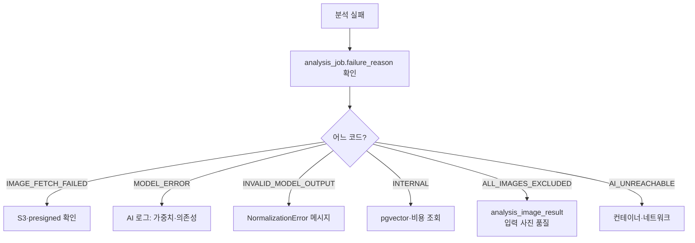

# AI 오류

## 목적

AI 서버에서 발생하는 오류와 진단 방법을 정리한다.

## 현재 구현

### 오류 코드 체계

AI 서버는 계약상 **4개 코드만** 콜백에 실을 수 있다.

| 코드 | `retryable` | 발생 예외 |
| --- | --- | --- |
| `IMAGE_FETCH_FAILED` | `true` | `ImageFetchError` |
| `MODEL_ERROR` | `true` | `ModelRunError` |
| `INVALID_MODEL_OUTPUT` | `false` | `QueryEmbeddingError`, `ValueError` |
| `INTERNAL` | `true` | `VectorSearchError`, `CostRepositoryError` |

`QueryEmbeddingError` 가 `retryable: false` 인 이유가 주석에 있다 —
"같은 입력으로 다시 해도 같다."

검색·비용 실패가 `INTERNAL` 로 뭉뚱그려지는 것은 계약이 4종만 허용하기 때문이다
(`AI/server/README.md`).

### HTTP 상태

| 상태 | `detail.code` | 상황 |
| --- | --- | --- |
| 401 | — | `X-Internal-Token` 불일치 |
| 404 | `IMAGE_FETCH_FAILED` | 이미지 다운로드 실패 |
| 422 | `INVALID_MODEL_OUTPUT` | 모델 출력 형식 오류 |
| 500 | `MODEL_ERROR` | YOLO 실행 실패 |
| 501 | `ANALYSIS_ORCHESTRATOR_NOT_IMPLEMENTED` | 검색·견적 서비스 미주입 |
| 503 | `PIPELINE_NOT_CONFIGURED` | `FEATURE_PIPELINE_VERSION_ID` 가 0 |
| 503 | `COST_DATA_UNAVAILABLE` | `DATABASE_URL` 없음·조회 실패 |

### 증상별 진단

#### 서버가 안 뜸

```bash
docker logs --tail 80 a307-ai
```

| 로그 | 원인 | 조치 |
| --- | --- | --- |
| `model weights not found: <경로>` | 가중치 파일 없음 | 이미지에 포함됐는지 확인 |
| `ultralytics is not installed` | 의존성 누락 | 이미지 재빌드 |
| `ModuleNotFoundError: shared.vision` | 디렉터리 구조 평탄화 | Dockerfile COPY 경로 확인 |
| `ImportError: libGL.so.1` | `libgl1` 누락 | 이미지 재빌드 |

`shared.vision` import 실패는 Dockerfile 주석이 경고한 문제다 —
"평평하게 복사하면 둘 다 깨진다."

#### `/health` 가 `configured: false`

```bash
docker exec a307-ai env | grep -E "AI_INTERNAL_TOKEN|FEATURE_PIPELINE_VERSION_ID"
```

```python
@property
def has_required_runtime_config(self) -> bool:
    return bool(self.internal_token) and self.pipeline_version_id > 0
```

둘 중 하나라도 비면 `false` 다. `FEATURE_PIPELINE_VERSION_ID` 가 `0`(기본값)이면
`/inference` · `/search` 가 **503** 이다.

#### `/health` 가 `dbReachable: false`

`DATABASE_URL` 이 잘못됐거나 DB가 죽었다.

```bash
docker exec a307-db psql -U <계정> -d a307 -c "SELECT 1;"
```

#### `modelsLoaded: false` 가 계속됨

**기동 직후에는 정상이다.** 지연 로드라 첫 추론 때 올라온다.

CI 주석 — "`modelsLoaded` 로 판정하지 않는다."

분석을 한 번 돌린 뒤에도 `false` 면 추론이 한 번도 성공하지 않은 것이다.

#### 첫 분석이 매우 느림

YOLO 2종 + DINOv2를 메모리에 올린다. **30초~1분이 걸릴 수 있다.**
컨테이너를 재생성할 때마다 첫 사용자가 이 비용을 부담한다.

#### 모든 사진이 제외됨 (`ALL_IMAGES_EXCLUDED`)

백엔드가 판정하는 값이지만 원인은 AI 쪽이다.

```bash
docker exec a307-db psql -U <계정> -d a307 -c "SELECT job_id, image_id, is_excluded, exclusion_reason, jsonb_array_length(COALESCE(detections,'[]'::jsonb)) AS detections FROM analysis_image_result WHERE job_id=(SELECT max(job_id) FROM analysis_job);"
```

| 결과 | 해석 |
| --- | --- |
| `NOT_VEHICLE` + detections 0 | 모델이 아무것도 못 찾았다 |
| `RATIO_BELOW_THRESHOLD` | 차량이 너무 작게 찍혔다 |

`exclusion_reason` 은 DB CHECK로 2종만 허용된다.

**입력 사진을 먼저 의심한다.** `Docs/AI/이미지 입력 및 검색 corpus 결정사항.md` 가
데모 입력을 "손상 부위 중심의 가까운 사진" 으로 한정했고, "임의의 모든 부품을 지원한다고
설명하지 않는다" 고 적었다.

#### 손상은 찾았는데 견적이 안 나옴

`nonEstimableReason` 을 본다.

| 값 | 의미 | 원인 |
| --- | --- | --- |
| `PART_NOT_RESOLVED` | 사진 전부 제외 | 위 항목 참고 |
| `NO_DAMAGE_DETECTED` | 차는 찍혔는데 손상 미검출 | 손상이 약하거나 모델이 못 잡음 |
| `INSUFFICIENT_CASES` | 유사 사례 부족 | corpus 매칭 실패 |

`INSUFFICIENT_CASES` 는 `MIN_CASE_COUNT = 2` 미달이다.

**부품이 확정되지 않으면(`VECTOR_ONLY`) 견적 항목이 되지 못한다.** 이것이 설계다 —
"부품을 틀리게 부여하는 것보다 null 이 견적 안전성 측면에서 낫다."

#### 검색이 느림

```bash
docker exec a307-db psql -U <계정> -d a307 -c "SELECT indexname FROM pg_indexes WHERE tablename='repair_case_roi_embedding';"
```

`ix_roi_hnsw` 가 없으면 304,114행 순차 스캔이다. **오류는 안 나고 느리기만 하다.**

#### `fallbackStage` 가 전부 `ALL`

```bash
docker exec a307-db psql -U <계정> -d a307 -c "SELECT count(*) AS total, count(model_id) AS with_model, count(price_tier) AS with_tier FROM repair_case;"
```

`with_model` 이 0이면 `MODEL` · `PRICE_TIER` 단계를 못 탄다.
2026-09-21 이관 후 33,379/39,676 (84%)다.

#### 임베딩 모델 버전 불일치

`AI/server/README.md` — "활성 `embedding_model_version`이 이 모델명·버전과 일치하지 않으면
**검색을 거부한다.**"

```bash
docker exec a307-db psql -U <계정> -d a307 -c "SELECT * FROM embedding_model_version WHERE is_active;"
```

```bash
docker exec a307-ai env | grep EMBEDDING_MODEL_VERSION
```

두 값이 같아야 한다. 전처리가 다른 벡터를 비교하는 사고를 막는 장치다.

#### 콜백이 도착하지 않음

| 확인 | 명령 |
| --- | --- |
| AI 로그 | `docker logs a307-ai \| grep jobId=<번호>` |
| 백엔드 수신 여부 | `docker logs a307-backend \| grep jobId=<번호>` |
| 백엔드 사설 IP 바인딩 | `docker port a307-backend` |
| 토큰 일치 | 두 env의 토큰 값 |

AI는 1·5·20초 간격 최대 4회 시도한다. 전부 실패하면 백엔드는
`processing-timeout` 후 `ABANDONED` 로 정리한다.

#### `NormalizationError` (`INVALID_MODEL_OUTPUT`)

`yolo_adapter` 가 raw 출력을 11가지로 검증한다. 흔한 것들이다.

| 메시지 | 의미 |
| --- | --- |
| `unknown part class_name: '...'` | 모델 클래스가 카탈로그에 없다 |
| `class map mismatch for class_id N` | 클래스 맵과 이름이 어긋남 |
| `image_id must match the backend imageId` | 엉뚱한 이미지 결과 |
| `part and damage outputs must have the same original image dimensions` | 두 모델 입력 크기 불일치 |
| `part detection must return segmentation: null` | detect 인데 마스크가 왔다 |
| `damage segmentation model returned boxes without masks` | segment 인데 마스크가 없다 |

**가중치를 교체하면 클래스 이름이 달라져 여기서 걸린다.**

### 🔴 알려진 위험

[모델 성능과 한계](../04_AI/모델_성능과_한계.md)에 정리한 것들이다.

| 위험 | 내용 |
| --- | --- |
| part 가중치가 segmentation | `task=segment` 실측 확인. README가 교체 필요를 명시 |
| 성능 지표 부재 | mAP 등을 저장소에서 확인하지 못함 |
| 동시성 1 | 분석이 직렬화된다 |
| GPU 없음 | CPU 추론이라 느리다 |

## 동작 흐름 (진단 순서)



## 주요 구성 요소

- `AI/server/app/services/analysis_service.py` — 예외 → 코드 변환
- `AI/server/app/adapters/yolo_adapter.py` — 검증 11종
- `AI/server/app/api/routes.py` — HTTP 상태
- `AI/server/app/core/config.py` — `has_required_runtime_config`

## 설정 및 실행 방법

```bash
curl http://172.26.4.46:8000/health
```

```bash
docker logs --tail 80 a307-ai
```

```bash
docker exec a307-ai env | grep -E "FEATURE_PIPELINE_VERSION_ID|ANALYSIS_PROFILE"
```

## 오류 및 예외 처리

이 문서 전체가 해당 내용이다.

## 관련 소스코드

- `AI/server/app/services/analysis_service.py:115~145` — except 절
- `AI/server/app/adapters/yolo_adapter.py:51~152` — 검증
- `AI/server/README.md`

## 근거 자료

- 소스 직접 확인
- 2026-09-21 운영 `/health` 실측
- 가중치 직접 로드 확인

## 확인 필요 항목

- **콜백 4회 실패 후 AI 동작** — 로그만 남기는지 확인하지 못함
- **`searchability == "EXCLUDED"`** — 필터는 있으나 설정 경로를 찾지 못함
- **AI 서버 로그 레벨** — 설정을 확인하지 못함
- **추론 시간 실측** — 확인하지 못함
