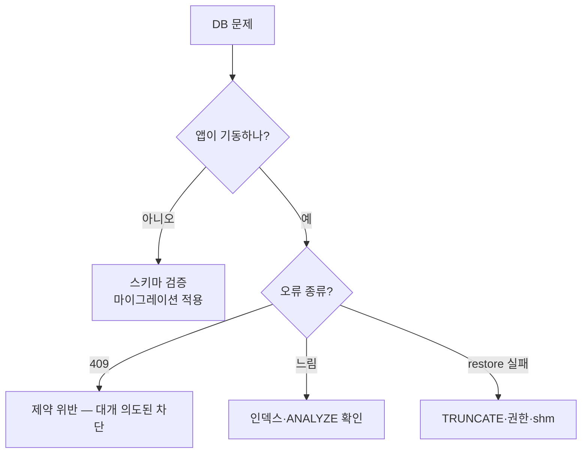

# 데이터베이스 오류

## 목적

PostgreSQL·pgvector에서 겪는 문제와 해결법을 정리한다.
2026-09-21 corpus 이관에서 실제로 부딪힌 사례가 다수 포함돼 있다.

## 현재 구현

### ① 스키마 검증 실패 (가장 흔한 치명적 오류)

```properties
spring.jpa.hibernate.ddl-auto=validate
```

**앱 전체가 기동하지 않는다.** 그 API만이 아니다.

| 상황 | 조치 |
| --- | --- |
| 운영 | 미적용 마이그레이션을 찾아 적용 |
| 로컬 | `docker compose down -v && docker compose up -d` |

로컬은 `docker-entrypoint-initdb.d` 가 **데이터 디렉터리가 비어 있을 때만** 실행된다.
DDL을 바꿔도 볼륨이 남아 있으면 반영되지 않는다.

`docker-compose.yml` 주석 — "로컬 DB 가 낡아서 `ddl-auto=validate` 가 실패하는 사고가
**이미 한 번 있었으니**, DDL 커밋을 pull 하면 이 절차를 밟는다."

**⚠️ 운영 박스에서는 `down -v` 를 절대 치지 않는다.**

### ② 제약 위반

#### UNIQUE

| 제약 | 의미 |
| --- | --- |
| `ux_job_inflight` | 이미 진행 중인 분석이 있다 (의도된 차단) |
| `uk_aia (image_id, variant)` | 같은 이미지·변형 중복 |
| `uk_est (job_id, version)` | 같은 버전 견적 중복 |
| `uk_air (job_id, image_id)` | 같은 결과 중복 |
| `uk_fpv (pipeline_name, version)` | 파이프라인 버전 중복 |
| `ux_fpv_active` / `ux_emv_active` | 활성 버전이 둘 이상 |

**부분 UNIQUE 7개**가 `WHERE status IN ('QUEUED','PROCESSING')` 조건으로 걸려 있다.
중복 작업을 DB가 막는다. 위반은 **설계대로 동작하는 것**이다.

`DataIntegrityViolationException` → `409 CONFLICT` 로 변환된다.

#### CHECK

| 제약 | 허용 값 |
| --- | --- |
| `ck_aj_status` | `QUEUED` `PROCESSING` `COMPLETED` `FAILED` |
| `ck_aj_retry` | 0 ~ 3 |
| `ck_air_reason` | `NOT_VEHICLE` `RATIO_BELOW_THRESHOLD` |
| `ck_ei_method` | `coating` `sheet_metal` `exchange` `repair` |
| `ck_est_grade` | NULL `HIGH` `MEDIUM` `LOW` |
| `ck_aia_var` | `ORIGINAL` `RESIZED` `THUMBNAIL` `BLURRED` |
| `ck_aia_size` | ≤ 20971520 |
| `ck_ai_quality` | `PASS` `WARN` |

**애플리케이션 enum과 DB CHECK가 쌍을 이룬다.** enum에서 값을 빼면 스키마와 어긋난다
(`ImageVariant.java` 주석).

### ③ 이관·복구 오류

#### `duplicate key` (restore)

```
pg_restore: error: COPY failed for table "repair_case": ERROR: duplicate key value
violates unique constraint "repair_case_pkey" DETAIL: Key (case_id)=(1880) already exists.
```

**원인**: 기존 데이터를 비우지 않고 `--data-only` restore.

**조치**: `TRUNCATE ... RESTART IDENTITY CASCADE` 먼저.

`--single-transaction` 이 있으면 통째로 롤백돼 DB가 안전하다.

#### `No space left on device` — `/dev/shm`

```
ERROR: could not resize shared memory segment "/PostgreSQL.xxx" to 2144374176 bytes:
       No space left on device
```

**디스크가 아니다.** 컨테이너 `/dev/shm` 이 도커 기본값 64MB다.

```bash
docker exec a307-db df -h /dev/shm
```

pgvector HNSW 병렬 빌드가 `maintenance_work_mem` 크기만큼 공유 메모리를 여기에 잡는다.

**조치**: 병렬 빌드를 끈다.

```sql
SET max_parallel_maintenance_workers=0;
SET maintenance_work_mem='2GB';
CREATE INDEX ix_roi_hnsw ON repair_case_roi_embedding USING hnsw (embedding vector_cosine_ops);
```

단일 스레드라 304,114건에 30분~1시간이 걸린다.

`--shm-size` 를 키우려면 컨테이너 재생성이 필요한데, **운영 DB가 그 안에 있어** 권하지 않는다.

#### `permission denied` (`--disable-triggers`)

`ALTER TABLE ... DISABLE TRIGGER ALL` 은 FK 트리거를 끄려면 **슈퍼유저**여야 한다.

```bash
docker exec a307-db psql -U <계정> -d a307 -c "SELECT rolsuper FROM pg_roles WHERE rolname=current_user;"
```

`f` 면 슈퍼유저 계정(보통 `postgres`)으로 restore만 돌린다. 나머지 단계는 일반 계정으로 한다.

#### 시퀀스 충돌 (restore 후)

`TRUNCATE ... RESTART IDENTITY` 로 시퀀스가 1이 됐는데, `--data-only` restore는 명시적 ID를
넣을 뿐 시퀀스를 올리지 않는다. 보정하지 않으면 다음 INSERT에서 PK 충돌이 난다.

BIGSERIAL 9개가 대상이다 (`repair_case_damage_feature_part_mapping` 은 복합 PK라 제외).

```sql
SELECT setval(pg_get_serial_sequence(tbl, col), COALESCE(max_value, 1), max_value IS NOT NULL);
```

빈 테이블은 `setval(seq, 1, false)` 로 가야 안전하다.

### ④ 성능 문제

#### 검색이 느림

```bash
docker exec a307-db psql -U <계정> -d a307 -c "SELECT indexname FROM pg_indexes WHERE tablename='repair_case_roi_embedding';"
```

`ix_roi_hnsw` 가 없으면 순차 스캔이다. **오류 없이 느리기만 하다.**

#### 플래너가 엉뚱한 계획을 고름

통계는 restore로 따라오지 않는다.

```bash
docker exec a307-db psql -U <계정> -d a307 -c "ANALYZE repair_case, repair_case_image, repair_case_damage_feature, repair_case_roi_embedding;"
```

#### 대량 적재가 느림

DDL 주석 — "대량 적재 전에 만들면 INSERT 가 느려집니다 (**실측 11.4만건 65초**).
초기 backfill 은 인덱스 없이 적재한 뒤 이 문을 실행하세요."

### ⑤ 진단 쿼리

**현재 실행 중**

```bash
docker exec a307-db psql -U <계정> -d a307 -c "SELECT now()-xact_start AS elapsed, state, wait_event_type, left(query,70) AS query FROM pg_stat_activity WHERE datname='a307' AND state<>'idle';"
```

**인덱스 생성 진행률**

```bash
docker exec a307-db psql -U <계정> -d a307 -c "SELECT phase, tuples_done, tuples_total FROM pg_stat_progress_create_index;"
```

`tuples_total` 이 0으로 나오는 단계가 있다 — pgvector가 안 채워서다. **정상이다.**

**긴 쿼리 취소**

```bash
docker exec a307-db psql -U <계정> -d a307 -c "SELECT pid, pg_cancel_backend(pid) FROM pg_stat_activity WHERE query LIKE 'CREATE INDEX%' AND pid <> pg_backend_pid();"
```

**주의**: `-c "SET ...; CREATE INDEX ..."` 처럼 여러 문을 보내면 `query` 가 `SET` 으로
시작한다. `LIKE 'CREATE INDEX%'` 에 안 걸린다.

**테이블 크기**

```bash
docker exec a307-db psql -U <계정> -d a307 -c "SELECT relname, pg_size_pretty(pg_total_relation_size(relid)) FROM pg_stat_user_tables ORDER BY pg_total_relation_size(relid) DESC LIMIT 10;"
```

### ⑥ 로컬 개발 문제

| 증상 | 원인 | 조치 |
| --- | --- | --- |
| compose 기동 실패 | 5432·6379 포트 충돌 | 루트 `.env` 로 포트 변경 |
| DDL 변경 미반영 | 볼륨이 남아 있음 | `down -v` |
| 한글 깨짐 | 인코딩 | `LANG: C.UTF-8` (compose에 설정됨) |
| H2 테스트 한글 깨짐 | `spring.sql.init.encoding` | `S15P21A307-512` |

## 동작 흐름 (진단)



## 주요 구성 요소

- `Docs/Erd/A307_ddl_final.sql` — 제약·인덱스·주석
- `pipeline/sql/` — 마이그레이션 14개
- `docker-compose.yml` — 로컬 초기화

## 설정 및 실행 방법

[운영 가이드](../10_운영/운영_가이드.md) · [백업과 복구](../10_운영/백업과_복구.md) 참고.

## 오류 및 예외 처리

| 계층 | 처리 |
| --- | --- |
| DB | 제약이 거부 |
| JPA | `DataIntegrityViolationException` |
| 백엔드 | `409 CONFLICT` |
| 프론트 | `ApiError` |

## 관련 소스코드

- `Docs/Erd/A307_ddl_final.sql`
- `backend/src/main/java/com/ssafy/a307/common/exception/GlobalExceptionHandler.java`

## 근거 자료

- DDL 주석의 실측값
- 2026-09-21 이관 실측 (오류 2건 직접 확인)

## 확인 필요 항목

- **커넥션 풀 설정** — HikariCP 값을 확인하지 못함
- **`max_connections`** — 확인하지 못함
- **슬로 쿼리 로그** — `log_min_duration_statement` 설정을 확인하지 못함
- **`pg_stat_statements`** — 설치 여부를 확인하지 못함
- **VACUUM·autovacuum 설정** — 확인하지 못함
- **운영 DB 계정 권한** — 슈퍼유저 여부를 이관 시 확인했으나 문서화되지 않음
