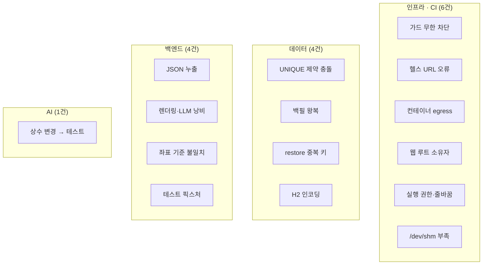

# 문제해결 사례

## 목적

Git 커밋과 코드 주석에서 확인되는 **실제로 겪고 해결한 문제**를 모은다.
가정한 사례가 아니라 기록이 남은 것만 담았다.

## 현재 구현

### ① 마이그레이션 가드가 영영 통과하지 못함

| 항목 | 내용 |
| --- | --- |
| 커밋 | `a560f93` (2026-09-17) |
| 제목 | "마이그레이션 가드가 적용 후 다시 실행해도 통과하지 못하던 문제를 고친다" |
| 영역 | 인프라 / CI |

**문제**: SQL을 운영 DB에 적용한 뒤 파이프라인을 재실행해도 가드가 또 멈췄다.

**원인**: `.gitlab-ci.yml` 주석이 적었다.

> 배포가 실패하면 `DEPLOY_MARK` 가 그대로라 다시 실행해도 같은 SQL 이 또 잡혀
> 영영 통과하지 못했다.

가드는 "마지막 배포 커밋 이후 바뀐 SQL"을 찾는다. 배포가 실패하면 `DEPLOY_MARK` 가
갱신되지 않아 같은 SQL이 계속 잡혔다.

**해결**: 적용 완료 목록(`APPLIED_MIGRATIONS`)을 별도 파일로 둔다.

```
/home/ubuntu/.a307-applied-migrations
  <내용 해시> <경로>
```

**경로만이 아니라 내용 해시까지** 적는다 — "적용한 뒤 누가 SQL 을 고치면 다시 멈춰야 한다."

**배운 것**: 상태를 하나(`DEPLOY_MARK`)로만 추적하면 실패 경로에서 막힌다.
"코드 배포 상태" 와 "스키마 적용 상태" 는 **다른 축**이라 따로 기록해야 한다.

---

### ② AI 기동 확인이 항상 실패

| 항목 | 내용 |
| --- | --- |
| 커밋 | `8aad748` (2026-09-16) |
| 제목 | "AI 기동 확인 주소를 사설 IP 로 바로잡는다" |
| 영역 | 인프라 |

**문제**: AI 서버가 정상인데 CI 기동 확인이 30번 재시도 후 실패했다.

**원인**: 헬스 URL이 `127.0.0.1:8000` 이었다. CI 주석:

> 컨테이너를 `172.26.4.46` 에만 묶으므로 호스트의 `127.0.0.1:8000` 에는 아무것도 없다.

**해결**: `AI_HEALTH: "http://172.26.4.46:8000/health"`

**배운 것**: `-p IP:포트:포트` 로 특정 IP에 묶으면 `127.0.0.1` 로는 못 닿는다.
보안을 위한 바인딩이 헬스체크를 깨뜨렸다.

---

### ③ 오버레이 이미지가 UNIQUE 제약을 위반

| 항목 | 내용 |
| --- | --- |
| 근거 | `Docs/Erd/A307_ddl_final.sql` 주석 |
| 영역 | 데이터베이스 |

**문제**: 재분석 시 `uk_aia UNIQUE (image_id, variant)` 위반.

**원인**: DDL 주석:

> `OVERLAY` 제외: **(job × image)마다 생성되므로 이미지당 1개 제약과 충돌.**
> 재분석 시 `uk_aia` 위반이 **실측으로 확인됨**

`accident_image_asset` 은 "이미지당 변형 하나" 를 전제한다. 오버레이는 분석할 때마다
새로 생기므로 이미지 하나에 여러 개가 필요했다.

**해결**: `analysis_image_result.s3_key_overlay` 로 옮겼다. 그 테이블은
`uk_air UNIQUE (job_id, image_id)` 라 작업마다 다른 행이다.

(오버레이 자체는 2026-09-11에 폐기돼 현재 `s3_key_overlay` 는 쓰이지 않는다.)

**배운 것**: 제약이 데이터 성격과 맞지 않으면 제약을 풀 게 아니라 **테이블을 옮긴다.**

---

### ④ H2 테스트에서 한글이 깨짐

| 항목 | 내용 |
| --- | --- |
| Jira | `S15P21A307-512` |
| 제목 | "H2 시드 한글이 깨진다 — `spring.sql.init.encoding` 미지정" |
| 영역 | 백엔드 / 테스트 |

**문제**: H2 인메모리 DB에 시드를 넣으면 한글이 깨졌다.

**원인**: `spring.sql.init.encoding` 미지정. 운영 PostgreSQL은 `LANG: C.UTF-8` 이지만
H2는 별도 설정이 필요했다.

**배운 것**: **테스트 DB와 운영 DB가 다르면 이런 차이가 생긴다.**
H2로 PostgreSQL을 대신하는 선택의 비용이다.

---

### ⑤ 테스트가 정본 스키마와 어긋남

| 항목 | 내용 |
| --- | --- |
| Jira | `S15P21A307-511` |
| 제목 | "`repair_case` 테스트가 정본 스키마와 어긋난다 — NOT NULL 위반" |
| 영역 | 백엔드 / 테스트 |

**문제**: 테스트 픽스처가 `source_item_key` · `image_type` 을 안 채워 NOT NULL 위반.

**배운 것**: 스키마가 바뀌면 테스트 픽스처도 따라가야 한다. ④와 같은 뿌리다 —
**테스트 스키마(`schema-h2.sql`)와 정본 DDL이 두 벌**이라 어긋날 수 있다.

---

### ⑥ 최소 사례 수 완화로 테스트가 깨짐

| 항목 | 내용 |
| --- | --- |
| 커밋 | `30671b4` → `b553171` (2026-09-18) |
| 영역 | AI |

**경위**: `30671b4` "견적 최소 사례 수 완화 및 차급 fallback 재시도" 에서
`MIN_CASE_COUNT` 를 3 → 2로 낮췄다. 그러자 3건 기준으로 쓰인 테스트가 깨졌고,
`b553171` 이 고쳤다.

**현재 상태**: 이 조사에서 AI 테스트를 돌린 결과
`test_estimate_service.py::test_not_approved_rows_are_excluded` 가 **여전히 실패한다.**

```
assert True is False   (tests/test_estimate_service.py:419)
```

테스트 주석이 `# case 1이 불인정으로 빠지므로 최소 사례 수(3) 미달 → 미해결 처리.` 라고
적혀 있는데 현재 `MIN_CASE_COUNT = 2` 다. **고치다 만 것으로 보인다.**

**배운 것**: 상수 하나를 바꾸면 그 값을 전제한 테스트를 전부 찾아야 한다.

---

### ⑦ 차량 백필이 DB를 왕복함

| 항목 | 내용 |
| --- | --- |
| 커밋 | `e8489f9` (2026-09-18) |
| 제목 | "차량 백필을 COPY + 일괄 UPDATE 로 바꿔 DB 왕복을 없앤다" |
| 영역 | 데이터 |

**해결**: 행마다 UPDATE 하던 것을 `COPY` 로 임시 테이블에 적재한 뒤 한 번에 UPDATE.

**배운 것**: 대량 처리에서 왕복 횟수가 곧 시간이다.

---

### ⑧ 버려지는 렌더링과 LLM 크레딧 낭비

| 항목 | 내용 |
| --- | --- |
| 커밋 | `cee4f46` · `c29e9f4` (2026-09-17) |
| Jira | `S15P21A307-528` · `-526` |
| 영역 | 백엔드 |

**문제**: PDF를 다 만든 뒤 저장소가 없어 실패했다. 검증 PDF는 LLM을 부른 뒤 실패했다.

**해결**: **순서를 바꿨다.** 저장소 확인을 렌더링·LLM 호출보다 **앞**에 뒀다.

**배운 것**: 비싼 작업 앞에 값싼 검사를 둔다. LLM은 실패해도 돈이 든다.

---

### ⑨ 견적 요약 JSON에 헬퍼 메서드가 새어 나감

| 항목 | 내용 |
| --- | --- |
| 커밋 | `c4ec121` (2026-09-18) |
| Jira | `S15P21A307-537` |
| 영역 | 백엔드 |

**원인**: Jackson이 `getXxx()` 를 프로퍼티로 보고 직렬화했다. 헬퍼 메서드가 이름 규칙에
걸려 응답에 들어갔다.

**배운 것**: Java 레코드·클래스를 그대로 직렬화하면 의도하지 않은 필드가 나간다.

---

### ⑩ 분석 결과 좌표가 원본 기준이라 오버레이가 어긋남

| 항목 | 내용 |
| --- | --- |
| 커밋 | `bc67210` (2026-09-17) |
| Jira | `S15P21A307-203` |
| 영역 | 백엔드 / 프론트 |

**문제**: 손상 영역을 사진 위에 그렸는데 위치가 맞지 않았다.

**원인**: AI는 `RESIZED` 변형을 분석하는데 응답의 크기는 원본 기준이었다.

**해결**: "분석 결과의 사진 크기를 AI 가 분석한 축소본 기준으로 준다."
`api.js` 주석에 근거가 남았다 — "`height`(AI 가 분석한 축소본 픽셀 — bc67210)".

**배운 것**: 좌표는 **어느 이미지 기준인지**와 함께 다녀야 한다.

---

### ⑪ 컨테이너에서 Gradle 의존성을 못 받음

| 항목 | 내용 |
| --- | --- |
| 근거 | `backend/Dockerfile` 주석 |
| 영역 | 인프라 |

**문제**: 멀티스테이지로 컨테이너 안에서 빌드했더니 의존성을 못 받았다.

> 이 개발 환경에서는 컨테이너 egress 가 막혀 있어 Gradle 배포본·의존성을 받지 못했다
> (호스트는 되고 이미지 pull 도 되는데 **컨테이너에서만 안 나간다**).

**해결**: 미리 만든 jar를 COPY. 부수 효과가 더 컸다 — 빌드가 수 초로 끝나고,
레이어드 jar로 전송이 97MB → 8.9MB로 줄었다.

**배운 것**: 제약을 우회하다 더 나은 구조를 찾은 사례다.

---

### ⑫ HNSW 인덱스 생성이 `/dev/shm` 부족으로 실패

| 항목 | 내용 |
| --- | --- |
| 시점 | 2026-09-21 (이 조사 중 실측) |
| 영역 | 데이터베이스 |

**문제**:

```
ERROR: could not resize shared memory segment "/PostgreSQL.xxx" to 2144374176 bytes:
       No space left on device
```

**원인**: `a307-db` 컨테이너의 `/dev/shm` 이 도커 기본값 **64MB**. pgvector HNSW 병렬 빌드가
`maintenance_work_mem`(2GB) 크기만큼 공유 메모리를 잡으려다 실패했다.
**박스 메모리는 14GB 남아 있었다** — 디스크도 메모리도 아니고 `/dev/shm` 이었다.

**해결**:

```sql
SET max_parallel_maintenance_workers=0;
SET maintenance_work_mem='2GB';
CREATE INDEX ix_roi_hnsw ON repair_case_roi_embedding USING hnsw (embedding vector_cosine_ops);
```

병렬을 끄면 프로세스 전용 메모리를 쓴다. 단일 스레드라 304,114건에 30분~1시간이 걸렸다.

**배운 것**: "No space left on device" 가 항상 디스크는 아니다. 컨테이너 기본값이
호스트 자원과 무관하게 병목이 된다.

---

### ⑬ TRUNCATE 없이 restore

| 항목 | 내용 |
| --- | --- |
| 시점 | 2026-09-21 (이 조사 중 실측) |
| 영역 | 데이터베이스 |

**문제**:

```
pg_restore: error: COPY failed for table "repair_case": ERROR: duplicate key value
violates unique constraint "repair_case_pkey" DETAIL: Key (case_id)=(1880) already exists.
```

**원인**: 기존 corpus를 비우지 않고 restore를 돌렸다.

**결과**: `--single-transaction` 덕분에 **통째로 롤백**돼 DB가 그대로였다.

**배운 것**: `--single-transaction` 이 절차 실수를 흡수했다.
1.15GB를 절반쯤 넣다 멈췄으면 정리가 훨씬 복잡했을 것이다.

---

### ⑭ 웹 루트 소유자 문제

| 항목 | 내용 |
| --- | --- |
| 커밋 | `3746c71` (2026-09-16) |
| 제목 | "CI 배포 후 웹 루트 소유자를 ubuntu 로 되돌린다" |
| 영역 | 인프라 |

**배운 것**: 배포 스크립트가 파일 소유권을 바꾸면 다음 배포가 막힐 수 있다.

---

### ⑮ `gradlew` 실행 권한 누락

| 항목 | 내용 |
| --- | --- |
| 커밋 | `ddffbc1` (2026-09-16) |
| 제목 | "backend/gradlew 에 실행 권한을 부여한다" |
| 영역 | 인프라 |

**배운 것**: Windows에서 개발하고 Linux에서 빌드하면 실행 비트가 빠진다.
`d08e06e` "셸 스크립트를 LF 로 고정한다" 도 같은 계열(줄바꿈) 문제다.

## 동작 흐름 (문제 유형 분포)



**인프라·CI 문제가 가장 많다.** 코드보다 환경이 자주 발목을 잡았다.

## 주요 구성 요소

- Git 커밋 메시지 (2026년 9월 `Fix:` 접두)
- `.gitlab-ci.yml` · `backend/Dockerfile` · `Docs/Erd/A307_ddl_final.sql` 주석
- Jira `S15P21A307-511` · `-512` · `-526` · `-528` · `-537`

## 근거 자료

- `git log --since=2026-09-01 | grep "^Fix"` — 30건 이상
- 소스·설정 주석
- 2026-09-21 이관 작업 실측

## 확인 필요 항목

- **⑥ 의 현재 실패 테스트** — `test_not_approved_rows_are_excluded` 가 여전히 깨져 있다. 고칠지 테스트를 바꿀지 판단 필요
- **장애 기록 문서** — 포스트모템 양식이 있는지 확인하지 못함
- **Docs/Claude 기록** — `.gitignore` 대상이라 조사하지 않았다
