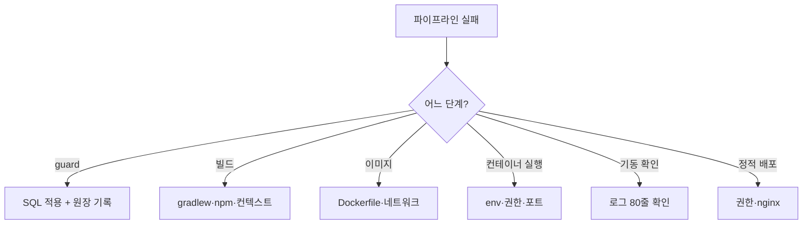

# 배포·인프라 오류

## 목적

배포 파이프라인과 서버 환경에서 나는 오류를 정리한다.
Git 기록상 **가장 많이 겪은 영역**이다.

## 현재 구현

### ① CI 파이프라인 실패

#### `migration-guard` 에서 멈춤

**정상 동작이다.** 새 SQL이 있으면 멈추게 설계했다.

```
1) 운영 DB 에 그 SQL 을 적용한다
2) BE 박스에서 guard 로그에 찍힌 echo 명령을 그대로 붙여넣어 적용 완료를 기록한다
3) 파이프라인을 다시 실행한다
```

**적용했는데 또 멈춘다면**:

| 원인 | 확인 |
| --- | --- |
| 원장 기록 누락 | `cat /home/ubuntu/.a307-applied-migrations` |
| SQL 내용이 바뀜 | 해시가 달라져 다시 잡힌다 (의도된 동작) |

과거에 이 문제로 **영영 통과하지 못하는** 버그가 있었다 (커밋 `a560f93`).
원장 도입으로 해결됐다.

#### `docker 를 쓸 수 없다.`

Runner 사용자가 docker 그룹에 없거나 데몬이 죽었다.

```bash
docker info
```

#### `CI 변수 VITE_API_BASE_URL 이 없다.`

GitLab CI/CD Variables에 등록되지 않았다. **빌드 전에 확인하고 실패시킨다** —
오래 걸리는 빌드를 돌린 뒤 실패하는 낭비를 막는다.

#### `번들에 API 주소가 없다. .env 우선순위를 확인하라.`

빌드는 성공했는데 `VITE_API_BASE_URL` 이 번들에 안 들어갔다.

Vite의 `.env` 우선순위 때문이다. `.env.local` 이나 `.env.production.local` 이 있으면
CI가 만든 `.env.production` 을 덮는다.

**이 검사가 없으면 배포 후에야 드러난다** — 앱이 엉뚱한 서버를 부른다.

#### `/etc/a307/ai.env 를 읽을 수 없다.`

Runner 사용자가 파일을 못 읽는다. 파일은 `0600 root:root` 다.

```bash
sudo ls -l /etc/a307/ai.env
```

#### 기동 확인 실패

```
기동하지 못했다. 최근 로그 80줄:
```

로그가 함께 출력된다. 원인별로 [백엔드 오류](백엔드_오류.md) · [AI 오류](AI_오류.md) 참고.

**과거 사례**: AI 헬스 URL이 `127.0.0.1` 이라 항상 실패했다 (커밋 `8aad748`).
컨테이너가 사설 IP에만 묶여 있어서다.

#### `환경변수 누락. /etc/a307/ai.env 확인.`

AI `/health` 가 `configured: false` 를 반환했다.
`AI_INTERNAL_TOKEN` 또는 `FEATURE_PIPELINE_VERSION_ID` 가 없다.

#### `DB 에 닿지 못한다. DATABASE_URL 확인.`

AI `/health` 가 `dbReachable: false` 를 반환했다.

### ② 도커 오류

#### `--env-file: open /etc/a307/ai.env: permission denied`

**`--env-file` 은 도커 데몬이 아니라 클라이언트가 읽는다.** `ubuntu` 계정으로는
`0600 root:root` 파일을 못 읽는다.

```bash
sudo docker run -d --name a307-ai ... --env-file /etc/a307/ai.env ...
```

`ubuntu` 는 이미 docker 그룹(사실상 root)이라 `sudo` 를 붙여도 권한 경계가 새로 생기지 않는다.

**파일 권한을 푸는 쪽은 택하지 않는다** — 그 파일에 토큰과 DB 접속 정보가 있다.

#### 환경변수를 바꿨는데 반영이 안 됨

`--env-file` 은 **컨테이너 생성 시점에만** 읽힌다.

| 명령 | 반영 |
| --- | --- |
| `docker restart` | ✗ |
| `docker rm -f` + `docker run` | ✓ |

```bash
docker exec a307-ai env | grep <변수명>
```

로 실제 반영을 확인한다.

#### `docker rm -f` 후 `docker run` 이 실패

**컨테이너가 사라진 상태**가 된다. 2026-09-21에 실제로 발생했다 (위 permission denied).

```bash
docker inspect -f '{{.Config.Image}}' a307-ai
```

**지우기 전에 이미지 태그를 먼저 확보한다.**

#### 디스크 부족

배포마다 3.5GB대 이미지가 태그와 함께 쌓인다.

```bash
docker images a307-ai --format '{{.Tag}}\t{{.Size}}'
```

```bash
df -h /var/lib/docker
```

`docker image prune -f` 는 **dangling만** 지운다. 태그가 붙어 있으면 남는다.

```bash
docker rmi a307-ai:<오래된 태그>
```

**🔴 `docker system prune -a --volumes` 를 치지 않는다.** 운영 DB 볼륨이 사라진다.

### ③ 빌드 오류

#### `gradlew: Permission denied`

커밋 `ddffbc1` "backend/gradlew 에 실행 권한을 부여한다".

Windows에서 개발하고 Linux에서 빌드하면 실행 비트가 빠진다.

```bash
git update-index --chmod=+x backend/gradlew
```

#### 셸 스크립트 줄바꿈

커밋 `d08e06e` "셸 스크립트를 LF 로 고정한다".

CRLF로 커밋하면 Linux에서 `bad interpreter` 가 난다. `.gitattributes` 로 고정한다.

#### 백엔드 이미지 빌드 실패

| 원인 | 조치 |
| --- | --- |
| `bootJar` 를 먼저 안 돌림 | `./gradlew bootJar -x test` |
| 빌드 컨텍스트가 `backend/` | **저장소 루트**에서 빌드 |

```bash
cd backend && ./gradlew bootJar -x test
cd .. && docker build -t a307-backend:latest -f backend/Dockerfile .
```

#### AI 이미지 빌드 실패

| 원인 | 조치 |
| --- | --- |
| 빌드 컨텍스트 오류 | 저장소 루트에서 |
| torch 다운로드 실패 | CPU 인덱스 URL 확인 |
| DINOv2 다운로드 실패 | 빌드 시 네트워크 필요 |

#### 컨테이너 안에서 의존성을 못 받음

`backend/Dockerfile` 주석:

> 이 개발 환경에서는 컨테이너 egress 가 막혀 있어 Gradle 배포본·의존성을 받지 못했다
> (호스트는 되고 이미지 pull 도 되는데 **컨테이너에서만 안 나간다**).

그래서 미리 만든 jar를 COPY 한다.

### ④ Nginx·정적 파일

#### 배포 직후 짧은 404

```sh
rm -rf "${WEB_ROOT:?}"/*
cp -r frontend/dist/* "$WEB_ROOT"/
```

`rm` 과 `cp` 사이에 파일이 없다. **짧지만 다운타임이 있다.**

#### 웹 루트 소유권

커밋 `3746c71` "CI 배포 후 웹 루트 소유자를 ubuntu 로 되돌린다".

```sh
chown -R ubuntu:www-data "$WEB_ROOT"
```

소유권이 어긋나면 다음 배포의 `rm -rf` 나 Nginx 읽기가 실패한다.

#### `systemctl reload nginx` 실패

sudoers에 그 명령만 허용돼 있을 수 있다 (절대 경로 `/usr/bin/systemctl` 사용).
설정 문법 오류면 reload가 거부된다.

```bash
sudo nginx -t
```

### ⑤ 네트워크

#### AI 서버에 못 닿음

```bash
curl http://172.26.4.46:8000/health
```

| 원인 | 확인 |
| --- | --- |
| 컨테이너 중단 | `docker ps` |
| 바인딩 IP 불일치 | `docker port a307-ai` |
| 방화벽 | 확인 필요 |

#### 콜백이 안 옴

백엔드가 **사설 IP에도** 열려 있어야 한다.

```bash
docker port a307-backend
```

`172.26.8.28:8080` 이 없으면 AI 박스에서 못 닿는다.

### ⑥ 메모리

**AI 박스는 swap이 0이다.** 여유가 없으면 바로 OOM kill이다.

```bash
free -g
```

```bash
docker stats --no-stream
```

AI 컨테이너 상한을 빼면 **DB까지 끌고 내려간다.** CI 주석의 🔴 경고다.

## 동작 흐름 (배포 실패 진단)



## 주요 구성 요소

- `.gitlab-ci.yml` — 오류 메시지가 다음 행동을 지시한다
- `backend/Dockerfile` · `AI/server/Dockerfile`
- `/home/ubuntu/.a307-applied-migrations`

## 설정 및 실행 방법

[배포 절차](../08_배포_CICD/배포_절차.md) · [롤백 절차](../08_배포_CICD/롤백_절차.md) 참고.

## 오류 및 예외 처리

**CI의 모든 오류 메시지가 조치를 포함한다.**

| 메시지 | 조치 |
| --- | --- |
| "docker 를 쓸 수 없다." | 데몬·그룹 확인 |
| "CI 변수 … 가 없다." | GitLab 변수 등록 |
| "번들에 API 주소가 없다. **.env 우선순위를 확인하라.**" | `.env.local` 제거 |
| "… 를 읽을 수 없다." | 파일 권한 |
| "환경변수 누락. **/etc/a307/ai.env 확인.**" | env 파일 |
| "DB 에 닿지 못한다. **DATABASE_URL 확인.**" | 접속 정보 |

## 관련 소스코드

- `.gitlab-ci.yml`
- 커밋 `a560f93` · `8aad748` · `3746c71` · `ddffbc1` · `d08e06e`

## 근거 자료

- CI 정의와 오류 메시지
- Git 커밋 기록
- 2026-09-21 실측 (permission denied, `/dev/shm`)

## 확인 필요 항목

- **방화벽 규칙** — 확인하지 못함
- **sudoers 설정** — `systemctl reload nginx` 만 허용하는지 확인하지 못함
- **Runner `config.toml`** — 확인하지 못함
- **동시 파이프라인 충돌** — `resource_group` 이 없어 동시 배포 시 문제 가능
- **디스크 임계 알림** — 없음
