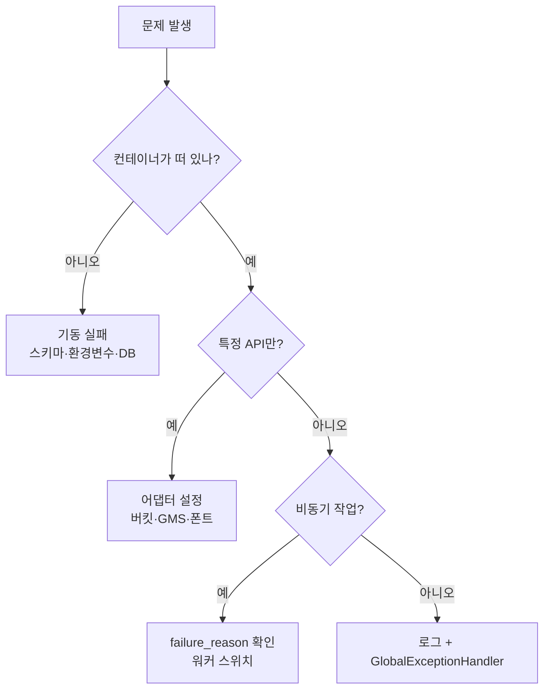

# 백엔드 오류

## 목적

백엔드에서 발생하는 오류를 기동 실패·런타임 오류·워커 실패로 나눠 정리한다.

## 현재 구현

### ① 기동 실패 — 가장 위험

#### 스키마 불일치

```properties
spring.jpa.hibernate.ddl-auto=validate
```

**스키마가 어긋나면 그 API만이 아니라 앱 전체가 뜨지 않는다.**
`backend/Dockerfile` 주석이 이를 경고한다.

| 증상 | 로그 |
| --- | --- |
| 기동 즉시 종료 | Hibernate 스키마 검증 예외 (컬럼·테이블 없음) |

**조치**

```bash
docker logs --tail 80 a307-backend
```

로그에서 어느 테이블·컬럼인지 확인하고 해당 마이그레이션을 적용한다.

로컬은 DDL이 바뀌면 볼륨을 지워야 한다.

```bash
docker compose down -v && docker compose up -d
```

`docker-compose.yml` 주석 — "로컬 DB 가 낡아서 `ddl-auto=validate` 가 실패하는 사고가
**이미 한 번 있었으니**, DDL 커밋을 pull 하면 이 절차를 밟는다."

**⚠️ 운영 박스에서는 절대 `down -v` 를 치지 않는다.**

#### 환경변수 누락

```
Could not resolve placeholder 'XXX'
```

`Docs/Architecture/인프라 실행 교본.md:674` 이 이 증상을 표로 적었다 —
"`--env-file` 경로와 오타 확인."

```bash
docker exec a307-backend env | grep <변수명>
```

`--env-file` 은 **컨테이너 생성 시점에만** 읽힌다. `docker restart` 로는 안 바뀐다.

#### DB 연결 실패

DB가 AI 박스에 있다. DB가 죽어 있으면 백엔드가 기동하지 못한다.
**DB를 먼저 복구한다.**

### ② 런타임 오류

`GlobalExceptionHandler` 가 처리하는 것들이다.

| 예외 | 응답 | 흔한 원인 |
| --- | --- | --- |
| `BusinessException` | 해당 `ErrorCode` | 업무 규칙 위반 |
| `MethodArgumentNotValidException` | `400 INVALID_REQUEST` | `@Valid` 실패 |
| `HttpMessageNotReadableException` | `400 INVALID_REQUEST` | JSON 파싱 실패 |
| `MissingServletRequestParameterException` | `400` + `"{이름} 파라미터가 필요합니다."` | 쿼리 파라미터 누락 |
| `DataIntegrityViolationException` | `409 CONFLICT` | UNIQUE·FK·CHECK 위반 |
| `OptimisticLockingFailureException` | `VERSION_CONFLICT` | 관리자 동시 수정 |
| `AccidentImageValidationException` | `400` | 이미지 타입·크기 |
| `KakaoLocalException` | (전용) | 카카오 API 실패 |

#### `503 SERVICE_UNAVAILABLE` 이 나올 때

**헬스체크는 UP인데 특정 API만 503** 인 경우다. `/actuator/health` 는 어댑터 상태를 안 본다.

| API | 필요 설정 |
| --- | --- |
| 이미지 업로드 | `AWS_REGION` + `STORAGE_STAGING_BUCKET` + `STORAGE_SERVICE_BUCKET` |
| 체크리스트·요약·질문 | `GMS_KEY` |
| 견적서 검증 | `DOCUMENT_STORAGE_PROVIDER` + `ESTIMATE_OCR_PROVIDER` |

`ObjectStorageProperties.isConfigured()` 가 셋을 모두 요구한다. 하나만 빠져도 503이다.

#### `PDF 생성만 500`

`backend/Dockerfile` 주석이 정확히 이 증상을 경고한다.

> `libfreetype` · `libfontconfig` · `fc-list` · `java.desktop` 모듈 —
> 이 셋이 없으면 PDF 생성(openhtmltopdf-pdfbox)과 이미지 전처리(ImageIO·java.awt)가
> 런타임에 죽는다. **증상이 기동 실패가 아니라 "그 요청만 500" 이라 배포 후에야 드러난다.**

베이스 이미지를 바꿨다면 이것부터 확인한다.

#### `409 CONFLICT`

DB 제약 위반이 `CONFLICT` 로 온다.

| 제약 | 의미 |
| --- | --- |
| `ux_job_inflight` (부분 UNIQUE) | 이미 진행 중인 분석이 있다 |
| `uk_aia (image_id, variant)` | 같은 이미지·변형이 이미 있다 |
| `uk_est (job_id, version)` | 같은 버전 견적이 이미 있다 |
| `uk_air (job_id, image_id)` | 같은 결과가 이미 있다 |

**대부분 의도된 차단이다.** 중복 작업을 막는다.

#### AI 콜백 오류

| 상황 | 응답 |
| --- | --- |
| 헤더 `X-Request-Id` ≠ 본문 `requestId` | `400` "X-Request-Id 와 본문 requestId 가 다릅니다." |
| 경로 `jobId` ≠ 본문 `jobId` | `400` "경로의 jobId 와 본문 jobId 가 다릅니다." |
| 없는 작업 | `404` "존재하지 않는 경로입니다." |
| 저장된 `requestId` 와 불일치 | `409` "이 작업이 기다리는 요청이 아닙니다." |
| 토큰 불일치 | `401` |

`409` 는 **철 지난 콜백**이다. 재분석으로 새 `requestId` 가 발급된 뒤 이전 시도의 결과가
늦게 도착한 것이다. 정상 차단이다.

### ③ 워커 실패

응답이 아니라 **DB 컬럼**에 남는다.

```bash
docker exec a307-db psql -U <계정> -d a307 -c "SELECT failure_reason, count(*) FROM analysis_job WHERE status='FAILED' AND created_at > now() - interval '1 day' GROUP BY 1 ORDER BY 2 DESC;"
```

| 사유 | 의미 |
| --- | --- |
| `ALL_IMAGES_EXCLUDED` | 모든 사진이 제외됨 |
| `AI_UNREACHABLE` | AI 서버에 못 닿음 |
| `ABANDONED` | `processing-timeout` 초과 |
| `NO_IMAGE` | 사진 없음 |
| `STORAGE_UNAVAILABLE` | 저장소 실패 |
| `IMAGE_FETCH_FAILED` 등 4종 | AI가 보낸 코드 |

#### 큐가 안 줄어듦

```bash
docker exec a307-backend env | grep WORKER_ENABLED
```

워커 스위치가 `false` 면 큐만 쌓인다. 저장소 기본값이 `false` 인 워커가 여럿이다.

#### LLM 기능이 계속 실패

`ABANDONED` 로 종결된다. `EstimateNarrativeFailure` 주석:

> 영영 실패하는 건이 매 주기 GMS 크레딧을 태운다

무한 재시도를 막는 설계다. 실패가 늘면 `GMS_KEY` · 모델명 · 프록시 상태를 본다.

### ④ 테스트 실패

| 증상 | 원인 | 사례 |
| --- | --- | --- |
| 한글 깨짐 | `spring.sql.init.encoding` 미지정 | `S15P21A307-512` |
| NOT NULL 위반 | 픽스처가 스키마와 어긋남 | `S15P21A307-511` |
| 상수 변경 후 깨짐 | 값을 전제한 테스트 | `b553171` |

**테스트는 H2, 운영은 PostgreSQL** 이라 차이에서 오는 문제가 있다.

이 조사에서 로컬 실행 결과: **1,677건 통과 · 0 실패 · 40 건너뜀.**

## 동작 흐름 (진단 순서)



## 주요 구성 요소

- `common/exception/GlobalExceptionHandler.java`
- `common/exception/ErrorCode.java`
- `analysis/callback/AnalysisCallbackService.java`
- `backend/Dockerfile` — 런타임 의존성 주석
- `Docs/Architecture/인프라 실행 교본.md:674` — 오류 표

## 설정 및 실행 방법

```bash
docker logs --tail 80 a307-backend
```

```bash
docker exec a307-backend env | grep <변수명>
```

```bash
curl -sf http://127.0.0.1:8080/actuator/health
```

## 오류 및 예외 처리

이 문서 전체가 해당 내용이다. 코드 목록은 [오류코드](../06_API/오류코드.md)에 있다.

## 관련 소스코드

- `backend/src/main/java/com/ssafy/a307/common/exception/`
- `backend/src/main/resources/application.properties`

## 근거 자료

- `@ExceptionHandler` 9개 직접 확인
- Dockerfile·compose 주석
- Jira `S15P21A307-511` · `-512`
- 이 조사에서 실행한 `./gradlew test`

## 확인 필요 항목

- **로그 레벨 설정** — `logging.level.*` 을 확인하지 못함
- **`Exception.class` 기본 핸들러** — 존재 여부를 확인하지 못함
- **`TOO_MANY_REQUESTS` 발생 지점** — 정의만 있고 던지는 곳을 찾지 못함
- **건너뛴 테스트 40건** — 이유를 확인하지 못함
- **워커 폴링 주기** — `fixedDelay` 값을 확인하지 못함
