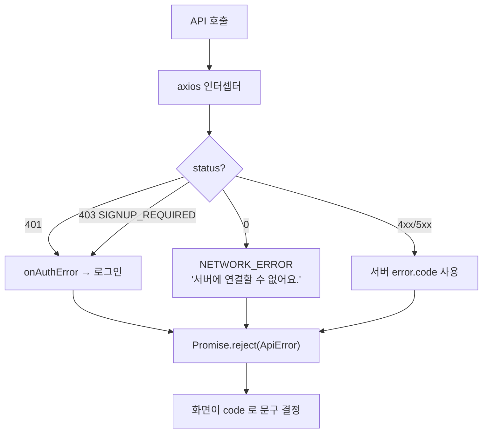

# 프론트엔드 오류

## 목적

프론트에서 발생하는 오류의 원인과 확인 방법을 정리한다.

## 현재 구현

### 오류 정규화

모든 서버 오류는 `ApiError { status, code, message }` 로 통일된다.

```js
// frontend/src/lib/api.js
export class ApiError extends Error {
  constructor(status, code, message) { ... }
}
```

| `code` | 출처 |
| --- | --- |
| 서버 `error.code` | 백엔드가 준 값 |
| `UNAUTHORIZED` | 401인데 본문이 없을 때 (프론트 생성) |
| `NETWORK_ERROR` | `status === 0` (프론트 생성) |
| `UNKNOWN` | 그 외 (프론트 생성) |

### 자주 나오는 증상

#### 모든 API가 401

| 원인 | 확인 |
| --- | --- |
| 세션 만료 (30분) | 재로그인 |
| `withCredentials` 미적용 | `api.js` 의 `http` 인스턴스를 쓰는지 |
| 크로스 오리진 쿠키 차단 | `CORS_ALLOWED_ORIGINS` · `SameSite` |
| `VITE_API_BASE_URL` 오류 | 네트워크 탭에서 요청 주소 |

`api.js` 주석 — "`withCredentials` 가 없으면 브라우저가 쿠키를 싣지 않아 보호 API 가
**전부 401** 이 된다."

`http` 인스턴스를 거치지 않고 `axios` 를 직접 쓰면 이 증상이 난다.

#### 403 `SIGNUP_REQUIRED` 가 반복됨

소셜 인증은 됐지만 가입이 안 끝난 상태(`ROLE_SIGNUP_PENDING`)다.
`api.js` 가 401과 같이 묶어 `onAuthError` 로 보낸다.

```js
if (status === 401 || (status === 403 && code === 'SIGNUP_REQUIRED')) authErrorHandler?.(err)
```

`main.js` 의 훅이 가입 화면으로 보내야 한다. 훅 등록이 빠지면 무한 반복처럼 보인다.

#### 로그인 후 원래 화면으로 안 돌아감

```js
// stores/auth.js
// 서버가 OAuth 성공 후 항상 FE '/' 로 보내므로 세션 스토리지에 잠시 보관한다.
const NEXT_KEY = 'noka.auth.next'
```

`sessionStorage` 가 막혀 있거나(프라이빗 모드) 새 탭으로 열리면 값이 사라진다.

#### 새로고침하면 404

Vue Router history 모드인데 Nginx SPA 폴백(`try_files ... /index.html`)이 없으면 난다.
**Nginx 설정을 확인하지 못해 추정이다** — [Nginx 구성](../07_인프라/Nginx_구성.md) 참고.

#### 업로드가 실패함

`UploadView.vue` 가 오류를 분류해 버튼 문구를 바꾼다.

```js
const retryLabel = computed(() =>
  (photo.retrySame || photo.code === 'NETWORK' || photo.code === 'STORAGE'
    ? '다시 시도' : '다른 사진 선택'))
```

| 코드 | 원인 | 사용자 조치 |
| --- | --- | --- |
| `NETWORK` | 네트워크 실패·presigned 만료 | 같은 사진으로 재시도 |
| `STORAGE` | 버킷 미설정(503)·S3 장애 | 재시도 (서버 조치 필요) |
| 그 외 | 파일 문제 | 다른 사진 선택 |

`storageDown` 플래그가 저장소 장애를 따로 표시한다.

#### 분석이 끝나지 않음

`AnalyzingView.vue` 가 2초마다 폴링한다 (`POLL_MS = 2000`).

| 상황 | 확인 |
| --- | --- |
| `QUEUED` 에서 멈춤 | 워커가 꺼졌을 수 있다 |
| `PROCESSING` 에서 멈춤 | AI 무응답. `processing-timeout` 후 `ABANDONED` |
| 첫 요청이 느림 | 모델 지연 로드 (30초~1분, 정상) |

#### 분석 실패 문구가 나옴

`FAIL_TEXT` 매핑이 코드를 한국어로 바꾼다. 전체 표는
[화면과 기능](../02_프론트엔드/화면과_기능.md)에 있다.

`photo: true` 인 사유(`ALL_IMAGES_EXCLUDED` · `NO_IMAGE`)는 **같은 사진으로 다시 해도
결과가 같다.** 재촬영으로 이끈다.

매핑에 없는 코드면 기본 문구가 나온다 — "일시적인 문제일 수 있어요."

#### 견적 화면에 영문 코드가 보임

```html
<!-- EstimateView.vue:270 -->
{{ est.nonEstimableReason || '참조할 수리 사례가 부족해 금액을 계산하지 못했어요.' }}
```

**`nonEstimableReason` 에 한국어 매핑이 없다.** `INSUFFICIENT_CASES` ·
`PART_NOT_RESOLVED` · `NO_DAMAGE_DETECTED` 가 그대로 보인다.

`ReportView.vue:186` 도 같다. **개선 여지다.**

#### 손상 영역 오버레이가 어긋남

과거 사례다 (커밋 `bc67210`). AI는 `RESIZED` 를 분석하는데 응답 크기가 원본 기준이었다.
지금은 축소본 기준으로 준다 — `api.js` 주석이 `height` 를 "AI 가 분석한 축소본 픽셀" 로 적었다.

화면이 원본 크기로 환산하면 다시 어긋난다.

#### 카카오 지도가 안 뜸

| 원인 | 확인 |
| --- | --- |
| `VITE_KAKAO_JS_KEY` 미설정 | 콘솔 오류 |
| 도메인 미등록 | 카카오 개발자 콘솔 |
| SDK 로드 실패 | 네트워크 탭 |

#### 현재 위치를 못 받음

브라우저 Geolocation은 **보안 컨텍스트(https 또는 localhost)** 에서만 동작한다.
휴대폰에서 `192.168.x.x:5173` 으로 접속하면 http라 실패한다.

```
npm run dev:https
```

`vite.config.js` 주석이 이 용도를 명시했다.

#### 목업 데이터가 보임

`VITE_AUTH_GUARD=off` 면 스토어가 `MOCK_*` 상수를 쓴다.
`.env.example` 에 없는 변수라 **운영 빌드에서 켜지면 알아채기 어렵다.**

```js
// stores/accidents.js
const MOCK_ACCIDENTS = () => [ { accidentId: 1, manufacturer: '현대', modelName: '아반떼', ... } ]
```

"아반떼 · 쏘렌토" 가 고정으로 보이면 목업 모드다.

### 자동 재시도가 없다

```js
// 어떤 상태에도 자동 재시도하지 않는다 (특히 429)
```

일시적 네트워크 오류도 그대로 실패한다. 재시도는 사용자 조작이다.

## 동작 흐름 (오류 처리 경로)



## 주요 구성 요소

- `frontend/src/lib/api.js` — 인터셉터·정규화
- `frontend/src/main.js` — `onAuthError` 훅
- `frontend/src/views/AnalyzingView.vue` — `FAIL_TEXT` · `EXCLUDE_REASON`
- `frontend/src/views/UploadView.vue` — 업로드 오류 분류

## 설정 및 실행 방법

브라우저 개발자 도구 네트워크·콘솔 탭이 1차 확인 수단이다.
프론트 로그를 서버로 보내는 경로는 없다.

## 오류 및 예외 처리

위 증상별 표 참고.

## 관련 소스코드

- `frontend/src/lib/api.js:20~40`
- `frontend/src/views/AnalyzingView.vue:20~50`
- `frontend/src/views/UploadView.vue:56~61`
- `frontend/src/views/EstimateView.vue:270`

## 근거 자료

- 소스 주석과 상수
- Git 커밋 (`bc67210` 등)

## 확인 필요 항목

- **전역 오류 경계** — Vue `errorHandler` 설정을 확인하지 못함
- **프론트 오류 수집** — Sentry 등이 없다
- **SPA 폴백** — Nginx 설정 미확인
- **`VITE_AUTH_GUARD` 운영 차단** — 방어책을 확인하지 못함
- **브라우저 호환 범위** — 명시를 확인하지 못함
