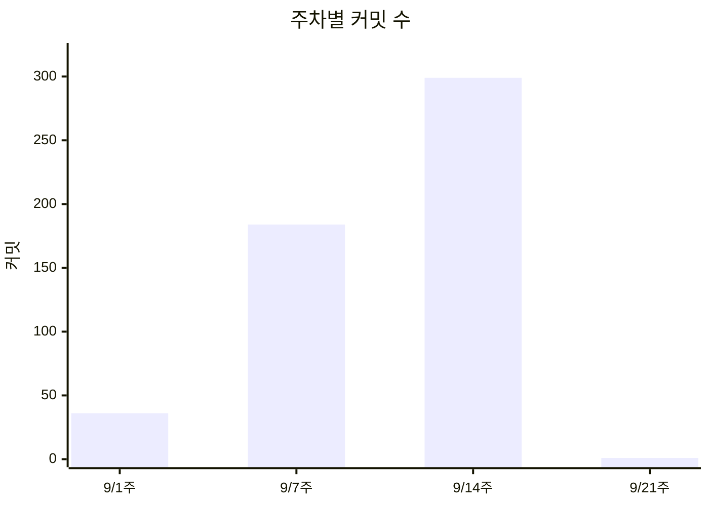
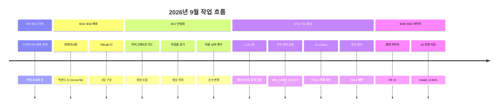

# 2026년 09월 전체 작업기록

## 목적

2026년 9월의 작업을 Git 기록·Jira·코드 주석에서 확인되는 범위로 통합 정리한다.
같은 작업이 여러 곳에 나오면 하나로 묶고 근거를 모두 연결했다.

## 조사 범위와 한계

| 근거 | 접근 | 비고 |
| --- | --- | --- |
| 로컬 Git 커밋 | ✓ | 520건 (9월) |
| 커밋 diff·변경 파일 | ✓ | |
| Jira | ✓ 부분 | JQL 조회 100건. `hasNextPage: true` 로 **전체는 아니다** |
| GitLab MR | ✗ | **접근하지 못했다.** 머지 커밋 메시지로만 추정 |
| 코드·설정 주석 | ✓ | 판단 근거가 다수 기록돼 있다 |
| `Docs/` 기존 문서 | ✓ | 235개 |
| Claude 작업 기록 | ✗ | `Docs/Claude/` 는 `.gitignore` 대상이라 조사하지 않았다 |
| 배포·장애 대응 기록 | ✓ 부분 | CI 주석과 커밋으로 확인 |

## 전체 통계

| 항목 | 값 |
| --- | --- |
| 9월 커밋 | **520건** (전체 536건의 97%) |
| Jira 번호가 붙은 커밋 | 490건 (94%) |
| 등장한 Jira 이슈 | 216개 |
| 작업 기간 | 2026-09-03 ~ 2026-09-21 |

### 주차별 커밋

| 주 | 커밋 수 |
| --- | --: |
| 9/1 주 (36주) | 36 |
| 9/7 주 (37주) | 184 |
| 9/14 주 (38주) | **299** |
| 9/21 주 (39주) | 1 |



**9/14 주에 299건이 몰렸다.** 마지막 주 집중 개발 패턴이다.

일자별 최고는 2026-09-18의 **77건**이다.

### 커밋이 많은 이슈

| 이슈 | 커밋 | 내용 |
| --- | --: | --- |
| `-546` | 17 | 기술문서 코드 대조 검증 및 Docs 재편 |
| `-505` | 15 | README 진행상황 |
| `-556` | 12 | v2 YOLO corpus |
| `-232` | 12 | (확인 필요) |
| `-235` | 11 | 견적 산출 정책 |
| `-236` | 10 | 사례 조회 |
| `-558` | 9 | FE UI 수정 |

---

## 주요 작업

### 2026-09-03 ~ 09-12 — 기반 구축

- **작업 영역**: 전 영역
- **작업 배경**: 프로젝트 초기. 스키마·API·화면 골격을 만드는 단계
- **수행 작업**: DDL 정본 작성, 도메인 API 구현, 화면 골격, AI 서버 뼈대
- **관련 커밋**: 이 구간 커밋 220여 건
- **결과**: 9/12까지 기본 흐름이 돌아가는 상태
- **남은 작업**: 배포·운영 체계

이 구간은 커밋 수가 많고 세부 추적이 어려워 **개별 항목으로 나누지 않았다.**

---

### 2026-09-14 ~ 09-16 — 컨테이너화와 자동 배포

- **작업 영역**: 인프라
- **작업 배경**: 로컬에서만 돌던 것을 운영 서버에 올려야 했다
- **발생한 문제**: 컨테이너 안에서 Gradle 의존성을 받지 못했다
- **원인**: `backend/Dockerfile` 주석 — "이 개발 환경에서는 컨테이너 egress 가 막혀 있어
  Gradle 배포본·의존성을 받지 못했다(호스트는 되고 이미지 pull 도 되는데 컨테이너에서만 안 나간다)"
- **수행 작업**:
  - 백엔드 Dockerfile 작성 — 미리 만든 jar를 레이어드로 분해해 COPY
  - AI 서버 Dockerfile 작성 — CPU torch, DINOv2 가중치 내장
  - GitLab CI 3잡 구성 (`migration-guard` · `deploy` · `deploy-ai`)
- **기술적 판단**:
  - 이미지 안에서 빌드하지 않는다 → 빌드 수 초, 전송 97MB→8.9MB
  - AI 컨테이너에 메모리 상한 — 같은 박스에 DB가 있다
  - 비밀값은 서버 파일에만, CI 변수에 두지 않는다
- **검증 방법**: `/actuator/health` · AI `/health` 3종
- **관련 Jira**: `S15P21A307-501` (백엔드 Dockerfile), `-520` (AI 컨테이너화·CI), `-502` (체크리스트·교본)
- **관련 커밋**: `ddffbc1` (gradlew 권한), `d08e06e` (LF 고정), `3746c71` (웹 루트 소유자), `8aad748` (헬스 URL)
- **결과**: `develop` 머지 시 자동 배포
- **남은 작업**: 무중단 배포, 자동 롤백

---

### 2026-09-16 ~ 09-17 — 마이그레이션 가드

- **작업 영역**: 인프라 / 데이터
- **작업 배경**: `ddl-auto=validate` 라 스키마가 어긋나면 앱 전체가 안 뜬다
- **발생한 문제**: SQL을 적용한 뒤에도 가드가 계속 멈췄다
- **원인**: CI 주석 — "배포가 실패하면 `DEPLOY_MARK` 가 그대로라 다시 실행해도 같은 SQL 이
  또 잡혀 영영 통과하지 못했다"
- **수행 작업**: 적용 완료 원장(`APPLIED_MIGRATIONS`) 도입. **내용 해시까지** 기록
- **기술적 판단**: "코드 배포 상태" 와 "스키마 적용 상태" 는 다른 축이라 따로 기록한다
- **변경 파일**: `.gitlab-ci.yml`
- **관련 커밋**: `a560f93`
- **관련 Jira**: `S15P21A307-503` (운영 DB 마이그레이션 적용)
- **결과**: 적용 → 기록 → 재실행으로 통과
- **남은 작업**: 역방향(down) 스크립트 없음

---

### 2026-09-17 — AI 분석 결과 분기 정리

- **작업 영역**: AI / 백엔드
- **작업 배경**: 차량 미검출·손상 미검출을 오류로 처리하면 사용자에게 잘못된 안내가 나간다
- **수행 작업**:
  - 차량·손상 미검출 분기 처리
  - 이미지 유효성 판정과 검색 오류 수정
  - 분석 결과 사진 크기를 **AI가 분석한 축소본 기준**으로 변경
- **기술적 판단**: 미검출은 HTTP 오류가 아니라 `nonEstimableReason` 으로 구분한다
- **관련 커밋**: `fa3f358` (미검출 분기), `dede888` (유효성·검색), `bc67210` (축소본 좌표)
- **관련 Jira**: `S15P21A307-506` · `-186` · `-203`
- **결과**: `NO_DAMAGE_DETECTED` · `PART_NOT_RESOLVED` 가 정상 완료로 처리됨
- **남은 작업**: `nonEstimableReason` 한국어 매핑

---

### 2026-09-17 — 비용 낭비 제거 (순서 바꾸기)

- **작업 영역**: 백엔드
- **발생한 문제**: PDF를 다 만든 뒤 저장소가 없어 실패했다. 검증 PDF는 LLM을 부른 뒤 실패했다
- **원인**: 비싼 작업이 값싼 검사보다 앞에 있었다
- **수행 작업**: 저장소 확인을 렌더링·LLM 호출보다 **앞으로** 옮겼다
- **기술적 판단**: LLM은 실패해도 크레딧이 든다
- **관련 커밋**: `cee4f46` (견적 PDF), `c29e9f4` (검증 PDF)
- **관련 Jira**: `S15P21A307-528` · `-526`
- **결과**: 버려지는 렌더링·LLM 호출 제거

---

### 2026-09-17 ~ 09-18 — LLM 기능 (체크리스트·요약·질문)

- **작업 영역**: 백엔드
- **작업 배경**: 견적만으로는 사용자가 정비소에서 무엇을 확인해야 할지 모른다
- **수행 작업**:
  - 정비 체크리스트 생성·항목 CRUD·재생성
  - 공통 확인 항목 마스터
  - 정비소 확인 질문
  - 견적 요약
  - LLM 호출을 `gpt-5.4` (OpenAI chat/completions)로 전환
- **기술적 판단**:
  - 반복 실패는 `ABANDONED` 로 종결 — "영영 실패하는 건이 매 주기 GMS 크레딧을 태운다"
  - LLM에게 HTML 마크업을 맡기지 않는다 — 구조화 출력이 JSON만 강제한다
  - 공통 항목 마스터를 둬서 LLM 실패 시에도 기본 항목이 나온다
- **관련 Jira**: `-459` ~ `-463`, `-476` · `-477`, `-482` ~ `-488`, `-509` · `-510`, `-536`, `-537`
- **관련 커밋**: `c4ec121` (JSON 누출 수정) 외 다수
- **결과**: 운영에서 워커 3종이 켜짐
- **남은 작업**: 정비소 질문 화면 (범위 제외)

---

### 2026-09-18 — 견적 정책 완화

- **작업 영역**: AI
- **발생한 문제**: 유사 사례가 부족해 견적이 안 나오는 경우가 많았다
- **수행 작업**:
  - 최소 사례 수 완화 (`MIN_CASE_COUNT` 3 → 2)
  - 차급(`carClass`) fallback 재시도 추가
  - 산정 근거 문구를 "동일 차급에서 비슷한 가격대"로 변경
- **기술적 판단**: 차급 완화는 **비용 정책을 통과한 사례가 최소 표본에 못 미칠 때만** 한다
- **부작용**: 3건을 전제한 테스트가 깨져 `b553171` 이 일부를 고쳤으나,
  `test_not_approved_rows_are_excluded` 는 **현재도 실패 중**이다
- **관련 커밋**: `30671b4` · `7c7cd9f` · `b553171`
- **관련 Jira**: `S15P21A307-235` · `-556`
- **남은 작업**: 남은 실패 테스트 정리

---

### 2026-09-18 — v2 YOLO corpus

- **작업 영역**: AI / 데이터
- **작업 배경**: v1 corpus의 부품 매칭 품질을 올려야 했다
- **수행 작업**:
  - `DAMAGE v2 corpus` 와 YOLO 부품 후보 추가 (`011`, `015`)
  - YOLO 기반 견적 참조 경로 추가
  - 참조 사례 수 정확도 평가 job 추가
  - 견적 참조를 K=200·최소 5·최대 30으로 조정
  - 정본 DDL에 v2 corpus·YOLO 후보 테이블 반영
- **기술적 판단**: v1·v2를 **같은 테이블에 공존**시켜 환경변수로 전환 가능하게 했다
- **변경 파일**: `pipeline/sql/011`, `015`, `Docs/Erd/A307_ddl_final.sql`, `pipeline/jobs/`
- **관련 커밋**: `da9fdae` · `8de8776` · `b503066` · `9d4a2b8` · `52161c9` · `04d983f`
- **관련 Jira**: `S15P21A307-556` · `-252`
- **결과**: 2026-09-21 운영 이관으로 실제 적용
- **관련 MR**: `fb29e84` 머지 (`feature/S15P21A307-556-v2-yolo-corpus`)

---

### 2026-09-18 ~ 09-20 — 문서 정리와 검증

- **작업 영역**: 문서
- **작업 배경**: 문서와 코드가 어긋난 곳이 있었다
- **수행 작업**:
  - `Docs/` 재편 (`Api` 19→8, `Handover` · `Archive` 신설)
  - 기술 아키텍처 이미지를 코드에 맞춰 재작성
  - README 기능 상태표를 운영 상태·범위 결정에 맞춤
  - 없는 문서 링크 제거, 낡은 수치를 실측으로 교체
  - 소스 주석의 문서 경로 7곳 수정
- **기술적 판단**: 문서 경로가 **소스 주석에도 있어서** md만 고치면 주석이 조용히 낡는다
- **관련 커밋**: `91af439` · `66495ea` · `99738e9` · `abed7da` · `cfc6b23` · `392e678` · `09c5d49` 외
- **관련 Jira**: `S15P21A307-538` · `-540` · `-541` · `-546` · `-505`
- **결과**: 추적 문서 96개 유지하며 재배치 (삭제 0건)

---

### 2026-09-18 ~ 09-20 — 화면 마무리

- **작업 영역**: 프론트엔드
- **수행 작업**:
  - 손상 부위 표시를 폴리곤 색칠 → 네온 글로우 코너 하이라이트로 변경
  - 홈을 한 화면에 고정하고 사고 이력만 스크롤 (Galaxy S24 기준)
  - 사고 이력·체크리스트 제거 + 건별 되돌리기
  - 구글 로그인 아이콘을 공식 4색 로고로 교체
  - 리포트를 이미 만든 사고는 "리포트 보기" 로 표시
- **관련 커밋**: `52f6ecd` · `70058c2` · `376d425` · `3389ff2` · `5821e13` · `344171c` · `a0c6b04` · `39a232c` · `30cee50`
- **관련 Jira**: `S15P21A307-557` · `-558` · `-553` · `-548` · `-209` · `-543`

---

### 2026-09-21 — v2 corpus 운영 이관

- **작업 영역**: 데이터 / 인프라
- **작업 배경**: v2 corpus를 운영에 반영해야 `MODEL` · `PRICE_TIER` 검색 단계가 살아난다
- **발생한 문제 1**: TRUNCATE 없이 restore → `duplicate key` 오류
- **해결**: `--single-transaction` 이 통째로 롤백. TRUNCATE 후 재실행
- **발생한 문제 2**: HNSW 인덱스 생성 실패

```
ERROR: could not resize shared memory segment to 2144374176 bytes: No space left on device
```

- **원인**: 컨테이너 `/dev/shm` 이 도커 기본값 64MB. pgvector 병렬 빌드가
  `maintenance_work_mem`(2GB) 크기만큼 공유 메모리를 잡으려 했다. **박스 메모리는 14GB 남아 있었다**
- **해결**: `SET max_parallel_maintenance_workers=0` 으로 병렬 빌드 차단.
  프로세스 전용 메모리를 쓴다. 단일 스레드라 304,114건에 30분~1시간
- **수행 작업**: AI 정지 → TRUNCATE → DROP INDEX → `pg_restore` (1.15GB) → 시퀀스 9개 보정 →
  CREATE INDEX → ANALYZE → `014` 재실행 → 건수 대조 → AI 재생성
- **검증 방법**: 5개 테이블 건수 대조 (`--disable-triggers` 로 FK 검사를 껐으므로 유일한 안전장치)
- **결과**:

| 항목 | 건수 |
| --- | --: |
| `repair_case` | 39,676 |
| `repair_case_image` | 168,297 |
| `repair_case_damage_feature` v1 | 205,977 |
| `repair_case_damage_feature` v2 | 347,086 |
| `repair_case_roi_embedding` | 304,114 |
| **`model_id` 채워진 사례** | **33,379 / 39,676 (84%)** |

- **핵심 성과**: 이전 운영 DB는 `repair_case.model_id` 가 **0건**이라 검색이 `MODEL` ·
  `PRICE_TIER` 단계를 못 타고 전부 `ALL` 로 떨어졌다. 84%가 채워져 두 단계가 실제로 동작한다
- **관련 커밋**: `fb29e84` (v2 corpus 머지)
- **남은 작업**: 스모크 테스트로 `fallbackStage` 확인

---

## 동작 흐름 (9월 진행)



## 주요 구성 요소

- 로컬 Git 저장소 (520 커밋)
- Jira `S15P21A307` (조회 100건)
- 코드·설정 주석

## 근거 자료

- `git log --since=2026-09-01` — 520건
- Jira JQL 조회 (2026-09-01 이후 갱신, 100건, **전체 아님**)
- `.gitlab-ci.yml` · `backend/Dockerfile` · `AI/server/Dockerfile` 주석
- `Docs/Erd/A307_ddl_final.sql` 주석
- 2026-09-21 운영 이관 실측

## 확인 필요 항목

- **GitLab MR 본문** — 접근하지 못했다. 머지 커밋 메시지로만 브랜치명을 확인함
- **Jira 전체 이슈** — 조회가 100건에서 잘렸다 (`hasNextPage: true`). `-457` 이전은 미확인
- **Claude 작업 기록** — `Docs/Claude/` 는 `.gitignore` 대상이라 조사하지 않았다
- **9/3~9/12 구간 세부** — 커밋이 많아 개별 작업으로 분해하지 못했다
- **`S15P21A307-232`** — 커밋 12건으로 상위인데 내용을 확인하지 못함
- **담당자별 작업 분리** — 커밋 author를 집계하지 않았다
