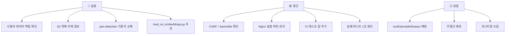

# 미완료 작업

## 목적

구현이 덜 됐거나, 구현은 됐으나 켜지지 않았거나, 알려진 문제로 남은 것을 정리한다.
**"미완료" 와 "범위 제외" 를 구분한다.**

## 현재 구현

### ① 구현 완료 · 범위 제외 (의도된 미가동)

루트 `README.md` 가 명시적으로 범위 결정이라고 적은 것들이다. **코드가 없는 게 아니다.**

| 기능 | 규모 | 켜려면 필요한 것 |
| --- | --- | --- |
| 견적서 검증 (OCR → 판정 → 리포트) | 백엔드 **101개 파일** | `DOCUMENT_STORAGE_PROVIDER` · `ESTIMATE_OCR_PROVIDER` 선택 + 업로드 화면 |
| 검증 결과 PDF | 생성기·한글 폰트·워커 완성, 테스트 3건 | 위와 함께 |
| 정비소 질문 | API·스키마·LLM 워커 완성 | 화면. 체크리스트와 목적이 겹쳐 하나로 합침 |
| 관리자 마스터·규칙 관리 | API **34개** 완성 | 관리자 UI |
| 사진 품질 판정 | 구현 완료 | `app.image-quality.enabled=true` |

**백엔드 엔드포인트 98개 중 45개(46%)가 화면 없이 대기 중이다.**
`estimatevalidation` 101개 파일은 `src/main` 전체의 19%다.

README의 판단 근거:

> 사진 기반 견적을 먼저 완성하는 쪽을 택해 제외했다.
> 관리자 UI 는 이번 범위에서 제외했다 — 사용자 화면을 먼저 완성하는 쪽을 택했다.
> 정비 체크리스트가 "정비소에서 확인할 항목" 이라는 같은 목적을 덮어, 화면을 둘로 나누지 않기로 했다.

### ② 🔴 알려진 위험 — part 가중치 교체

**가장 큰 기술 부채다.**

`AI/server/README.md`:

> `damage_part_best-35ep.pt`는 현재 **segmentation** 가중치다. 서버 adapter는 bbox만 읽어
> API에는 `detect` 결과로 내보내지만, **운영 전에는 명세대로 학습한 part detection 가중치로
> 교체해야 한다.**

이 조사에서 가중치를 직접 로드해 `task=segment` 를 확인했다.
**저장소에 교체용 detection 가중치가 없다.**

영향: 부품 인식 정확도가 명세가 상정한 수준인지 검증되지 않았다.
부품을 못 붙이면 `VECTOR_ONLY` 가 되고, `VECTOR_ONLY` 는 견적 항목이 되지 못한다.

### ③ 실패 중인 테스트 1건

```
FAILED tests/test_estimate_service.py::test_not_approved_rows_are_excluded[NOT_APPROVED]
assert True is False   (tests/test_estimate_service.py:419)
```

`MIN_CASE_COUNT` 를 3 → 2로 낮춘 커밋(`30671b4`) 이후 남은 것이다.
테스트 주석은 여전히 `최소 사례 수(3) 미달` 을 전제한다.

`b553171` 이 일부를 고쳤으나 이 건은 남았다. **고치다 만 것으로 보인다.**

(백엔드는 1,677건 전부 통과한다.)

### ④ 미추적 파일

```
?? pipeline/jobs/corpus/load_roi_embeddings.py
?? pipeline/jobs/corpus/tests/test_load_roi_embeddings.py
?? tmp/
```

`load_roi_embeddings.py` 는 **ROI 임베딩을 적재하는 핵심 잡**인데 Git에 없다.
운영 corpus 304,114건을 만든 코드가 추적되지 않는다.

### ⑤ 화면이 없는 코드 값

| 값 | 상태 |
| --- | --- |
| `ImageVariant.BLURRED` | enum·DDL CHECK에 있으나 **만드는 코드가 없다** |
| `analysis_image_result.s3_key_overlay` | 2026-09-11 오버레이 폐기로 미사용 |

`BLURRED` 는 의도적으로 남겼다 — "정본 DDL 의 `ck_aia_var` 가 네 값을 허용하므로 enum 에서
빼면 스키마와 어긋난다." 저장 경로(`S15P21A307-427`)가 열려 있다.

### ⑥ 사용처를 찾지 못한 것

| 항목 | 상태 |
| --- | --- |
| `repair_cost_stat` 테이블 | 읽는 코드를 확인하지 못함 |
| `GET /api/repair-shops` | 카카오 SDK 직접 연동으로 대체. "서버 경유가 필요해질 때를 위해 남겨 두었다" |
| `/api/accidents/{id}/actual-cost` · `cost-comparison` | `api.js` 에 대응 함수 없음 |
| `/api/estimates/{id}/basis` · `similar-cases` | 동일 |
| `/api/repair-cases/{caseId}` | 동일 |
| `/api/accidents/{id}/analysis/retry` | 동일 |
| `/api/guides/**` | 동일 |

### ⑦ 인프라 공백

| 항목 | 상태 |
| --- | --- |
| Nginx 설정 | **저장소에 없음.** 서버에서만 관리 |
| IaC (Terraform 등) | 없음. 서버 종류(EC2/Lightsail)조차 미확정 |
| 역방향 마이그레이션 | `pipeline/sql/` 에 down 스크립트 없음 |
| 이미지 레지스트리 | 로컬 태그만. 롤백이 서버 로컬 이미지에 의존 |
| 무중단 배포 | 없음. `rm -rf` → `cp` 구간에 다운타임 |
| 자동 롤백 | 없음. 헬스 실패 시 보고만 |
| 스테이징 환경 | 없음. `develop` → 운영 직행 |

루트 `README.md:176` 이 서버 종류 불일치를 이미 기록했다 —
"저장소에 IaC 가 없어 확인하지 못했다."

### ⑧ 품질·관측 공백

| 항목 | 상태 |
| --- | --- |
| CI 테스트 잡 | 없음 (`-x test`) |
| 린트·정적 분석 | 없음 |
| 보안 스캔 (SAST·의존성) | 없음 |
| 테스트 커버리지 측정 | 없음 |
| 프론트 테스트 | 없음 (`package.json` 에 러너 없음) |
| APM·메트릭·대시보드 | 없음 |
| 중앙 로그 수집 | 없음 |
| 자동 알림 | 없음 |
| 자동 스모크 테스트 | 없음 |

**장애를 자동으로 감지하는 경로가 배포 시점뿐이다.**

### ⑨ 보안 미확인·위험

[보안 점검표](../09_보안/보안_점검표.md)의 위험 10건 + 미확인 20건이다. 주요 항목:

| 항목 | 내용 |
| --- | --- |
| CSRF 비활성화 | SPA + 쿠키 세션인데 `SameSite` 미확인 |
| S3 객체 미삭제 | DB CASCADE가 S3까지 안 간다. **탈퇴 후 사진 잔존 가능** |
| 원본 EXIF 보존 | 위치 정보 포함 가능 |
| `VITE_AUTH_GUARD` | `.env.example` 에 없는 목업 스위치 |

### ⑩ 백업 미확인

**가장 중요한 확인 항목이다.**

| 항목 | 상태 |
| --- | --- |
| corpus 백업 | ✓ 확인 (2026-09-21 덤프) |
| **사용자 데이터 백업** | **확인하지 못함** |
| 자동 백업 스케줄 | 확인하지 못함 |
| 외부 보관 | 확인하지 못함 |

corpus는 파이프라인으로 재생성할 수 있지만, `member` · `accident` · `estimate` 는 **재생성이
불가능하다.**

### ⑪ 사용자 경험 미완

| 항목 | 내용 |
| --- | --- |
| `nonEstimableReason` 한국어 매핑 | 영문 코드가 화면에 그대로 노출 |
| 배포 중 다운타임 | 짧지만 존재 |
| 첫 분석 지연 | 모델 지연 로드로 30초~1분 |

## 우선순위 제안



**①~③ 은 데이터 손실·정확도와 직결된다.**

## 근거 자료

- 루트 `README.md` 기능 상태표
- `git status` (미추적 파일)
- 이 조사에서 실행한 테스트 (AI 1건 실패)
- `AI/server/README.md` 가중치 경고
- 가중치 직접 로드 확인

## 확인 필요 항목

- **범위 제외 결정의 공식 기록** — README 본문 외 회의록·Jira 결정을 확인하지 못함
- **`load_roi_embeddings.py` 미추적 사유** — 의도인지 실수인지 확인하지 못함
- **`tmp/` 용도** — 확인하지 못함
- **남은 Jira 이슈** — 조회 100건 중 "해야 할 일" 19건 · "진행 중" 5건. 전체는 확인하지 못함
