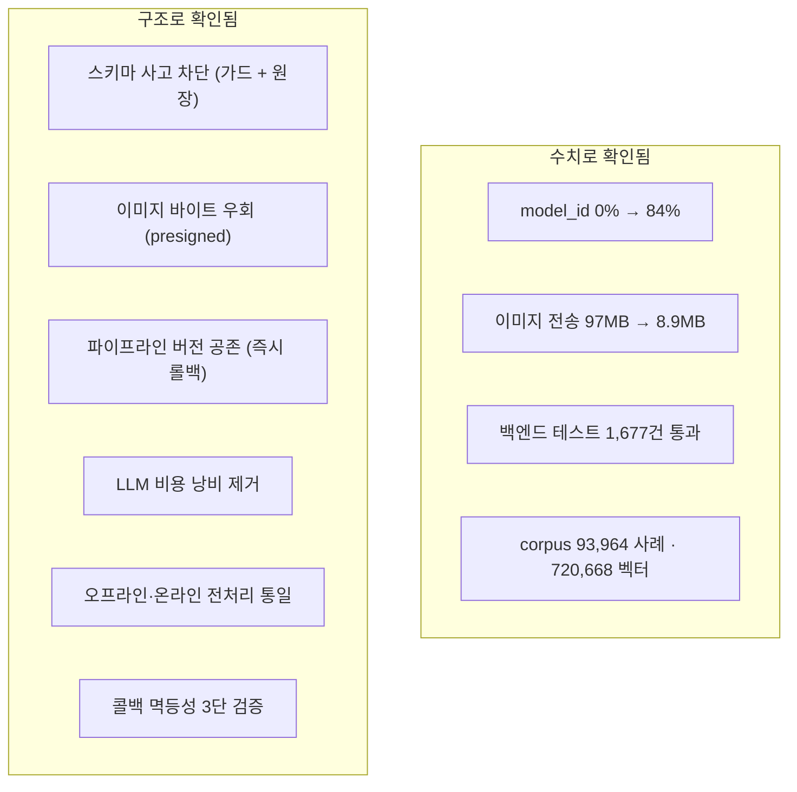

# 주요 성과

## 목적

수치나 코드로 **확인되는** 성과만 적는다. 근거가 없는 수치는 만들지 않는다.

## 확인된 수치 성과

### ① `repair_case.model_id` 커버리지 0% → 84%

| 시점 | `model_id` 채워진 사례 |
| --- | --- |
| 2026-09-21 이관 전 | **0건** |
| 이관 후 | **80,919 / 93,964 (86.1%)** |

**의미**: 유사 사례 검색은 `MODEL` → `PRICE_TIER` → `ALL` 3단계로 좁힌다.
`model_id` 가 없으면 앞 두 단계를 못 타고 전부 `ALL` (전체 검색)로 떨어진다.
차종·가격대가 다른 사례까지 섞여 견적 근거가 흐려진다.

**근거**: 2026-09-21 운영 DB 직접 조회.

```sql
SELECT count(*) AS total, count(model_id) AS with_model FROM repair_case;
-- 39676 | 33379
```

### ② 배포 이미지 전송량 97MB → 8.9MB

`backend/Dockerfile` 주석의 실측값이다.

| 구성 | 크기 |
| --- | --- |
| 전체 boot jar | 97MB |
| dependencies 레이어 | 93MB |
| **application 레이어** | **8.9MB** |

레이어드 jar로 쪼개, 코드만 바뀌면 8.9MB만 전송된다.
**약 91% 감소**다.

부수 효과로 이미지 빌드가 "수 초" 로 끝난다 (주석 표현).

### ③ 백엔드 테스트 1,677건 통과

이 조사에서 직접 실행한 결과다.

```
backend: tests=1677 failures=0 errors=0 skipped=40
```

`src/test` 144개 파일 · `src/main` 519개 파일 기준이다.

### ④ corpus 규모

2026-09-21 운영 DB 실측이다.

| 항목 | 건수 |
| --- | --: |
| 수리 사례 | 93,964 |
| 사례 이미지 | 337,966 |
| 손상 특징 (v1) | 205,977 |
| 손상 특징 (v2) | 851,516 |
| ROI 임베딩 (768차원) | 720,668 |
| v2 검색 가능 임베딩 | 711,073 |

### ⑤ 구현 규모

| 항목 | 값 |
| --- | --: |
| 9월 커밋 | 520 |
| Java 파일 (main) | 519 |
| Java 파일 (test) | 144 |
| REST 엔드포인트 | 98 |
| Vue 화면 | 25 |
| DB 테이블 | 47 |
| Jira 이슈 (조회분) | 100+ |
| 기존 문서 | 235 |

**한 달 남짓에 이 규모**다 (전체 커밋 536건 중 520건이 9월).

## 확인된 기술적 성과

### ⑥ 스키마 사고를 구조로 막았다

`ddl-auto=validate` 는 스키마가 어긋나면 **앱 전체가 안 뜬다.** 위험한 설정이다.
그래서 CI `migration-guard` 가 미적용 SQL이 있으면 배포를 멈춘다.

가드가 **파일 원장 + 내용 해시**를 쓰는 것이 핵심이다. 처음에는 배포 커밋만 봐서
"적용했는데도 계속 멈추는" 문제가 있었고(커밋 `a560f93`), 원장 도입으로 해결했다.

### ⑦ 이미지 바이트가 백엔드를 통과하지 않는다

브라우저 → S3 직접 PUT, AI 서버 → S3 직접 GET (presigned).
백엔드는 URL만 발급한다.

**효과**: 백엔드 메모리·대역폭 절약, AI 서버에 AWS 자격증명 불필요.

### ⑧ 두 파이프라인 버전이 공존한다

`repair_case_damage_feature` 에 v1(205,977) · v2(851,516)가 같이 있다.
전환은 환경변수 한 줄 + 컨테이너 재생성이다.

**2026-09-21에 v2 → v1 → v2 전환을 실제로 수행**해 롤백 경로가 살아 있음을 확인했다.

### ⑨ 비용이 드는 실패를 막았다

LLM 호출은 실패해도 크레딧이 든다.

| 조치 | 근거 |
| --- | --- |
| 저장소 확인을 LLM 호출보다 **앞**에 | 커밋 `c29e9f4` |
| 저장소 확인을 렌더링보다 **앞**에 | 커밋 `cee4f46` |
| 반복 실패는 `ABANDONED` 로 종결 | "영영 실패하는 건이 매 주기 GMS 크레딧을 태운다" |
| 프론트 자동 재시도 금지 | "어떤 상태에도 자동 재시도하지 않는다 (특히 429)" |

### ⑩ 오프라인과 온라인이 같은 코드를 쓴다

`shared/vision` 이 파이프라인과 AI 서버의 공통 조상이다.
ROI 20% padding · 224px letterbox · L2 정규화가 양쪽에서 동일하다.

전처리가 갈라지면 **오류 없이 검색 결과만 틀린다.** 잡기 어려운 버그를 구조로 막았다.

`embedding_model_version` 불일치 시 검색을 거부하는 장치도 있다.

### ⑪ 멱등성을 3단으로 검증한다

AI가 콜백을 최대 4회 보낸다. 막지 않으면 "분석 한 번에 견적 4개" 가 된다.

| 단계 | 검사 |
| --- | --- |
| 1 | 헤더 `X-Request-Id` == 본문 `requestId` |
| 2 | 경로 `jobId` == 본문 `jobId` |
| 3 | 저장된 `requestId` 와 일치 (철 지난 콜백 차단) |

### ⑫ 판단 근거를 코드에 남겼다

이 저장소의 두드러진 특징이다. 주요 결정마다 **이유가 주석에 있다.**

| 결정 | 근거가 적힌 곳 |
| --- | --- |
| iText 대신 Open HTML to PDF | `build.gradle` (AGPL 회피) |
| CPU torch | `AI/server/Dockerfile` (GPU 없음, 이미지 6GB) |
| 메모리 상한 | `.gitlab-ci.yml` (같은 박스에 DB) |
| 파일명을 키에 안 넣음 | `AccidentImageKeys.java` (경로 조작) |
| `partCode = null` | corpus 결정사항 (틀린 부품보다 null) |
| 레이어드 jar | `backend/Dockerfile` (97MB→8.9MB) |

**이 문서 전체가 그 주석 덕분에 추측 없이 쓰였다.**

## 성과 요약



## 근거 자료

| 성과 | 근거 |
| --- | --- |
| ① | 2026-09-21 운영 DB 직접 조회 |
| ② | `backend/Dockerfile` 주석 실측값 |
| ③ | 이 조사에서 `./gradlew test` 실행 |
| ④ | 2026-09-21 운영 DB 직접 조회 |
| ⑤ | 파일·커밋 집계 |
| ⑥~⑫ | 소스·설정·주석 직접 확인 |

## 확인 필요 항목

**아래는 성과로 주장할 근거를 찾지 못한 것들이다.**

- **분석 응답 시간** — `Docs/Architecture/분석 응답 시간 측정 (S15P21A307-159).md` 가 있으나 내용을 확인하지 못했다
- **모델 정확도 (mAP 등)** — 저장소에서 확인하지 못했다
- **견적 정확도** — 실제 수리비와 비교한 평가를 확인하지 못했다
- **검색 응답 시간** — "2초" 기준이 언급되나 측정값을 확인하지 못했다
- **사용자 수·이용 실적** — 확인하지 못했다
- **이관 전후 검색 품질 비교** — `fallbackStage` 분포 비교 데이터가 없다.
  `model_id` 커버리지 개선은 확인했으나 **그것이 견적 정확도를 얼마나 올렸는지는 측정되지 않았다**
