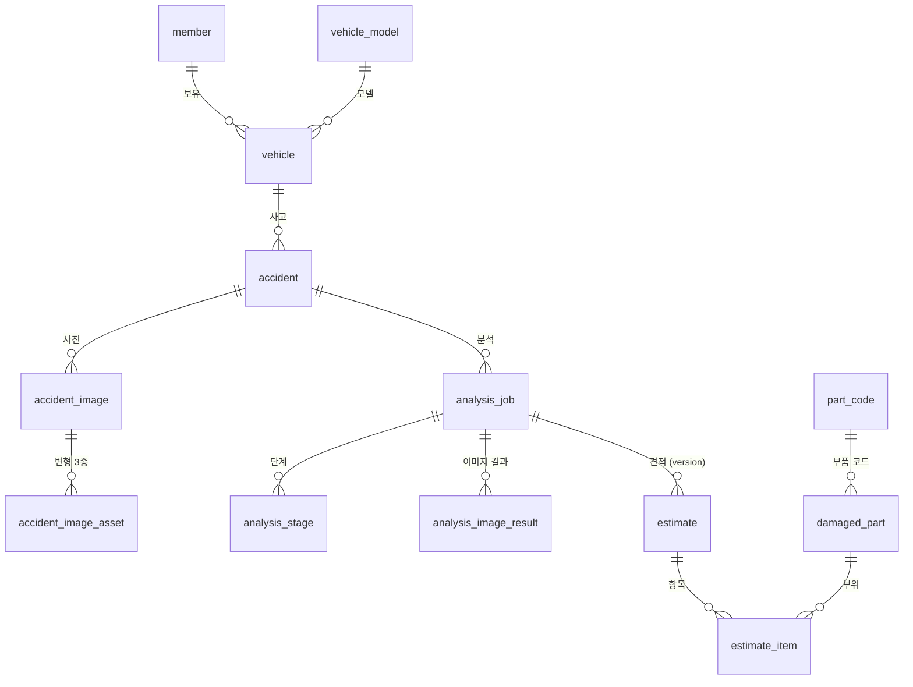
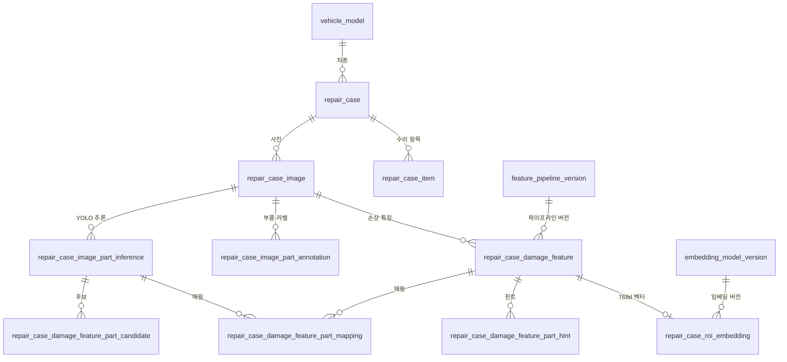
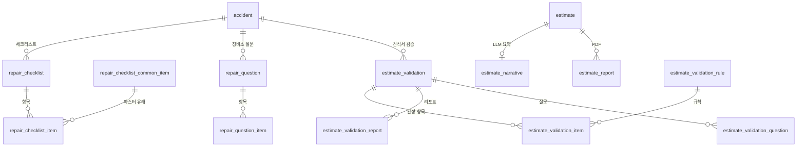
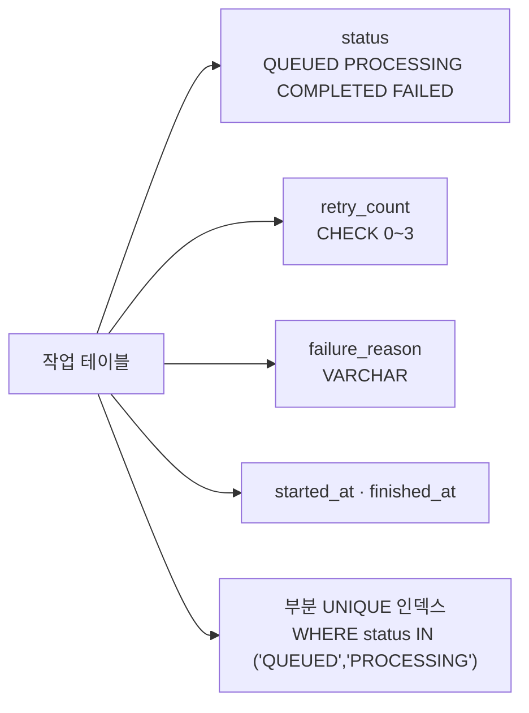
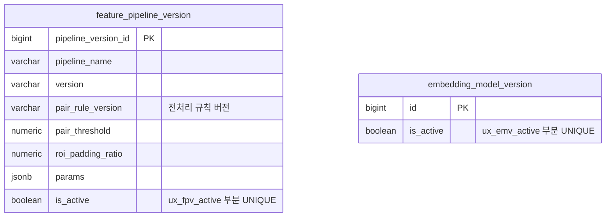
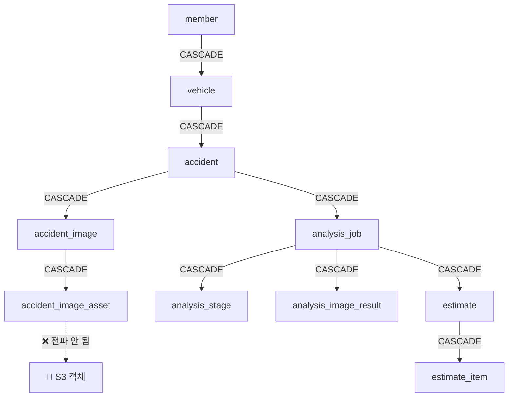

# ERD 다이어그램

## 목적

47개 테이블의 관계를 한눈에 보이도록 정리한다. 전부 한 장에 넣으면 읽을 수 없으므로
**전체 개요 + 그룹별 상세** 로 나눈다. 컬럼 상세는 [ERD](../05_데이터/ERD.md)에 있다.

## 전체 개요 (테이블 그룹 관계)

```mermaid
flowchart TB
    subgraph M["마스터 10"]
        M1["part_code · part_name_mapping"]
        M2["vehicle_model"]
        M3["repair_code · repair_method_rule"]
        M4["estimate_validation_rule"]
        M5["repair_checklist_common_item"]
        M6["estimate_notice"]
        M7["feature_pipeline_version"]
        M8["embedding_model_version"]
    end
    subgraph U["회원 3"]
        U1["member"]
        U2["terms_agreement"]
        U3["vehicle"]
    end
    subgraph A["사고 4"]
        A1["accident"]
        A2["accident_image"]
        A3["accident_image_asset"]
        A4["accident_review"]
    end
    subgraph N["분석 4"]
        N1["analysis_job"]
        N2["analysis_stage"]
        N3["analysis_image_result"]
        N4["damaged_part"]
    end
    subgraph E["견적 4"]
        E1["estimate"]
        E2["estimate_item"]
        E3["estimate_narrative"]
        E4["estimate_report"]
    end
    subgraph C["corpus 11"]
        C1["repair_case · repair_case_item"]
        C2["repair_case_image"]
        C3["repair_case_damage_feature"]
        C4["repair_case_roi_embedding"]
        C5["part_annotation · part_inference<br/>part_hint · part_mapping · part_candidate"]
        C6["repair_cost_stat"]
    end
    subgraph V["검증 4"]
        V1["estimate_validation"]
        V2["estimate_validation_item"]
        V3["estimate_validation_report"]
        V4["estimate_validation_question"]
    end
    subgraph D["파생 4"]
        D1["repair_checklist · repair_checklist_item"]
        D2["repair_question · repair_question_item"]
    end
    subgraph O["운영 3"]
        O1["batch_job_execution"]
        O2["data_validation_error"]
        O3["audit_log"]
    end

    M2 --> U3 --> A1 --> N1 --> E1
    U1 --> U3
    U1 --> U2
    A1 --> A2 --> A3
    N1 --> N2
    N1 --> N3
    E1 --> E2
    E1 --> E3
    E1 --> E4
    C1 -.->|검색 근거| E2
    M2 --> C1
    C2 --> C3 --> C4
    M7 --> C3
    M8 --> C4
    A1 --> D1
    A1 --> D2
    A1 --> V1 --> V2
    M1 --> N4 --> E2
    O1 --> O2
```



## 핵심 경로 (사고 → 견적)



## 검색 corpus



## 파생 기능



## 작업 큐 테이블의 공통 구조



이 패턴이 **7곳**에 있다. 진행 중인 작업이 있으면 같은 대상에 새 작업을 넣을 수 없다.

## 버전 관리 테이블



**전처리 규칙을 데이터로 기록한다.** 규칙이 바뀌면 새 버전을 만들고, corpus와 질의가 같은
버전인지 확인할 수 있다.

`is_active` 가 `true` 인 행이 **하나뿐**임을 부분 UNIQUE 인덱스가 보장한다.

다만 AI 서버는 `is_active` 를 읽지 않고 `FEATURE_PIPELINE_VERSION_ID` 환경변수로 고른다.

## 삭제 전파



**S3 객체는 CASCADE를 따라가지 않는다.** 탈퇴 후에도 사진이 남을 수 있다 —
[데이터 보존 정책](../05_데이터/데이터_보존_정책.md) 참고.

## 벡터 컬럼

```
repair_case_roi_embedding.embedding  vector(768)  NOT NULL
CREATE INDEX ix_roi_hnsw ON repair_case_roi_embedding
    USING hnsw (embedding vector_cosine_ops);
```

유일한 벡터 컬럼이다. 768은 DINOv2-base `pooler_output` 차원이다.

DDL 주석 — "대량 적재 전에 만들면 INSERT 가 느려집니다 (**실측 11.4만건 65초**)."

## 운영 실측 건수 (2026-09-21)

| 테이블 | 건수 |
| --- | --: |
| `repair_case` | 39,676 |
| `repair_case_image` | 168,297 |
| `repair_case_damage_feature` (v1) | 205,977 |
| `repair_case_damage_feature` (v2) | 347,086 |
| `repair_case_roi_embedding` | 304,114 |
| `vehicle_model` | 51 |

## 관련 문서

- [ERD](../05_데이터/ERD.md) — 컬럼 상세
- [테이블 명세](../05_데이터/테이블_명세.md)
- [데이터베이스 구조](../05_데이터/데이터베이스_구조.md)
- [벡터 검색](../05_데이터/벡터_검색.md)

## 근거 자료

- `Docs/Erd/A307_ddl_final.sql` — `CREATE TABLE` 47개, `REFERENCES` 선언
- 2026-09-21 운영 DB 직접 조회

## 확인 필요 항목

- **일부 관계의 카디널리티** — FK로 방향은 확인했으나 1:1 / 1:N 구분을 일부 추정으로 표기함
- **`damaged_part` 생성 경로** — 참조는 확인했으나 채우는 코드를 확인하지 못함
- **`repair_cost_stat` 관계** — 읽는 코드를 확인하지 못함
- **`audit_log` 컬럼** — 인덱스 이름으로 역추정함
- **검증 계열 4개 테이블 FK** — 상세를 전수 확인하지 못함
