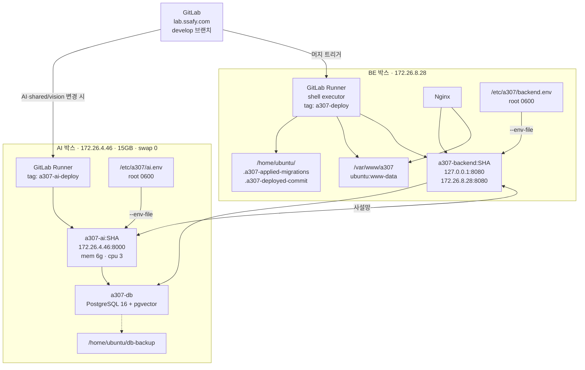
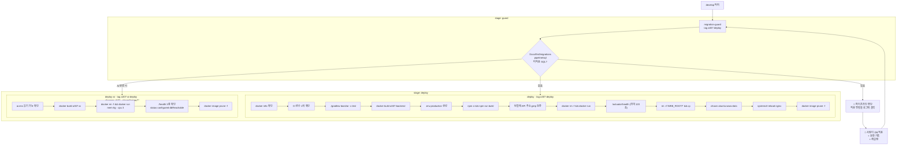
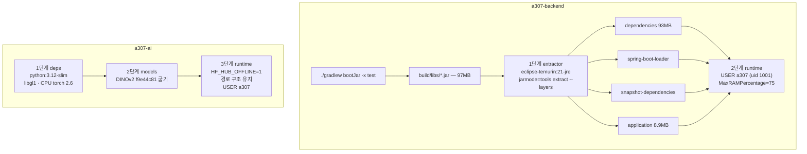
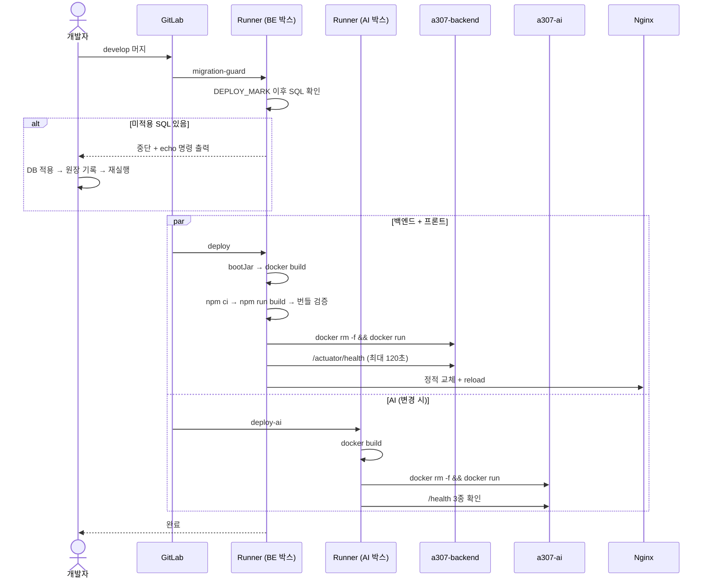
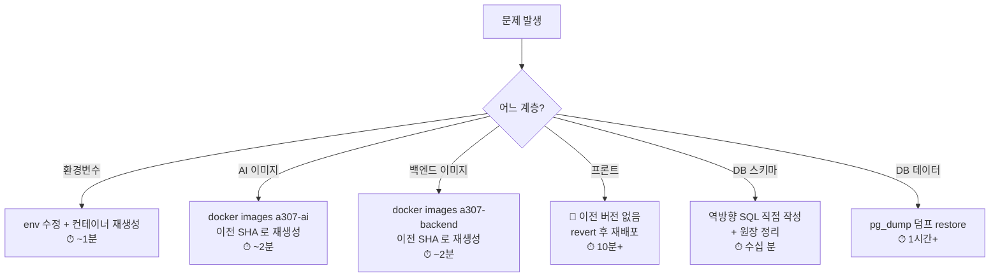
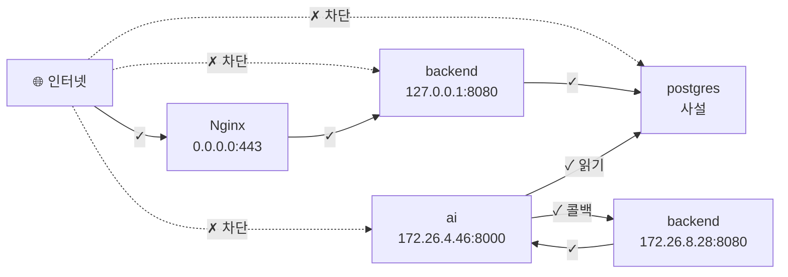

# 배포 구조 다이어그램

## 목적

AWS·Docker 배포 구조와 CI/CD 파이프라인을 그린다.

## 배포 토폴로지

## CI/CD 파이프라인

## 이미지 빌드

**두 이미지 모두 빌드 컨텍스트가 저장소 루트다.**

## 배포 흐름 (시간순)

## 롤백

**아래로 갈수록 오래 걸리고 위험하다.** 프론트는 `rm -rf` 로 이전 파일을 지워 서버에
남지 않는다.

## 네트워크 경계

**인터넷에서 직접 닿는 것은 Nginx뿐이다.**

## 관련 문서

- [배포 구조](../08_배포_CICD/배포_구조.md)
- [배포 절차](../08_배포_CICD/배포_절차.md)
- [CI/CD 파이프라인](../08_배포_CICD/CICD_파이프라인.md)
- [롤백 절차](../08_배포_CICD/롤백_절차.md)
- [Docker 구성](../07_인프라/Docker_구성.md)

## 근거 자료

- `.gitlab-ci.yml` (312행) 전체
- `backend/Dockerfile` · `AI/server/Dockerfile`
- 2026-09-21 서버 실측

## 확인 필요 항목

- **Nginx 리슨 포트** — 443으로 추정. 설정이 저장소에 없음
- **`--network a307-net`** — CI 헤더 롤백 예시에만 나온다. 실제 `deploy` 잡에서 쓰는지 미확인
- **서버 종류 (EC2/Lightsail)** — IaC 없음
- **파이프라인 소요 시간** — 확인하지 못함
