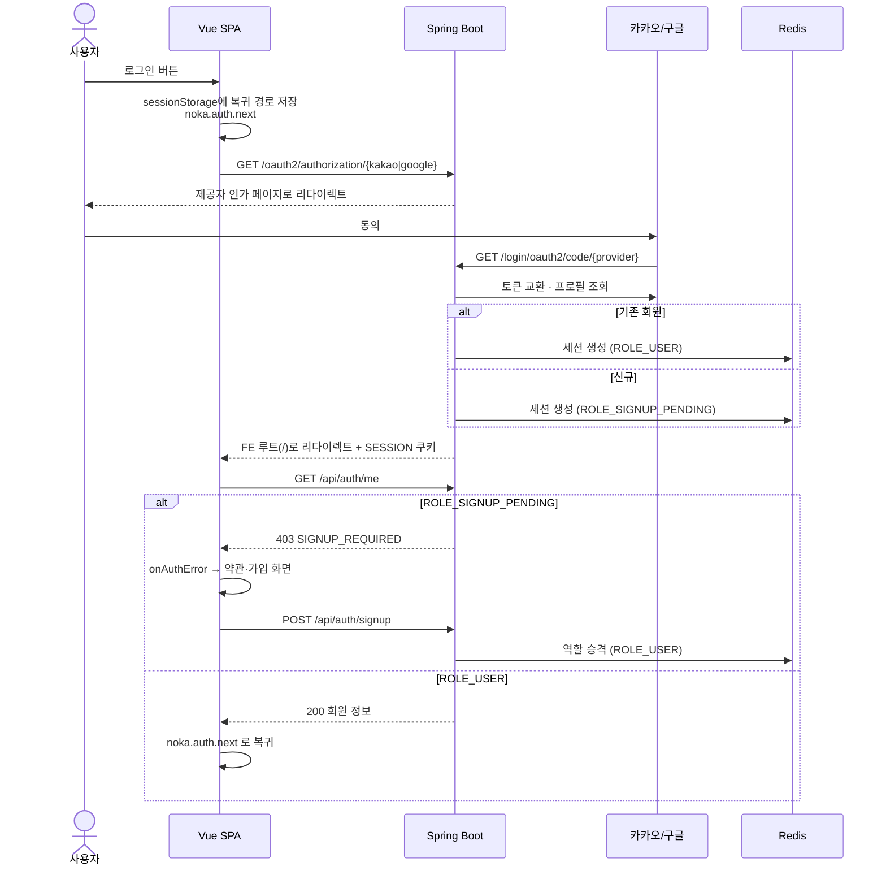
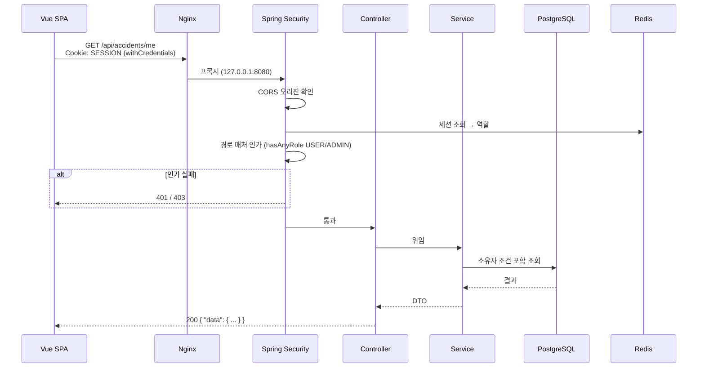
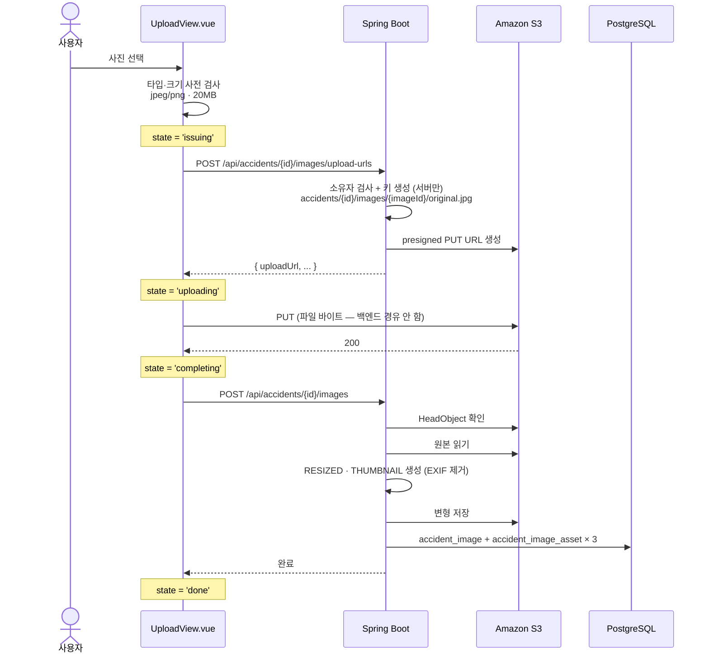
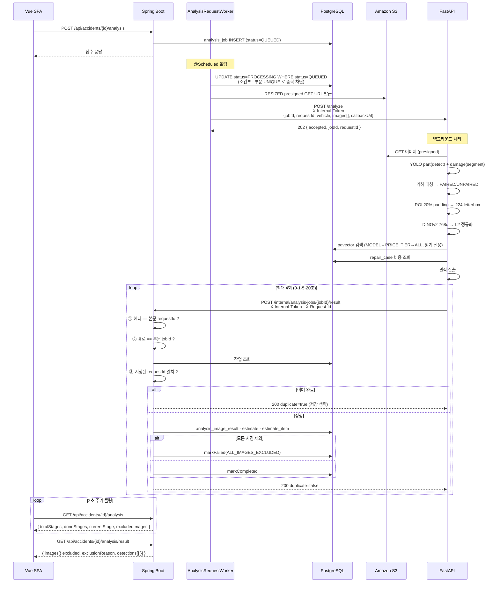
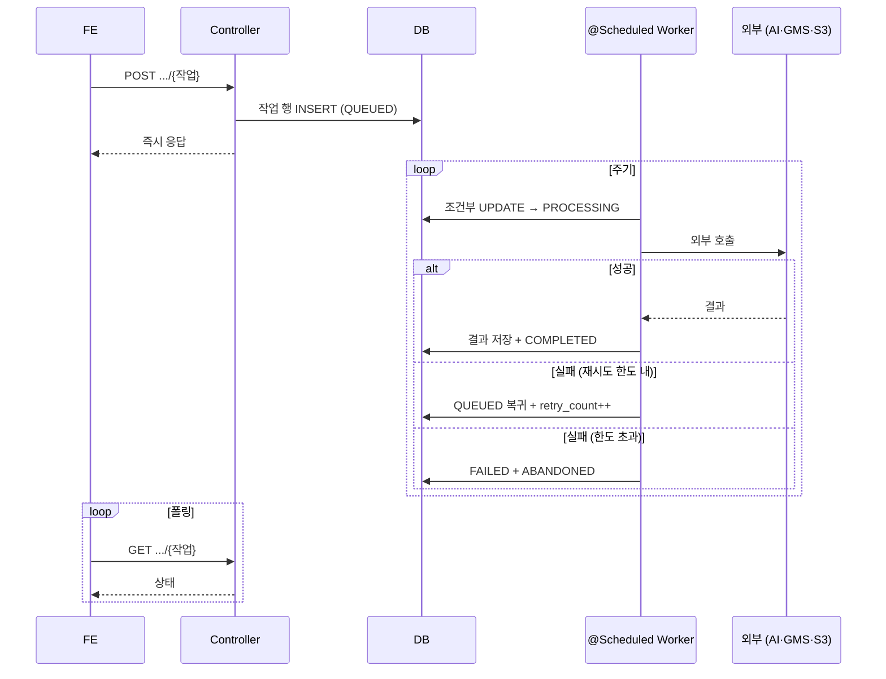
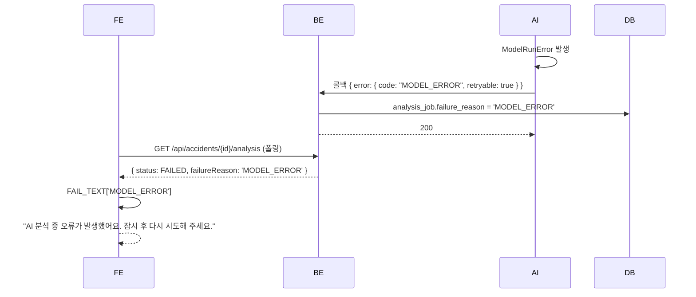

# 요청 처리 시퀀스

## 목적

프론트엔드 → 백엔드 → AI 서버로 이어지는 요청 흐름을 시퀀스로 그린다.

## ① 로그인

## ② 일반 조회 요청

## ③ 사진 업로드 3단계

## ④ 분석 요청 → 콜백 (핵심 경로)

## ⑤ 비동기 작업 공통 패턴

분석·견적 PDF·체크리스트가 모두 이 모양이다.

**반복 실패를 큐에 되돌리지 않는다** — "영영 실패하는 건이 매 주기 GMS 크레딧을 태운다."

## ⑥ 오류 전파

**오류 코드가 DB를 거쳐 화면 문구가 된다.** 한글 문안은 코드에 넣지 않는다 —
"사용자에게 보일 문구는 화면이 이 코드를 보고 정한다."

## 관련 문서

- [서비스 데이터 흐름](../01_전체_아키텍처/서비스_데이터_흐름.md) — 10단계 상세
- [API 처리 흐름](../03_백엔드/API_처리_흐름.md)
- [백엔드 ↔ AI 서버 통신](../04_AI/백엔드_AI서버_통신.md)
- [이미지 업로드 흐름](../02_프론트엔드/이미지_업로드_흐름.md)

## 근거 자료

- `AnalysisCallbackService.java` · `AnalysisRequestPayload.java`
- `AI/server/app/services/analysis_service.py`
- `frontend/src/lib/api.js` · `UploadView.vue` · `AnalyzingView.vue`
- `SecurityConfig.java`

## 확인 필요 항목

- **Nginx 프록시 단계** — 설정이 없어 `/api` 경로 처리를 확인하지 못함
- **업로드 URL 발급 요청·응답 본문** — DTO를 확인하지 못함
- **워커 폴링 주기** — `fixedDelay` 값을 확인하지 못함
- **RESIZED 생성 시점** — 완료 통보 처리 중 동기 생성으로 추정
