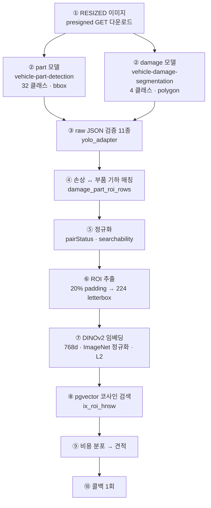
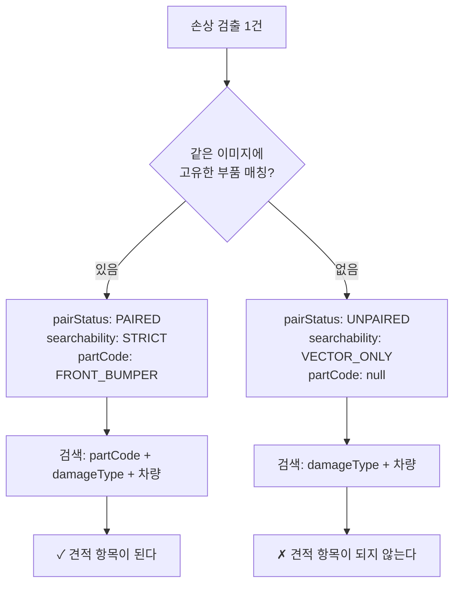
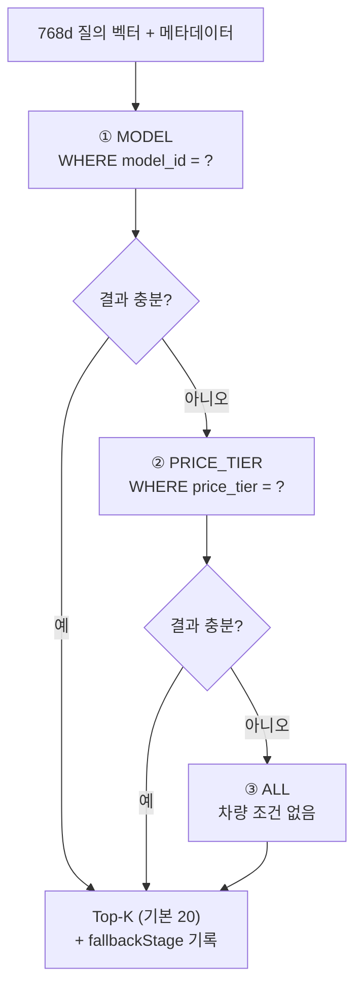
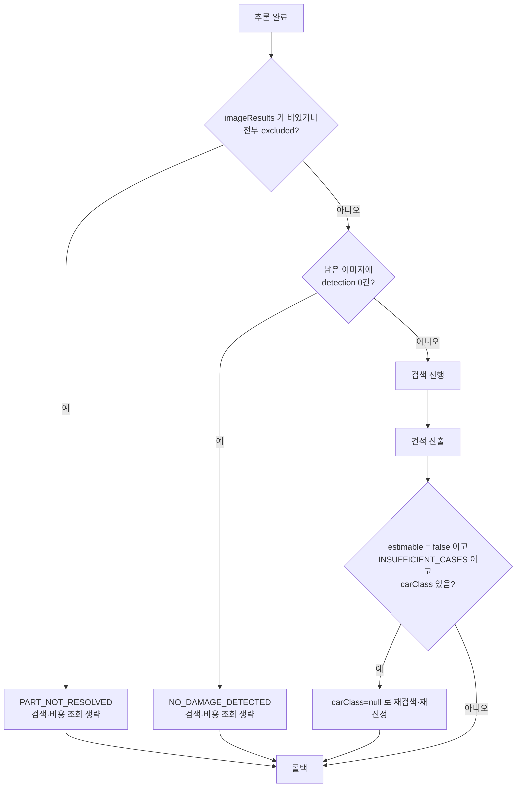
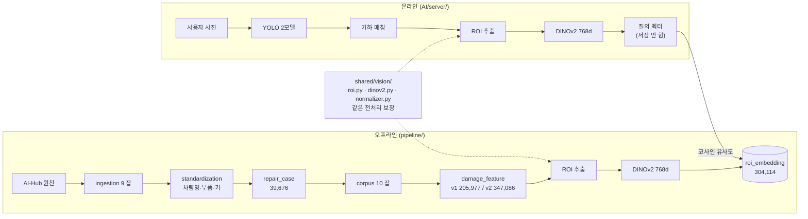
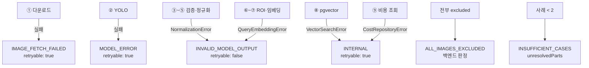
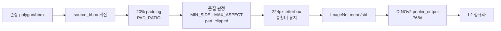
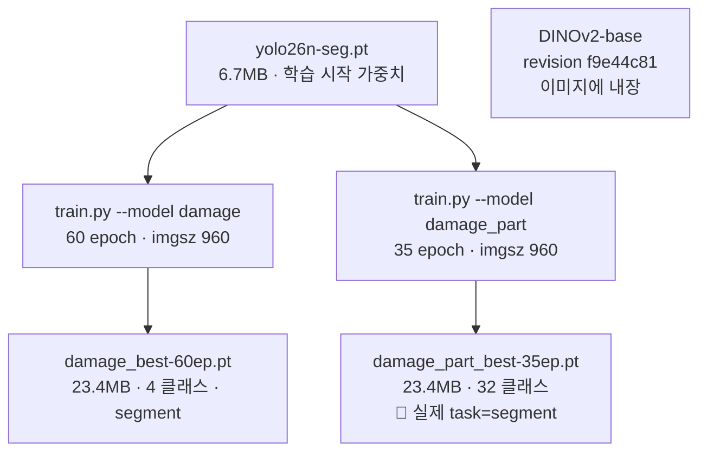

# 이미지 분석 흐름 다이어그램

## 목적

사진 한 장이 견적이 되기까지의 변환을 단계별로 그린다.

## 전체 파이프라인

## 분기 — searchability 결정

> 부품을 틀리게 부여하는 것보다 null 이 견적 안전성 측면에서 낫다.
> — `Docs/AI/이미지 입력 및 검색 corpus 결정사항.md`

## 검색 완화 3단계

`price_tier` 가 없으면 **추측하지 않고 그 단계를 건너뛴다.**

결과의 `fallbackStage` 는 `estimate_item.ref_condition` 에 저장돼 화면이
"얼마나 비슷한 사례인가" 를 보여 준다.

## 조기 종료 분기

**검색·비용 조회는 DB 왕복이다.** 결과가 정해진 경우 건너뛴다.

## 오프라인 corpus 구축과의 대칭

**전처리가 갈라지면 오류 없이 결과만 틀린다.** `shared/vision` 공유와
`embedding_model_version` 검증이 이를 막는다.

## 실패 지점

**AI 서버가 콜백에 실을 수 있는 코드는 4종뿐이다.**

## ROI 전처리 상세

letterbox를 쓰는 이유는 **종횡비 유지**다. 단순 리사이즈하면 긴 스크래치가 찌그러져
다른 모양이 된다.

L2 정규화하면 코사인 유사도가 내적과 같아져 `vector_cosine_ops` 검색이 정확해진다.

## 모델 구성

🔴 **`damage_part_best-35ep.pt` 는 segmentation 가중치다.** API에는 `detect` 로 내보내며,
`AI/server/README.md` 가 "운영 전에는 명세대로 학습한 part detection 가중치로 교체해야 한다"
고 명시했다. 저장소에 교체용 가중치가 없다.

## 관련 문서

- [이미지 분석 과정](../04_AI/이미지_분석_과정.md)
- [추론 파이프라인](../04_AI/추론_파이프라인.md)
- [모델 구성](../04_AI/모델_구성.md)
- [벡터 검색](../05_데이터/벡터_검색.md)
- [서비스 데이터 흐름](../01_전체_아키텍처/서비스_데이터_흐름.md)

## 근거 자료

- `AI/server/app/services/` · `adapters/` · `infrastructure/`
- `shared/vision/roi.py` · `dinov2.py` · `normalizer.py`
- `AI/training/train.py` · `prepare_dataset.py`
- 가중치 직접 로드 확인 (`model.names` · `model.task`)

## 확인 필요 항목

- **완화 단계 전환 기준 건수** — "결과가 충분" 의 임계값을 확인하지 못함
- **`roi.py` 상수 실제 값** — `MIN_SIDE` · `MAX_ASPECT` 등 일부 미확인
- **품질 판정이 온라인에 쓰이는지** — corpus 전용인지 확인하지 못함
- **교체용 part detection 가중치** — 저장소에 없음
