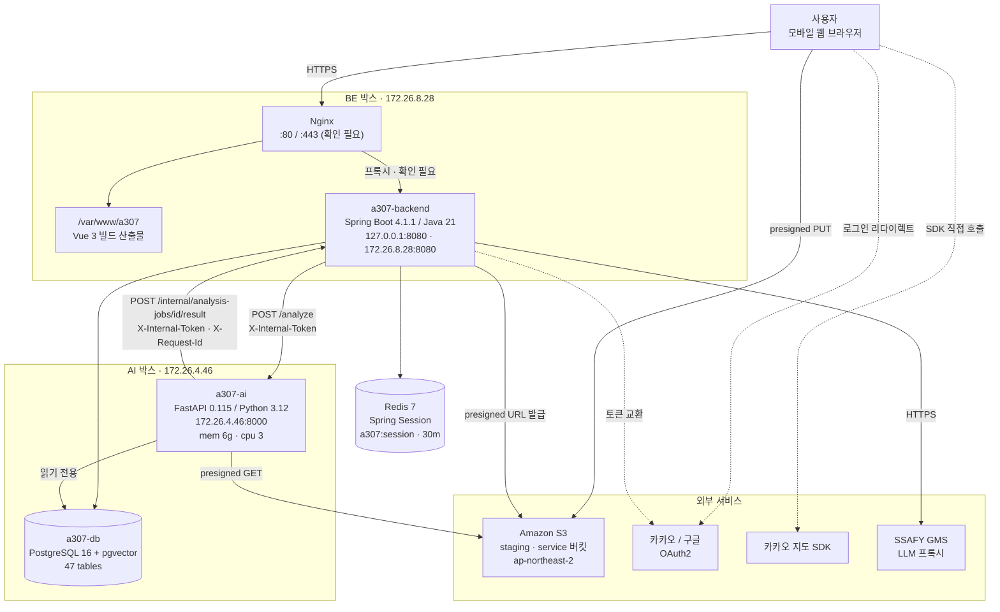
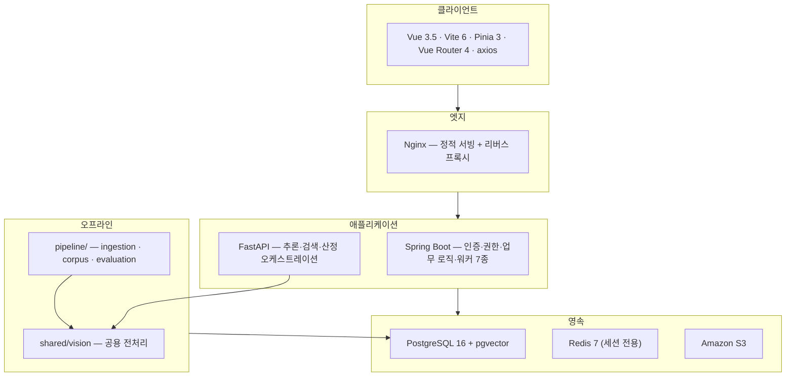
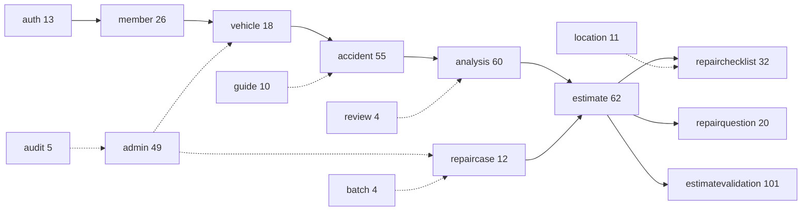
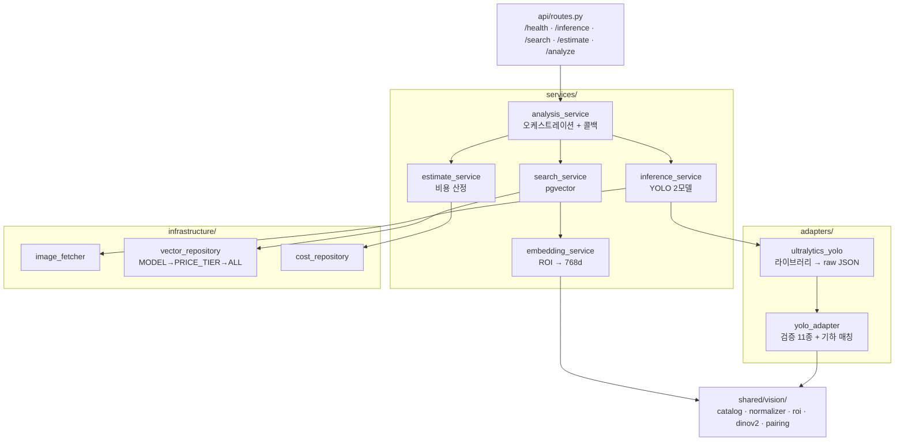
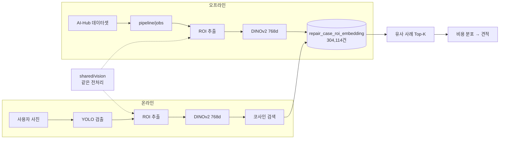

# 전체 아키텍처 다이어그램

## 목적

시스템 구성을 한 장에 담는다. 서비스명·포트·경로는 **설정 파일에서 확인한 값**이며,
확인하지 못한 것은 표시했다.

## 시스템 구성도

## 계층 구조

## 백엔드 도메인 구조

숫자는 Java 파일 수다. 점선은 참조·보조 관계다.

## AI 서버 내부 구조

## 데이터 흐름 (개념)

**`shared/vision` 이 양쪽에 같은 전처리를 보장한다.** 갈라지면 오류 없이 결과만 틀린다.

## 확인된 값 · 확인 필요 값

| 항목 | 값 | 출처 |
| --- | --- | --- |
| BE 박스 사설 IP | `172.26.8.28` | `.gitlab-ci.yml` |
| AI 박스 사설 IP | `172.26.4.46` | `.gitlab-ci.yml` |
| 백엔드 포트 | 8080 | `.gitlab-ci.yml` |
| AI 포트 | 8000 | `.gitlab-ci.yml` |
| 웹 루트 | `/var/www/a307` | `.gitlab-ci.yml` |
| 컨테이너명 | `a307-backend` · `a307-ai` · `a307-db` | `.gitlab-ci.yml`, 실측 |
| S3 리전 | `ap-northeast-2` | 로컬 `aws configure` 실측 |
| Redis 네임스페이스 | `a307:session` | `application.properties` |
| **Nginx 포트·프록시 규칙** | **확인 필요** | 설정이 저장소에 없음 |
| **운영 Redis 위치** | **확인 필요** | |
| **공인 도메인** | **확인 필요** | |
| **서버 종류 (EC2/Lightsail)** | **확인 필요** | IaC 없음. 루트 `README.md:176` |

## 관련 문서

- [시스템 아키텍처](../01_전체_아키텍처/시스템_아키텍처.md)
- [전체 시스템 구성](../00_프로젝트_개요/전체_시스템_구성.md)
- [컴포넌트 관계](../01_전체_아키텍처/컴포넌트_관계.md)
- [인프라 구성](../07_인프라/인프라_구성.md)

## 근거 자료

- `.gitlab-ci.yml` · `backend/Dockerfile` · `AI/server/Dockerfile` · `docker-compose.yml`
- `backend/src/main/resources/application.properties`
- 파일·디렉터리 구조 집계

## 확인 필요 항목

위 "확인 필요 값" 표 참고. 대부분 **Nginx 설정과 IaC가 저장소에 없어** 생긴 공백이다.
