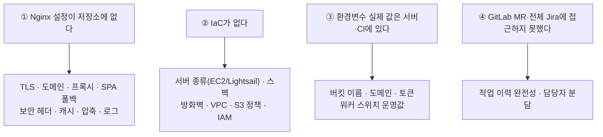

# 확인필요 항목

## 목적

전체 문서의 `확인 필요 항목` 을 한곳에 모은다. **"확인 안 됨" 은 "문제 있음" 이 아니라
"현재 작업공간에서 근거를 찾지 못함" 이다.**

## 공백의 뿌리

확인하지 못한 항목의 대부분이 **네 가지 원인**에서 나온다.

**①②를 저장소로 가져오면 절반 이상이 해소된다.**

## 🔴 우선 확인 (데이터·보안 직결)

| # | 항목 | 왜 중요한가 | 관련 문서 |
| --- | --- | --- | --- |
| 1 | **사용자 데이터 백업 여부** | corpus는 재생성 가능하지만 `member`·`accident`·`estimate` 는 불가능하다 | [백업과 복구](../10_운영/백업과_복구.md) |
| 2 | **S3 객체 삭제 경로** | DB CASCADE가 S3까지 안 간다. 탈퇴 후 사진 잔존 가능 | [데이터 보존 정책](../05_데이터/데이터_보존_정책.md) |
| 3 | **`SameSite` 쿠키 속성** | CSRF를 껐는데 보완책이 있는지 | [인증과 권한](../03_백엔드/인증과_권한.md) |
| 4 | **S3 버킷 퍼블릭 액세스 차단** | 사고 사진이 공개돼 있지 않은지 | [AWS 구성](../07_인프라/AWS_구성.md) |
| 5 | **자동 백업 스케줄** | 수동 덤프만 확인됨 | [백업과 복구](../10_운영/백업과_복구.md) |
| 6 | **TLS 설정·인증서** | Nginx 설정이 없어 확인 불가 | [Nginx 구성](../07_인프라/Nginx_구성.md) |

## 인프라

| 항목 | 상태 |
| --- | --- |
| Nginx 설정 파일 전체 | 저장소에 없음 |
| 서버 도메인 (`server_name`) | 확인 필요 |
| SPA 폴백 (`try_files`) | 확인 필요 |
| `/api` 프록시 규칙 | 확인 필요 |
| 정적 캐시 헤더·gzip | 확인 필요 |
| Nginx 로그 위치·형식 | 확인 필요 |
| **서버 종류 (EC2/Lightsail)** | 문서마다 다름. 루트 `README.md:176` 이 이미 기록 |
| 인스턴스 스펙 | AI 박스 15GB만 실측. BE 박스 미확인 |
| 디스크 용량 | 확인 필요 |
| OS 버전 | Ubuntu 추정 |
| 방화벽 (보안 그룹 / ufw) | 확인 필요 |
| VPC·서브넷 | IaC 없음 |
| SSH 포트·접근 제한 | 확인 필요 |
| **운영 Redis 위치** | 어느 박스인지 미확인 |
| 운영 PostgreSQL 포트 바인딩 | 확인 필요 |
| `a307-db` 생성 명령 | 저장소에 없음 |
| `--network a307-net` | CI 롤백 예시에만 등장 |
| 컨테이너 아웃바운드 규칙 | 일부 차단 언급만 있음 |
| 서버 프로비저닝 절차 | 스크립트 없음 |

## AWS

| 항목 | 상태 |
| --- | --- |
| 버킷 이름 | 환경변수라 확인 불가 |
| IAM 역할 정책 내용 | 확인 필요 |
| S3 버킷 정책 | 확인 필요 |
| S3 CORS 설정 | 브라우저 직접 PUT에 필요 |
| S3 암호화 (SSE) | 확인 필요 |
| S3 수명 주기 | 확인 필요 |
| presigned URL 유효 시간 | 설정 키만 확인 |
| **staging → service 승격 코드** | `copyObject` 호출을 찾지 못함 |

## 보안

| 항목 | 상태 |
| --- | --- |
| 보안 헤더 (HSTS·CSP·X-Frame-Options) | Nginx 설정 없음 |
| 세션 고정 공격 방어 | `sessionManagement` 미확인 |
| 동시 세션 제한 | 확인 필요 |
| Rate limiting | `TOO_MANY_REQUESTS` 코드만 존재 |
| `ROLE_ADMIN` 부여 경로 | 코드에서 찾지 못함 |
| 토큰 상수 시간 비교 | `internalApi.matches()` 미확인 |
| 의존성 취약점 | 스캔 도구 없음 |
| 매직 바이트 검사 | Content-Type 외 검증 여부 미확인 |
| 백업 암호화 | 확인 필요 |
| 로그 개인정보 포함 | 전수 검사 못 함 |
| 개인정보 처리방침 문안 | 화면은 있으나 내용 미확인 |
| `/etc/a307/backend.env` 권한 | `ai.env` 와 같을 것으로 추정 |

## 백엔드

| 항목 | 상태 |
| --- | --- |
| `ApiResponse` · `ErrorResponse` 클래스 정의 | 프론트 파싱으로 역추정 |
| 소유자 검사 구현 위치 | 공통인지 개별인지 미확인 |
| 워커 폴링 주기 (`fixedDelay`) | 확인 필요 |
| 트랜잭션 경계 규칙 | 전수 확인 못 함 |
| 로그 레벨 설정 | `logging.level.*` 미확인 |
| `Exception.class` 기본 핸들러 | 존재 여부 미확인 |
| `TOO_MANY_REQUESTS` 발생 지점 | 던지는 곳 없음 |
| `STORAGE_UNAVAILABLE` 발생 경로 | 프론트 매핑에만 존재 |
| `batch`·`audit`·`review` 패키지 역할 | 파일 수만 확인 |
| 건너뛴 테스트 40건 | 이유 미확인 |
| 커넥션 풀 설정 | 확인 필요 |
| JPA 2차 캐시 | 미사용 추정 |

## 프론트엔드

| 항목 | 상태 |
| --- | --- |
| 라우트 ↔ 컴포넌트 매핑 | 경로·파일명으로 추정 |
| 중복 경로 3건 (`/terms`·`/login`·`/home`) | 리다이렉트 추정 |
| 라우트 가드 | 확인 필요 |
| `DevSidebar.vue` 운영 노출 | 조건부 렌더링 미확인 |
| **`VITE_AUTH_GUARD`** | `.env.example` 에 없음. 운영 차단책 미확인 |
| `uploadToPresignedUrl` 구현 | `http` 인스턴스 사용 여부 |
| `noka.socialName` 저장소 종류 | local/session 미확인 |
| `inflight` 동작 | 중복 방지로 추정 |
| 전역 오류 경계 | Vue `errorHandler` 미확인 |
| Node.js 버전 | `engines` 없음 |
| 브라우저 호환 범위 | 명시 없음 |
| 프론트 테스트 | 러너 자체가 없음 |

## AI

| 항목 | 상태 |
| --- | --- |
| **모델 성능 지표 (mAP 등)** | 저장소에 없음 |
| **견적 정확도** | 실제 수리비 비교 평가 없음 |
| **분석 응답 시간 실측** | `S15P21A307-159` 문서 본문 미확인 |
| **검색 응답 시간** | "2초" 기준의 측정값 미확인 |
| **교체용 part detection 가중치** | 저장소에 없음 (README가 교체 필요 명시) |
| 실제 학습 하이퍼파라미터 | `60ep`·`35ep` 외 미확인 |
| 데이터셋 표본 수 | 기본값 3,300 외 실제값 미확인 |
| `device=6` 학습 환경 | 어느 장비인지 미확인 |
| AI-Hub 라이선스·이용 조건 | 명시 문서 없음 |
| `searchability == "EXCLUDED"` 설정 경로 | 필터만 존재 |
| `MAX_INFERENCE_CONCURRENCY` 사용처 | 설정은 읽으나 적용 지점 미확인 |
| `workRuleVersion` 의미 | 상수로 박혀 있음 |
| 콜백 4회 실패 후 동작 | 미확인 |
| `gray` 전처리 | 버전 문자열에만 존재 |
| `roi.py` 상수 실제 값 | 일부 미확인 |
| 완화 단계 전환 임계값 | "충분" 의 기준 미확인 |
| HNSW 파라미터 튜닝 | 기본값 사용, 검토 기록 없음 |

## 데이터

| 항목 | 상태 |
| --- | --- |
| `repair_cost_stat` 사용처 | 읽는 코드 없음 |
| `damaged_part` 생성 경로 | 채우는 코드 미확인 |
| `estimate_notice` 내용 | 미확인 |
| `audit_log` 컬럼 | 인덱스로 역추정 |
| 재분석 버전 증가 로직 | 미확인 |
| 파이프라인 잡 실행 순서 | 오케스트레이션 스크립트 미확인 |
| 파이프라인 실행 주기 | 수동 추정 |
| `011_damage_pipeline_v2.sql` 변경 내용 | 미확인 |
| `Docs/Erd/migrations` 디렉터리 | 가드가 감시하나 존재 미확인 |
| 슬로 쿼리 로그·`pg_stat_statements` | 미확인 |
| VACUUM·autovacuum 설정 | 미확인 |

## 배포·운영

| 항목 | 상태 |
| --- | --- |
| GitLab Runner `config.toml` | 미확인 |
| 파이프라인 소요 시간 | 미확인 |
| 배포 알림 연동 | 미확인 |
| 이미지 보존 정책 | 미확인 (13개 누적 확인) |
| 도커 로그 로테이션 | 미확인 |
| 중앙 로그 수집 | 없음 |
| 업타임 모니터링 | 미확인 |
| 장애 알림 체계 | 없음 |
| 당직·에스컬레이션 | 미확인 |
| 포스트모템 양식 | 미확인 |
| RTO·RPO | 정의 미확인 |
| 복구 훈련 기록 | 미확인 |
| `resource_group` | 없음 (동시 배포 충돌 가능) |
| sudoers 설정 | 미확인 |

## 프로젝트

| 항목 | 상태 |
| --- | --- |
| **서비스 개명 시점** (바른견적 → 노카) | 근거 문서 미확인 |
| GitLab MR 본문 | 접근 못 함 |
| Jira 전체 이슈 | 100건에서 잘림 |
| `S15P21A307-232` | 커밋 12건 상위인데 내용 미확인 |
| 담당자별 커밋 분포 | author 집계 안 함 |
| 범위 제외 결정의 공식 기록 | README 본문 외 미확인 |
| `load_roi_embeddings.py` 미추적 사유 | 의도인지 실수인지 미확인 |
| `tmp/` 용도 | 미확인 |
| 사진 품질 판정을 끈 이유 | 미확인 |
| 서비스 공개 여부·사용자 수 | 미확인 |
| `Docs/담당 범위.md` 본문 | 미확인 |

## 해소 방법 제안

| 방법 | 해소되는 항목 |
| --- | --- |
| Nginx 설정을 `infra/nginx/` 로 버전 관리 | 12개+ |
| IaC 도입 (또는 서버 구성 문서화) | 10개+ |
| `.env.example` 을 실제 필요 변수 33개로 확장 | 5개+ |
| CI에 테스트·린트·보안 스캔 잡 추가 | 5개+ |
| 모델 평가 결과를 저장소에 기록 | 4개 |
| 백업 스케줄·절차 문서화 | 4개 |

## 관련 문서

- [문서 근거 목록](문서_근거_목록.md)
- [문서 검증 결과](문서_검증_결과.md)
- [보안 점검표](../09_보안/보안_점검표.md)
- [미완료 작업](../12_작업기록/미완료_작업.md)
